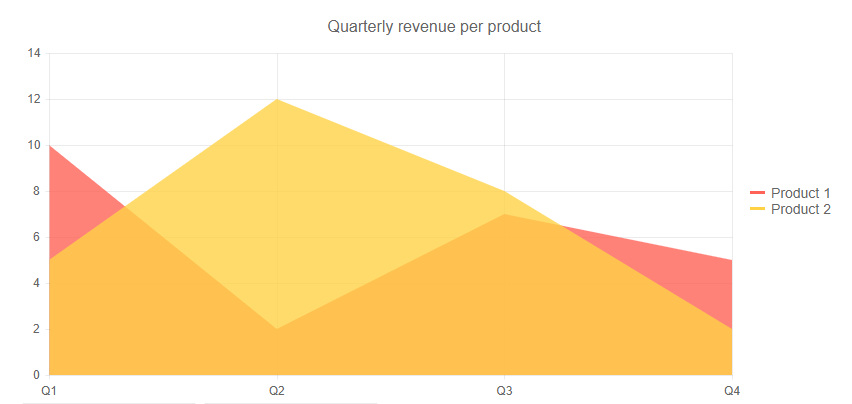

# Area Chart

An <a href="https://www.telerik.com/blazor-ui/area-chart" target="_blank">Blazor Area chart</a> shows the data as continuous lines that pass through points defined by their items' values. The portion of the graph beneath the lines is filled with a particular color for every series. Colors in an Area chart can be useful for emphasizing changes in values from several sets of similar data. A colored background will clearly visualize the differences.


An Area chart emphasizes the volume of money, data or any other unit that the given series has encompassed. When backgrounds are semi-transparent, it lets the user clearly see where different sets of data overlap.

>caption Area chart.  Results from the first code snippet below



@[template](/_contentTemplates/chart/link-to-basics.md#understand-basics-and-databinding-first)

To create an area chart:

1. add a `ChartSeries` to the `ChartSeriesItems` collection
2. set its `Type` property to `ChartSeriesType.Area`
3. provide a data collection to its `Data` property
4. optionally, provide data for the x-axis `Categories`


>caption An area chart that shows product revenues

````CSHTML
@*Area series*@

<TelerikChart>
    <ChartSeriesItems>
        <ChartSeries Type="ChartSeriesType.Area" Name="Product 1" Data="@series1Data">
        </ChartSeries>
        <ChartSeries Type="ChartSeriesType.Area" Name="Product 2" Data="@series2Data">
        </ChartSeries>
    </ChartSeriesItems>

    <ChartCategoryAxes>
        <ChartCategoryAxis Categories="@xAxisItems"></ChartCategoryAxis>
    </ChartCategoryAxes>

    <ChartTitle Text="Quarterly revenue per product"></ChartTitle>

    <ChartLegend Position="Telerik.Blazor.ChartLegendPosition.Right">
    </ChartLegend>
</TelerikChart>

@code {
    public List<object> series1Data = new List<object>() { 10, 2, 7, 5 };
    public List<object> series2Data = new List<object>() { 5, 12, 8, 2 };
    public string[] xAxisItems = new string[] { "Q1", "Q2", "Q3", "Q4" };
}
````


## Area Chart Specific Appearance Settings

### Color

The color of a series is controlled through the `Color` property that can take any valid CSS color (for example, `#abcdef`, `#f00`, or `blue`). The color control the fill color of the area.

You can control the color of the line itself separately by using the `Color` property of the nested `TelerikChartSeriesLine` tag.

@[template](/_contentTemplates/chart/link-to-basics.md#opacity-area-bubble)

### Missing Values

If some values are missing from the series data (they are `null`), you can have the chart work around this by setting the `MissingValues` property of the series to the desired behavior (member of the `Telerik.Blazor.ChartSeriesMissingValues` enum):

* `Zero` - the default behavior. The line goes to the 0 value mark.
* `Interpolate` - the line will go through the interpolated value of the missing data points and connect to the next data point with a value.
* `Gap` - behaves the same way as `Zero` because a line chart cannot have a gap in its filled area.


### Line Style

You can render the lines between the points with different styles. The supported styles can be set via the `Style` property of the child `ChartSeriesLine` tag - it takes a member of `Telerik.Blazor.ChartSeriesStyle` enum:

* `Normal`—This is the default style. It produces a straight line between data points.
* `Step`—The style renders the connection between data points through vertical and horizontal lines. It is suitable for indicating that the value is constant between the changes.
* `Smooth`—This style causes the Area Chart to display a fitted curve through data points. It is suitable when the data requires to be displayed with a curve, or when you wish to connect the points with smooth instead of straight lines.

>caption Comparison between line styles


@[template](/_contentTemplates/chart/link-to-basics.md#configurable-nested-chart-settings)

@[template](/_contentTemplates/chart/link-to-basics.md#configurable-nested-chart-settings-categorical)

>caption Change the rendering Step, Color and Font of the Category Axis Labels

````CSHTML
@* Change the rendering Step, Color and Font of the Category Axis Labels *@

<TelerikChart>
    <ChartSeriesItems>
        <ChartSeries Type="ChartSeriesType.Area" Name="Product 1" Data="@series1Data">
        </ChartSeries>
        <ChartSeries Type="ChartSeriesType.Area" Name="Product 2" Data="@series2Data">
        </ChartSeries>
    </ChartSeriesItems>

    <ChartCategoryAxes>
        <ChartCategoryAxis Categories="@xAxisItems">
            <ChartCategoryAxisLabels Step="2" Color="#008000" Font="bold 12px 'Helvetica'"></ChartCategoryAxisLabels>
        </ChartCategoryAxis>
    </ChartCategoryAxes>

    <ChartTitle Text="Quarterly revenue per product"></ChartTitle>

    <ChartLegend Position="Telerik.Blazor.ChartLegendPosition.Right">
    </ChartLegend>
</TelerikChart>

@code {
    public List<object> series1Data = new List<object>() { 10, 2, 7, 5 };
    public List<object> series2Data = new List<object>() { 5, 12, 8, 2 };
    public string[] xAxisItems = new string[] { "Q1", "Q2", "Q3", "Q4" };
}
````


## See Also

  * [Live Demo: Area Chart](https://demos.telerik.com/blazor-ui/chart/area-chart)
