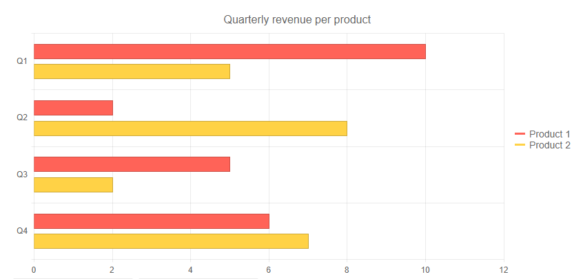

# Bar Chart

A **Bar** chart displays data as horizontal bars whose lengths vary according to their value. You can use a Bar chart to show a comparison between several sets of data (for example, summaries of sales data for different time periods). Each series is automatically colored differently for easier reading.

>caption Bar chart. Results from the first code snippet below



@[template](/_contentTemplates/chart/link-to-basics.md#understand-basics-and-databinding-first)

To create a bar chart:

1. add a `ChartSeries` to the `ChartSeriesItems` collection
2. set its `Type` property to `ChartSeriesType.Bar`
3. provide a data collection to its `Data` property
4. optionally, provide data for the x-axis `Categories`


>caption A bar chart that shows product revenues

````CSHTML
Bar series

<TelerikChart>
	<ChartSeriesItems>
		<ChartSeries Type="ChartSeriesType.Bar" Name="Product 1" Data="@series1Data">
		</ChartSeries>
		<ChartSeries Type="ChartSeriesType.Bar"Name="Product 2" Data="@series2Data">
		</ChartSeries>
	</ChartSeriesItems>

	<ChartCategoryAxes>
		<ChartCategoryAxis Categories="@xAxisItems"></ChartCategoryAxis>
	</ChartCategoryAxes>

	<ChartTitle Text="Quarterly revenue per product"></ChartTitle>

	<ChartLegend Position="ChartLegendPosition.Right">
	</ChartLegend>
</TelerikChart>

@code {
	public List<object> series1Data = new List<object>() { 10, 2, 5, 6 };
	public List<object> series2Data = new List<object>() { 5, 8, 2, 7 };
	public string[] xAxisItems = new string[] { "Q1", "Q2", "Q3", "Q4" };
}
````


## Bar Chart Specific Appearance Settings

### Color

The color of a series is controlled through the `Color` property that can take any valid CSS color (for example, `#abcdef`, `#f00`, or `blue`). The color control the fill color of the area.

@[template](/_contentTemplates/chart/link-to-basics.md#color-field-bar-column)

@[template](/_contentTemplates/chart/link-to-basics.md#gap-and-spacing)

@[template](/_contentTemplates/chart/link-to-basics.md#configurable-nested-chart-settings)

@[template](/_contentTemplates/chart/link-to-basics.md#configurable-nested-chart-settings-categorical)

>caption Configuring Label Template for the Value Axis and change the Font of the Category Axis.

````CSHTML
@* Add configuration settings for the Category and Value Axes *@

<TelerikChart>
    <ChartTitle Text="Site Visitors Stats"></ChartTitle>
    <ChartLegend Visible="false"></ChartLegend>

    <ChartSeriesItems>
        <ChartSeries Type="ChartSeriesType.Bar" Name="Total Visits" Data="@Series1Data">
        </ChartSeries>
        <ChartSeries Type="ChartSeriesType.Bar" Name="Unique visitors" Data="@Series2Data">
        </ChartSeries>
    </ChartSeriesItems>

    <ChartValueAxes>
        <ChartValueAxis Max="140000">
            <ChartValueAxisLabels Template="#=value/1000#k"></ChartValueAxisLabels>
        </ChartValueAxis>
    </ChartValueAxes>

    <ChartCategoryAxes>
        <ChartCategoryAxis Categories="@Categories">
            <ChartCategoryAxisLabels Font="bold 14px 'Times New Roman'" />
        </ChartCategoryAxis>
    </ChartCategoryAxes>

</TelerikChart>

@code {
    public class ModelData
    {
        public int Value { get; set; }
    }

    public List<ModelData>
    Data = new List<ModelData>()
    {
        new ModelData() { Value = 1 },
        new ModelData() { Value = 3 },
        new ModelData() { Value = 2 },
        };

    public List<object> Series1Data = new List<object>() { 56000, 63000, 74000, 91000, 117000, 138000 };
    public List<object> Series2Data = new List<object>() { 52000, 34000, 23000, 48000, 67000, 83000 };
    public string[] Categories = new string[] { "Jan", "Feb", "Mar", "Apr", "May", "Jun" };
}
````

## See Also

 * [Live Demo: Bar Chart](https://demos.telerik.com/blazor-ui/chart/index)
