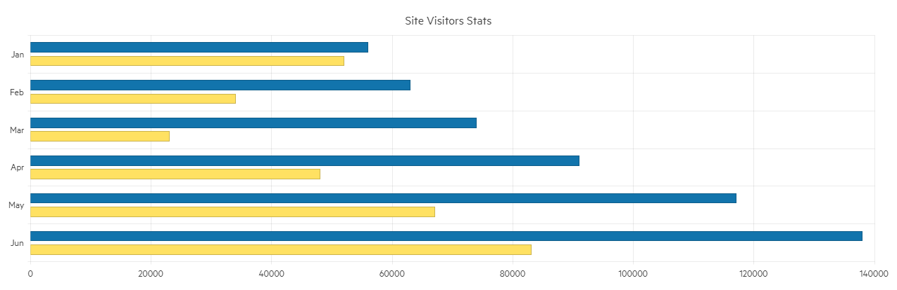

# Bar Chart

The <a href="https://www.telerik.com/blazor-ui/bar-chart" target="_blank">Blazor Bar chart</a> displays data as horizontal bars whose lengths vary according to their value. You can use a Bar chart to show a comparison between several sets of data (for example, summaries of sales data for different time periods). Each series is automatically colored differently for easier reading.

The Bar Chart is similar to the [Range Bar Chart](slug:components/chart/types/rangebar), which allows the bar to move away from the category axis.

@[template](/_contentTemplates/chart/link-to-basics.md#understand-basics-and-databinding-first)

#### To create a bar chart:

1. add a `ChartSeries` to the `ChartSeriesItems` collection
2. set its `Type` property to `ChartSeriesType.Bar`
3. provide a data collection to its `Data` property
4. optionally, provide data for the x-axis `Categories`

>caption A bar chart that shows product revenues

<demo metaUrl="client/chart/types/bar/overview/" height="420"></demo>

## Bar Chart Specific Appearance Settings

### Color

The color of a series is controlled through the `Color` property that can take any valid CSS color (for example, `#abcdef`, `#f00`, or `blue`). The color control the fill color of the area.

@[template](/_contentTemplates/chart/link-to-basics.md#color-field-bar-column)

@[template](/_contentTemplates/chart/link-to-basics.md#gap-and-spacing)

@[template](/_contentTemplates/chart/link-to-basics.md#configurable-nested-chart-settings)

@[template](/_contentTemplates/chart/link-to-basics.md#configurable-nested-chart-settings-categorical)

>caption Configuring Label Template for the Value Axis and change the Font of the Category Axis.

<demo metaUrl="client/chart/types/bar/value-axis-label-template/" height="420"></demo>

## See Also

* [Live Demo: Bar Chart](https://demos.telerik.com/blazor-ui/chart/bar-chart)
