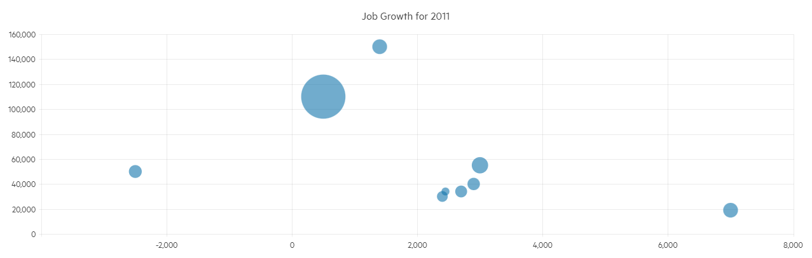

# Bubble Chart

The <a href="https://www.telerik.com/blazor-ui/bubble-chart" target="_blank">Blazor Bubble chart</a> shows the data as points with coordinates and size defined by their items' values. You might think of a Bubble chart as a variation of the [Scatter chart](slug:components/chart/types/scatter), in which the data points are replaced with bubbles. This allows a Bubble chart to display three dimensional data — two values for the items' coordinates and one for their size.



A Bubble chart is useful for visualizing different scientific relationships (e.g, economical, social, etc.). This chart type's x-axis is also numerical and does not require items.

@[template](/_contentTemplates/chart/link-to-basics.md#understand-basics-and-databinding-first)

## Creating a Blazor Bubble Chart

To use a Chart component with Bubble series:

1. Add a `ChartSeries` to the `ChartSeriesItems` collection.
2. Set its `Type` property to `ChartSeriesType.Bubble`.
3. Provide a data collection to its `Data` property, which contains numerical data for the X and Y axes, and for the bubble size.

>caption A bubble chart that shows projected population change on a plot of life expectancy versus fertility rate

````RAZOR
<TelerikChart>

    <ChartSeriesItems>
        <ChartSeries Type="ChartSeriesType.Bubble"
                     Data="@Series1Data"
                     Name="North America"
                     XField="@nameof(ModelData.LifeExpectancy)"
                     YField="@nameof(ModelData.FertilityRate)"
                     SizeField="@nameof(ModelData.PopulationChange)">
            <ChartSeriesLabels Visible="true" Template="@labelTemplate"></ChartSeriesLabels>
        </ChartSeries>
        <ChartSeries Type="ChartSeriesType.Bubble"
                     Data="@Series2Data"
                     Name="Europe"
                     XField="@nameof(ModelData.LifeExpectancy)"
                     YField="@nameof(ModelData.FertilityRate)"
                     SizeField="@nameof(ModelData.PopulationChange)">
            <ChartSeriesLabels Visible="true" Template="@labelTemplate"></ChartSeriesLabels>
        </ChartSeries>
    </ChartSeriesItems>

    <ChartXAxes>
        <ChartXAxis>
            <ChartXAxisTitle Text="Life Expectancy (years)"></ChartXAxisTitle>
        </ChartXAxis>
    </ChartXAxes>

    <ChartYAxes>
        <ChartYAxis>
            <ChartYAxisTitle Text="Fertility Rate (children per family)"></ChartYAxisTitle>
        </ChartYAxis>
    </ChartYAxes>

    <ChartTitle Text="Life expectancy, fertility rate and projected population change" />

</TelerikChart>

@code {
    string labelTemplate = "#=dataItem.Country#";

    public class ModelData
    {
        public double LifeExpectancy { get; set; }
        public double FertilityRate { get; set; }
        public int PopulationChange { get; set; }
        public string Country { get; set; }
    }

    public List<ModelData> Series1Data = new List<ModelData>()
    {
        new ModelData() { LifeExpectancy = 80.66, FertilityRate = 1.27, PopulationChange = 500000, Country = "Canada" },
        new ModelData() { LifeExpectancy = 78.09, FertilityRate = 2.3, PopulationChange = 7600000, Country = "USA" }
    };

    public List<ModelData> Series2Data = new List<ModelData>()
    {
        new ModelData() { LifeExpectancy = 67.3, FertilityRate = 1.54, PopulationChange = 25000, Country = "Denmark" },
        new ModelData() { LifeExpectancy = 74.3, FertilityRate = 1.85, PopulationChange = 3000000, Country = "Great Britain" }
    };
}
````

## Bubble Sizing

The Chart component determines the physical size of each bubble automatically:

* The maximum bubble size is 20% of the smaller Chart dimension (width or height). This ensures that the largest bubbles do not occupy too much space.
* The minimum bubble size is 2% of the smaller Chart dimension, but not less than `10px`. This ensures that even the smallest bubbles are perceivable and accessible. The smallest bubble size also depends on the largest `Size` value in the Chart series.
* All bubble sizes are set proportionately, as long as they comply with the preceding rules.

As a result of the above algorithms:

* Bubble sizing may not be linear if the ratio between the smallest and largest `Size` values is too big. For example, a 10-fold bubble size difference is achievable with a large-enough Chart, but a 100-fold size difference is not supported.
* The Bubble Chart helps users compare bubble sizes in the same Chart instance, rather than between different instances. To compare bubbles from multiple series, define these series in the same Chart instance.

If you need to [improve the bubble size comparability across several Charts](slug:chart-kb-bubble-size), then use a dummy data item with a `Size` value that matches the maximum `Size` value in all Chart instances.

## Bubble Chart Specific Appearance Settings

### Color

The color of a series is controlled through the `Color` property that can take any valid CSS color (for example, `#abcdef`, `#f00`, or `blue`). The color control the fill color of the bubble.

The `ColorField` can change the color of individual items. To use it, pass a valid CSS color to the corresponding field in the model and the chart will use its values instead of the `Color` parameter.

@[template](/_contentTemplates/chart/link-to-basics.md#opacity-area-bubble)

### Negative Values

Negative values are allowed for the X and Y fields, because they are plotted on standard numerical axes.

The size field should, generally, have positive values as it correlates to the physical size of the bubble. To render negative values, set the `Visible` parameter of the `ChartSeriesNegativeValues` tag of the series to `true`. Bubbles with negative size values will be calculated as if their sizes are positive. To distinguish one from the other, you can have negative items show up in a different color through the `Color` parameter of the `ChartSeriesNegativeValues` tag.

>caption Negative bubble size

````RAZOR
@* Negative bubble sizes can showcase decreases in values and can render in different color than the rest of the series *@

<TelerikChart>

    <ChartSeriesItems>
        <ChartSeries Type="ChartSeriesType.Bubble"
                     Data="@SeriesData"
                     XField="@nameof(ModelData.X)"
                     YField="@nameof(ModelData.Y)"
                     SizeField="@nameof(ModelData.Size)">
            <ChartSeriesNegativeValues Visible="true" Color="cyan"></ChartSeriesNegativeValues>
            <ChartSeriesLabels Visible="true" Template="#=dataItem.MetaData#"></ChartSeriesLabels>
        </ChartSeries>
    </ChartSeriesItems>

</TelerikChart>

@code {
    public class ModelData
    {
        public int X { get; set; }
        public int Y { get; set; }
        public int Size { get; set; }
        public string MetaData { get; set; }
    }

    public List<ModelData> SeriesData = new List<ModelData>()
    {
        new ModelData() { X = 250, Y = 5000, Size = 50000 , MetaData = "positive size"},
        new ModelData() { X = 500, Y = 1100, Size = -760000, MetaData = "negative size" }
    };
}
````

@[template](/_contentTemplates/chart/link-to-basics.md#configurable-nested-chart-settings)

@[template](/_contentTemplates/chart/link-to-basics.md#configurable-nested-chart-settings-numerical)

## See Also

* [Live Demo: Bubble Chart](https://demos.telerik.com/blazor-ui/chart/bubble-chart)
* [Configure Relative Bubble Sizes in Multiple Charts](slug:chart-kb-bubble-size)
