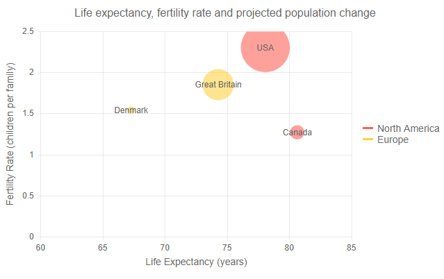

# Bubble Chart

A **Bubble** chart shows the data as points with coordinates and size defined by their items' values. You might think of a Bubble chart as a variation of the [Scatter chart](), in which the data points are replaced with bubbles. This allows a Bubble chart to display three dimensional data — two values for the items' coordinates and one for their size. 

A Bubble chart is useful for visualizing different scientific relationships (e.g, economical, social, etc.). This chart type's x-axis is also numerical and does not require items.

>caption Bubble chart. Results from the first code snippet below



@[template](/_contentTemplates/chart/link-to-basics.md#understand-basics-and-databinding-first)

To create a bubble chart:

1. add a `ChartSeries` to the `ChartSeriesItems` collection
2. set its `Type` property to `ChartSeriesType.Bubble`
3. provide a data collection to its `Data` property, which contains numerical data for the X and Y axes, and for the buble size


>caption A bubble chart that shows projected population change on a plot of life expectancy versus fertility rate

````CSHTML
@* Bubble Series *@

<TelerikChart>

    <ChartSeriesItems>
        <ChartSeries Type="ChartSeriesType.Bubble"
                     Data="@Series1Data"
                     Name="North America"
                     XField="@nameof(ModelData.LifeExpectancy)"
                     YField="@nameof(ModelData.FertilityRate)"
                     SizeField="@nameof(ModelData.PopulationChange)">
            <ChartSeriesLabels Visible="true" Template="@labelTemplate"></ChartSeriesLabels>
        </ChartSeries>
        <ChartSeries Type="ChartSeriesType.Bubble"
                     Data="@Series2Data"
                     Name="Europe"
                     XField="@nameof(ModelData.LifeExpectancy)"
                     YField="@nameof(ModelData.FertilityRate)"
                     SizeField="@nameof(ModelData.PopulationChange)">
            <ChartSeriesLabels Visible="true" Template="@labelTemplate"></ChartSeriesLabels>
        </ChartSeries>
    </ChartSeriesItems>

    <ChartXAxes>
        <ChartXAxis>
            <ChartXAxisTitle Text="Life Expectancy (years)"></ChartXAxisTitle>
        </ChartXAxis>
    </ChartXAxes>

    <ChartYAxes>
        <ChartYAxis>
            <ChartYAxisTitle Text="Fertility Rate (children per family)"></ChartYAxisTitle>
        </ChartYAxis>
    </ChartYAxes>

    <ChartTitle Text="Life expectancy, fertility rate and projected population change" />

</TelerikChart>

@code {
    string labelTemplate = "#=dataItem.Country#";

    public class ModelData
    {
        public double LifeExpectancy { get; set; }
        public double FertilityRate { get; set; }
        public int PopulationChange { get; set; }
        public string Country { get; set; }
    }

    public List<ModelData> Series1Data = new List<ModelData>()
    {
        new ModelData() { LifeExpectancy = 80.66, FertilityRate = 1.27, PopulationChange = 500000, Country = "Canada" },
        new ModelData() { LifeExpectancy = 78.09, FertilityRate = 2.3, PopulationChange = 7600000, Country = "USA" }
    };

    public List<ModelData> Series2Data = new List<ModelData>()
    {
        new ModelData() { LifeExpectancy = 67.3, FertilityRate = 1.54, PopulationChange = 25000, Country = "Denmark" },
        new ModelData() { LifeExpectancy = 74.3, FertilityRate = 1.85, PopulationChange = 3000000, Country = "Great Britain" }
    };
}

````


## Bubble Chart Specific Appearance Settings

### Color

The color of a series is controlled through the `Color` property that can take any valid CSS color (for example, `#abcdef`, `#f00`, or `blue`). The color control the fill color of the bubble. 

The `ColorField` can change the color of individual items. To use it, pass a valid CSS color to the corresponding field in the model and the chart will use its values instead of the `Color` parameter.

<!-- 

### Opacity

You can control how transparent the bubble fill is through the `Opacity` property. `0` means a completely opaque (non-transparent) series, and `255` means a completely transparent fill.

-->


<!-- 
### Negative Values

Negative values are allowed for the X and Y fields, because they are plotted on standard numerical axes.

The size field should, generally, have positive values as it correlates to the physical size of the bubble. To render negativ values, set the `NegativeValuesVisible` parameter of the series to `true`. They will be calculated as if their values are positive. To distinguish one from the other, you can have negative items show up in a different color through the `NegativeColor` parameter of the serires.

-->

## See Also

  * [Live Demo: Area Chart](https://demos.telerik.com/blazor-ui/chart/area-chart)
