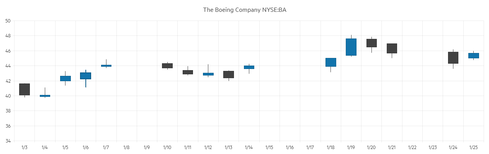

# Candlestick Chart

The <a href="https://www.telerik.com/blazor-ui/candlestick-chart" target="_blank"> Candlestick chart </a>shows data for the movement of the price of a financial unit. It consists of a bar (the candle), representing the open and close values, and vertical lines, the candlesticks, which illustrate the highest and lowest values.

@[template](/_contentTemplates/chart/link-to-basics.md#understand-basics-and-databinding-first)

#### To create a candlestick chart:

1. add a `ChartSeries` to the `ChartSeriesItems` collection
2. set its `Type` property to `ChartSeriesType.Candlestick`
3. provide a data collection to its `Data` property and set the corresponding fields:
    * `CategoryField` - the date that will be matched to the x-axis
    * `OpenField` - the field with the Open value
    * `CloseField` - the field with the Close value
    * `HighField` - the field with the High value
    * `LowField` - the field with the Low value
4. make the x-axis a [Date axis](slug:components/chart/date-axis) - while the candlestick chart can work with simple string categories, it is designed to show financial data over time

>caption A Candlestick chart that shows product financial stock data

<demo metaUrl="client/chart/types/candlestick/" height="560"></demo>

## Candlestick Chart Specific Appearance Settings

### DownColor

Set the color - a valid CSS, RGB, RGBA color - of the series when the `OpenField` is greater than the `CloseField` by setting the `DownColor` property of the `ChartSeries`. This can be passed through the data model and bound to the `DownColorField`.

@[template](/_contentTemplates/stockchart/link-to-basics.md#color-field-column-ohlc-candlestick)

>note The values bound to `DownColorField` and `ColorField` will take precedence over the values passed to the `Color` and the `DownColor` attributes. 

@[template](/_contentTemplates/stockchart/link-to-basics.md#gap-and-spacing)

@[template](/_contentTemplates/chart/link-to-basics.md#configurable-nested-chart-settings)

## See Also

* [Live Demo: Candlestick Chart](https://demos.telerik.com/blazor-ui/chart/candlestick-chart)
