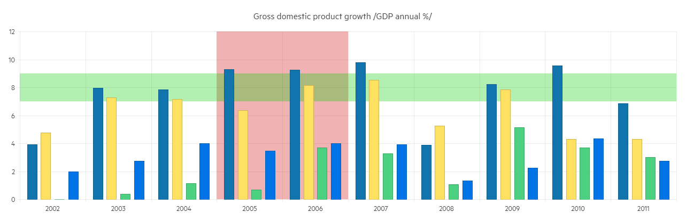

# Column Chart

The <a href="https://www.telerik.com/blazor-ui/column-chart" target="_blank">Blazor Column chart</a> displays data as vertical bars whose heights vary according to their value. You can use a Column chart to show a comparison between several sets of data (for example, summaries of sales data for different time periods). Each series is automatically colored differently for easier reading.

The Column Chart is similar to the [Range Column Chart](slug:components/chart/types/rangecolumn), which allows the column's low end to start above the horizontal axis.

@[template](/_contentTemplates/chart/link-to-basics.md#understand-basics-and-databinding-first)

#### To create a column chart:

1. add a `ChartSeries` to the `ChartSeriesItems` collection
2. set its `Type` property to `ChartSeriesType.Column`
3. provide a data collection to its `Data` property
4. optionally, provide data for the x-axis `Categories`

>caption A column chart that shows product revenues

<demo metaUrl="client/chart/types/column/overview/" height="420"></demo>

## Column Chart Specific Appearance Settings

### Labels

Each data item is decorated with a text label. You can control and customize them through the `<ChartCategoryAxisLabels />` and its children tags.

* `Visible` - hide all labels by setting this parameter to `false`.
* `Step` - renders every n-th labels, where n is the value(double number) passed to the parameter.
* `Skip` - skips the first n labels, where n is the value (double number) passed to the parameter.
* `Angle` - rotates the labels with the desired angle by n degrees, where n is the value passed to the parameter. It can take positive and negative numbers. To set this parameter use the `< ChartCategoryAxisLabelsRotation />` child tag.

To rotate the markers use the `ChartCategoryAxisLabelsRotation` child tag and set its `Angle` parameter. It can take positive and negative numbers as value.

### Color

The color of a series is controlled through the `Color` property that can take any valid CSS color (for example, `#abcdef`, `#f00`, or `blue`).

@[template](/_contentTemplates/chart/link-to-basics.md#color-field-bar-column)

@[template](/_contentTemplates/chart/link-to-basics.md#gap-and-spacing)

@[template](/_contentTemplates/chart/link-to-basics.md#configurable-nested-chart-settings)

@[template](/_contentTemplates/chart/link-to-basics.md#configurable-nested-chart-settings-categorical)

>caption Configuring Label Rotation, Skipping the rendering of every second label and adding borders and padding to the Labels.

<demo metaUrl="client/chart/types/column/label-customization/" height="460"></demo>

## See Also

* [Live Demo: Column Chart](https://demos.telerik.com/blazor-ui/chart/column-chart)
