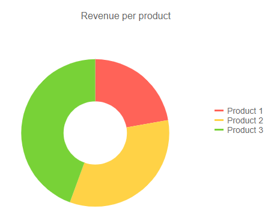
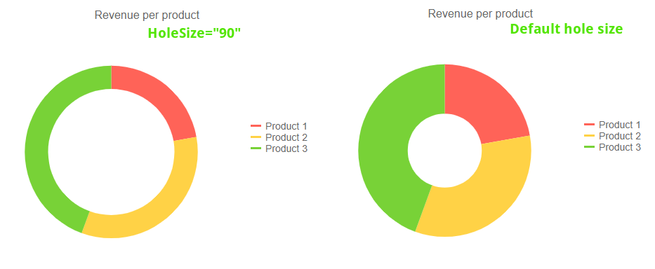

# Donut Chart

The **Donut** chart displays the data as sectors from a two-dimensional circle and is therefore useful for displaying data as parts of a whole. There can only be one series in a donut chart. There is a hole in the middle of the circle, hence the name of the chart.

>caption Donut chart.  Results from the first code snippet below



@[template](/_contentTemplates/chart/link-to-basics.md#understand-basics-and-databinding-first)

To create a donut chart:

1. add a `TelerikChartSeries` to the `TelerikChartSeriesItems` collection
2. set its `Type` property to `ChartSeriesType.Donut`
3. provide a data model collection to its `Data` property
4. set the `Field` and `CategoryField` properties to the corresponding fields in the model that carry the values and names that will be shown in the legend

If you use [simple data binding](#independent-series-binding) and only provide values, the chart will not render a legend.

>caption A donut chart that shows product revenues

````CSHTML
@using Telerik.Blazor
@using Telerik.Blazor.Components.Chart

<TelerikChart>
	<TelerikChartSeriesItems>
		<TelerikChartSeries Type="ChartSeriesType.Donut" Data="@donutData" 
							Field="@nameof(MyDonutChartModel.SegmentValue)" CategoryField="@nameof(MyDonutChartModel.SegmentName)">
		</TelerikChartSeries>
	</TelerikChartSeriesItems>

	<TelerikChartTitle Text="Revenue per product"></TelerikChartTitle>

	<TelerikChartLegend Position="ChartLegendPosition.Right">
	</TelerikChartLegend>
</TelerikChart>

@functions {
	public class MyDonutChartModel
	{
		public string SegmentName { get; set; }
		public double SegmentValue { get; set; }
		public bool ShouldShowInLegend { get; set; } = true;
	}
	public List<MyDonutChartModel> donutData = new List<MyDonutChartModel>
	{
		new MyDonutChartModel
		{
			SegmentName = "Product 1",
			SegmentValue = 2
		},
		new MyDonutChartModel
		{
			SegmentName = "Product 2",
			SegmentValue = 3
		},
		new MyDonutChartModel
		{
			SegmentName = "Product 3",
			SegmentValue = 4
		}
	};
}

````


## Donut Chart Specific Appearance Settings

The donut chart is a variation of the Pie Chart graph type, and has the same features and behavior. You can read more about them in the [Pie Chart](#pie-chart-specific-appearance-settings) article.

### Hole Size

You can change the percentage that the hole in the middle takes from the entire diameter of the circle by setting the `HoleSize` property of the series. Setting `0` removes the hole, and `100` means the entire chart is the hole.

````CSHTML
@using Telerik.Blazor
@using Telerik.Blazor.Components.Chart

<TelerikChart>
	<TelerikChartSeriesItems>
		<TelerikChartSeries Type="ChartSeriesType.Donut" Data="@donutData" HoleSize="90"
							Field="@nameof(MyDonutChartModel.SegmentValue)" CategoryField="@nameof(MyDonutChartModel.SegmentName)">
		</TelerikChartSeries>
	</TelerikChartSeriesItems>

	<TelerikChartTitle Text="Revenue per product"></TelerikChartTitle>

	<TelerikChartLegend Position="ChartLegendPosition.Right">
	</TelerikChartLegend>
</TelerikChart>

@functions {
	public class MyDonutChartModel
	{
		public string SegmentName { get; set; }
		public double SegmentValue { get; set; }
		public bool ShouldShowInLegend { get; set; } = true;
	}
	public List<MyDonutChartModel> donutData = new List<MyDonutChartModel>
	{
		new MyDonutChartModel
		{
			SegmentName = "Product 1",
			SegmentValue = 2
		},
		new MyDonutChartModel
		{
			SegmentName = "Product 2",
			SegmentValue = 3
		},
		new MyDonutChartModel
		{
			SegmentName = "Product 3",
			SegmentValue = 4
		}
	};
}

````

>caption Comparison between the result of the code snippet above and the default behavior



## See Also

  * [Live Demo: Donut Chart](https://demos.telerik.com/blazor-ui/chart/donut-chart)
