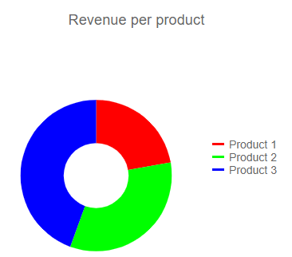
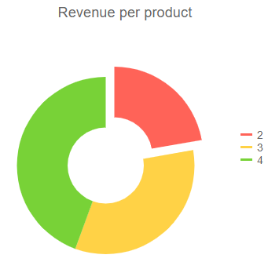
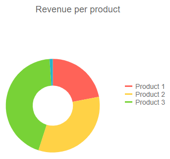
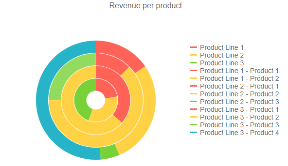

# Donut Chart

The <a href="https://www.telerik.com/blazor-ui/donut-chart" target="_blank">Blazor Donut chart</a> displays the data as sectors from a two-dimensional circle and is therefore useful for displaying data as parts of a whole. Unlike a pie chart, it can have multiple series in the same chart. There is a hole in the middle of the circle, hence the name of the chart.

>caption Donut chart. Results from the first code snippet below


@[template](/_contentTemplates/chart/link-to-basics.md#understand-basics-and-databinding-first)

To create a donut chart:

1. add a `ChartSeries` to the `ChartSeriesItems` collection
2. set its `Type` property to `ChartSeriesType.Donut`
3. provide a data model collection to its `Data` property
4. set the `Field` and `CategoryField` properties to the corresponding fields in the model that carry the values and names that will be shown in the legend

If you use [simple data binding](#independent-series-binding) and only provide values, the chart will not render a legend.

>caption A donut chart that shows product revenues

````CSHTML
Donut series

<TelerikChart>
	<ChartSeriesItems>
		<ChartSeries Type="ChartSeriesType.Donut" Data="@donutData"
							Field="@nameof(MyDonutChartModel.SegmentValue)" CategoryField="@nameof(MyDonutChartModel.SegmentName)">
		</ChartSeries>
	</ChartSeriesItems>

	<ChartTitle Text="Revenue per product"></ChartTitle>

	<ChartLegend Position="ChartLegendPosition.Right">
	</ChartLegend>
</TelerikChart>

@code {
	public class MyDonutChartModel
	{
		public string SegmentName { get; set; }
		public double SegmentValue { get; set; }
		public bool ShouldShowInLegend { get; set; } = true;
	}

	public List<MyDonutChartModel> donutData = new List<MyDonutChartModel>
	{
		new MyDonutChartModel
		{
			SegmentName = "Product 1",
			SegmentValue = 2
		},
		new MyDonutChartModel
		{
			SegmentName = "Product 2",
			SegmentValue = 3
		},
		new MyDonutChartModel
		{
			SegmentName = "Product 3",
			SegmentValue = 4
		}
	};
}
````

## Donut Chart Specific Appearance Settings

The following sections explain speciifc configuration options to the donut charts:

* [Rotation](#rotation)
* [Color Field](#color-field)
* [Exploded Segment](#exploded-segment)
* [Visible In Legend](#visible-in-legend)
* [Hole Size](#hole-size)
* [Multiple Series](#multiple-series)
* [Customize Chart Elements - Nested Tags Settings](#customize-chart-elements---nested-tags-settings)

### Rotation

By default, the firt segment starts at the top. You can change that by using the `StartAngle` property of the series.

### Color Field

You can control the color of the individual segments of the donut chart by providing a string with the desired color in the model, and setting the `ColorField` of the series to it. You can pass a valid CSS color (for example, `#abcdef`, `#f00`, or `blue`).

````CSHTML
@*Set color to the donut chart items*@

<TelerikChart>
    <ChartSeriesItems>
        <ChartSeries Type="ChartSeriesType.Donut"
                     Data="@donutData"
                     
                     ColorField="@nameof(MyDonutChartModel.SegmentColor)"

                     Field="@nameof(MyDonutChartModel.SegmentValue)"
                     CategoryField="@nameof(MyDonutChartModel.SegmentName)">
        </ChartSeries>
    </ChartSeriesItems>

    <ChartTitle Text="Revenue per product"></ChartTitle>

    <ChartLegend Position="ChartLegendPosition.Right">
    </ChartLegend>
</TelerikChart>

@code {
    public class MyDonutChartModel
    {
        public string SegmentName { get; set; }
        public double SegmentValue { get; set; }
        public string SegmentColor { get; set; }
    }

    public List<MyDonutChartModel> donutData = new List<MyDonutChartModel>
    {
        new MyDonutChartModel
        {
            SegmentName = "Product 1",
            SegmentValue = 2,
            SegmentColor = "red"
        },
        new MyDonutChartModel
        {
            SegmentName = "Product 2",
            SegmentValue = 3,
            SegmentColor = "#00ff00"
        },
        new MyDonutChartModel
        {
            SegmentName = "Product 3",
            SegmentValue = 4,
            SegmentColor = "#00f"
        }
    };
}
````

>caption The result from the code snippet above



### Exploded Segment

You can have some of the segments of the donut chart separated from the rest of the circle with a small margin. This helps bring attention to them as outliers or as important bits that the viewer should focus on.

To explode (separate) a segment, use the `ExplodeField` property of the series and set it to a boolean field that indicates whether the segment is exploded. Only a `true` value explodes a segment, so you can use a nullable field as well and only provide values for the items you want separated.

>caption Exploded Items

````CSHTML
@*Separate items from the main body of the chart*@

<TelerikChart>
    <ChartSeriesItems>
        <ChartSeries Type="ChartSeriesType.Donut"
                     Data="@donutData"
                     
                     ExplodeField="@nameof(MyDonutChartModel.IsSeparated)"

                     Field="@nameof(MyDonutChartModel.SegmentValue)"
                     CategoryField="@nameof(MyDonutChartModel.SegmentValue)">
        </ChartSeries>
    </ChartSeriesItems>

    <ChartTitle Text="Revenue per product"></ChartTitle>

    <ChartLegend Position="ChartLegendPosition.Right">
    </ChartLegend>
</TelerikChart>

@code {
    public class MyDonutChartModel
    {
        public string SegmentName { get; set; }
        public double SegmentValue { get; set; }
        public bool? IsSeparated { get; set; }
    }

    public List<MyDonutChartModel> donutData = new List<MyDonutChartModel>
    {
        new MyDonutChartModel
        {
            SegmentName = "Product 1",
            SegmentValue = 2,
            IsSeparated = true
        },
        new MyDonutChartModel
        {
            SegmentName = "Product 2",
            SegmentValue = 3
        },
        new MyDonutChartModel
        {
            SegmentName = "Product 3",
            SegmentValue = 4
        }
    };
}
````

>caption The result from the code snippet above



### Visible In Legend

You can hide certain segments from the legend (for example, if their contribution is insignificantly small). To do this, add a boolean field to the model and set its name to the `VisibleInLegendField` property of the donut series. The flags in this field will denote whether the particular item will be rendered in the legend.

>caption Hide segments from the legend

````CSHTML
@*Show only some items in the legend*@

<TelerikChart>
    <ChartSeriesItems>
        <ChartSeries Type="ChartSeriesType.Donut"
                     Data="@donutData"
                     
                     VisibleInLegendField="@nameof(MyDonutChartModel.ShouldShowInLegend)"

                     Field="@nameof(MyDonutChartModel.SegmentValue)" 
                     CategoryField="@nameof(MyDonutChartModel.SegmentName)">
        </ChartSeries>
    </ChartSeriesItems>

    <ChartTitle Text="Revenue per product"></ChartTitle>

    <ChartLegend Position="ChartLegendPosition.Right">
    </ChartLegend>
</TelerikChart>

@code {
    public class MyDonutChartModel
    {
        public string SegmentName { get; set; }
        public double SegmentValue { get; set; }
        public bool ShouldShowInLegend { get; set; } = true;
    }

    public List<MyDonutChartModel> donutData = new List<MyDonutChartModel>
    {
        new MyDonutChartModel
        {
            SegmentName = "Product 1",
            SegmentValue = 2
        },
        new MyDonutChartModel
        {
            SegmentName = "Product 2",
            SegmentValue = 3
        },
        new MyDonutChartModel
        {
            SegmentName = "Product 3",
            SegmentValue = 4
        },
        new MyDonutChartModel
        {
            SegmentName = "Insignificant Product",
            SegmentValue = 0.1,
            ShouldShowInLegend = false
        }
    };
}
````

>caption The result from the code snippet above



### Hole Size

You can change the percentage that the hole in the middle takes from the entire diameter of the circle by setting the `HoleSize` property of the series. Setting `0` removes the hole, and `100` means the entire chart is the hole.

````CSHTML
Control the hole size of the donut chart

<TelerikChart>
	<ChartSeriesItems>
		<ChartSeries Type="ChartSeriesType.Donut" Data="@donutData" HoleSize="90"
							Field="@nameof(MyDonutChartModel.SegmentValue)" CategoryField="@nameof(MyDonutChartModel.SegmentName)">
		</ChartSeries>
	</ChartSeriesItems>

	<ChartTitle Text="Revenue per product"></ChartTitle>

	<ChartLegend Position="ChartLegendPosition.Right">
	</ChartLegend>
</TelerikChart>

@code {
	public class MyDonutChartModel
	{
		public string SegmentName { get; set; }
		public double SegmentValue { get; set; }
		public bool ShouldShowInLegend { get; set; } = true;
	}

	public List<MyDonutChartModel> donutData = new List<MyDonutChartModel>
	{
		new MyDonutChartModel
		{
			SegmentName = "Product 1",
			SegmentValue = 2
		},
		new MyDonutChartModel
		{
			SegmentName = "Product 2",
			SegmentValue = 3
		},
		new MyDonutChartModel
		{
			SegmentName = "Product 3",
			SegmentValue = 4
		}
	};
}
````

>caption Comparison between the result of the code snippet above and the default behavior


### Multiple Series

Unlike a pie chart, a donut chart can have multiple series in a single chart. Each series is nested in the next - the first declared series is in the center, and the last series is at the outer edge.

You can use multiple series to showcase relationships within a data set, or several similar sets of data.

You can also use the `ColorField` property to define a field with the segments' colors. With this, you can color-code different series and their relationships to one another.

>caption Multiple donut series in a single chart (code sample after the figure)



````CSHTML
@* You can bind the entire chart to one collection of data, even though this example shows separate collections for each series *@

<TelerikChart>
    <ChartSeriesItems>
        <ChartSeries Type="ChartSeriesType.Donut" Data="@firstSeriesData"
                     Field="@nameof(MyDonutChartModel.SegmentValue)" CategoryField="@nameof(MyDonutChartModel.SegmentName)">
        </ChartSeries>
        <ChartSeries Type="ChartSeriesType.Donut" Data="@secondSeriesData"
                     Field="@nameof(MyDonutChartModel.SegmentValue)" CategoryField="@nameof(MyDonutChartModel.SegmentName)">
        </ChartSeries>
        <ChartSeries Type="ChartSeriesType.Donut" Data="@thirdSeriesData"
                     Field="@nameof(MyDonutChartModel.SegmentValue)" CategoryField="@nameof(MyDonutChartModel.SegmentName)">
        </ChartSeries>
        <ChartSeries Type="ChartSeriesType.Donut" Data="@fourthSeriesData"
                     Field="@nameof(MyDonutChartModel.SegmentValue)" CategoryField="@nameof(MyDonutChartModel.SegmentName)">
        </ChartSeries>
    </ChartSeriesItems>

    <ChartTitle Text="Revenue per product"></ChartTitle>

    <ChartLegend Position="ChartLegendPosition.Right">
    </ChartLegend>
</TelerikChart>

@code {
    public class MyDonutChartModel
    {
        public string SegmentName { get; set; }
        public double SegmentValue { get; set; }
        public bool ShouldShowInLegend { get; set; } = true;
    }

    public List<MyDonutChartModel> firstSeriesData = new List<MyDonutChartModel>
    {
        new MyDonutChartModel
        {
            SegmentName = "Product Line 1",
            SegmentValue = 2
        },
        new MyDonutChartModel
        {
            SegmentName = "Product Line 2",
            SegmentValue = 3
        },
        new MyDonutChartModel
        {
            SegmentName = "Product Line 3",
            SegmentValue = 4
        }
    };

    public List<MyDonutChartModel> secondSeriesData = new List<MyDonutChartModel>
    {
        new MyDonutChartModel
        {
            SegmentName = "Product Line 1 - Product 1",
            SegmentValue = 4
        },
        new MyDonutChartModel
        {
            SegmentName = "Product Line 1 - Product 2",
            SegmentValue = 7
        }
    };

    public List<MyDonutChartModel> thirdSeriesData = new List<MyDonutChartModel>
    {
        new MyDonutChartModel
        {
            SegmentName = "Product Line 2 - Product 1",
            SegmentValue = 1
        },
        new MyDonutChartModel
        {
            SegmentName = "Product Line 2 - Product 2",
            SegmentValue = 5
        },
        new MyDonutChartModel
        {
            SegmentName = "Product Line 2 - Product 3",
            SegmentValue = 2
        }
    };

    public List<MyDonutChartModel> fourthSeriesData = new List<MyDonutChartModel>
    {
        new MyDonutChartModel
        {
            SegmentName = "Product Line 3 - Product 1",
            SegmentValue = 6
        },
        new MyDonutChartModel
        {
            SegmentName = "Product Line 3 - Product 2",
            SegmentValue = 11
        },
        new MyDonutChartModel
        {
            SegmentName = "Product Line 3 - Product 3",
            SegmentValue = 2
        },
        new MyDonutChartModel
        {
            SegmentName = "Product Line 3 - Product 4",
            SegmentValue = 20
        }
    };
}
````

@[template](/_contentTemplates/chart/link-to-basics.md#configurable-nested-chart-settings)

@[template](/_contentTemplates/chart/link-to-basics.md#configurable-nested-chart-settings-axis-free)

>caption Configuring Title Margin, changing Font and adding Borders to the Labels.

````CSHTML
@* Add margin to the Title, changing the Font and Borders of the labels. *@

<TelerikChart>
    <ChartTitle Text="What is you favourite sport?">
        <ChartTitleMargin Bottom="20"></ChartTitleMargin>
    </ChartTitle>
    <ChartLegend Visible="true" Position="ChartLegendPosition.Top"></ChartLegend>

    <ChartSeriesItems>
        <ChartSeries Type="ChartSeriesType.Donut"
                     Data="@Data"
                     Field="@nameof(ModelData.Value)"
                     CategoryField="@nameof(ModelData.Category)">
            <ChartSeriesLabels Position="ChartSeriesLabelsPosition.OutsideEnd"
                               Visible="true"
                               Background="transparent"
                               Template="#= dataItem.Category # - #= percentage*100 #%"
                               Font="20px 'Helvetica'">
                <ChartSeriesLabelsBorder Width="1"
                                               Color="#0000FF"
                                               DashType="DashType.LongDashDotDot">
                </ChartSeriesLabelsBorder>
            </ChartSeriesLabels>
        </ChartSeries>
    </ChartSeriesItems>

</TelerikChart>

@code {
    public class ModelData
    {
        public string Category { get; set; }
        public Int32 Value { get; set; }
    }

    public List<ModelData> Data = new List<ModelData>()
    {
        new ModelData()
        {
            Category = "Football",
            Value = 35
        },
        new ModelData()
        {
            Category = "Basketball",
            Value = 25
        },
        new ModelData()
        {
            Category = "Volleyball",
            Value = 20
        },
        new ModelData()
        {
            Category = "Rugby",
            Value = 10
        },
        new ModelData()
        {
            Category = "Tennis",
            Value = 10
        },

    };
}
````

## See Also

  * [Live Demo: Donut Chart](https://demos.telerik.com/blazor-ui/chart/donut-chart)
