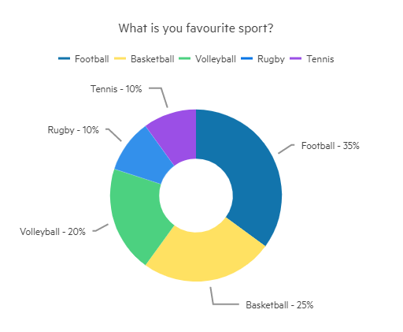

# Donut Chart

The <a href="https://www.telerik.com/blazor-ui/donut-chart" target="_blank">Blazor Donut chart</a> displays the data as sectors from a two-dimensional circle and is therefore useful for displaying data as parts of a whole. Unlike a pie chart, it can have multiple series in the same chart. There is a hole in the middle of the circle, hence the name of the chart.

@[template](/_contentTemplates/chart/link-to-basics.md#understand-basics-and-databinding-first)

## Creating Donut Chart

1. Add a `ChartSeries` to the `ChartSeriesItems` collection
2. Set its `Type` property to `ChartSeriesType.Donut`
3. Provide a data model collection to its `Data` property
4. Set the `Field` and `CategoryField` properties to the corresponding fields in the model that carry the values and names that will be shown in the legend

If you use [simple data binding](slug:components/chart/databind#independent-series-binding) and only provide values, the chart will not render a legend.

>caption A donut chart that shows product revenues

<demo metaUrl="client/chart/types/donut/overview/" height="420"></demo>

## Donut Chart Specific Appearance Settings

The following sections explain specific configuration options to the donut charts:

* [Rotation](#rotation)
* [Color Field](#color-field)
* [Exploded Segment](#exploded-segment)
* [Visible In Legend](#visible-in-legend)
* [Hole Size](#hole-size)
* [Multiple Series](#multiple-series)
* [Customize Chart Elements - Nested Tags Settings](#customize-chart-elements-nested-tags-settings)

### Rotation

By default, the first segment starts at the top. You can change that by using the `StartAngle` property of the series.

### Color Field

You can control the color of the individual segments of the donut chart by providing a string with the desired color in the model, and setting the `ColorField` of the series to it. You can pass a valid CSS color (for example, `#abcdef`, `#f00`, or `blue`).

<demo metaUrl="client/chart/types/donut/color-field/" height="420"></demo>

### Exploded Segment

You can have some of the segments of the donut chart separated from the rest of the circle with a small margin. This helps bring attention to them as outliers or as important bits that the viewer should focus on.

To explode (separate) a segment, use the `ExplodeField` property of the series and set it to a boolean field that indicates whether the segment is exploded. Only a `true` value explodes a segment, so you can use a nullable field as well and only provide values for the items you want separated.

>caption Exploded Items

<demo metaUrl="client/chart/types/donut/exploded-segment/" height="420"></demo>

### Visible In Legend

You can hide certain segments from the legend (for example, if their contribution is insignificantly small). To do this, add a boolean field to the model and set its name to the `VisibleInLegendField` property of the donut series. The flags in this field will denote whether the particular item will be rendered in the legend.

>caption Hide segments from the legend

<demo metaUrl="client/chart/types/donut/visible-in-legend/" height="420"></demo>

### Hole Size

You can change the percentage that the hole in the middle takes from the entire diameter of the circle by setting the `HoleSize` property of the series. Setting `0` removes the hole, and `100` means the entire chart is the hole.

<demo metaUrl="client/chart/types/donut/hole-size/" height="420"></demo>

### Multiple Series

Unlike a pie chart, a donut chart can have multiple series in a single chart. Each series is nested in the next - the first declared series is in the center, and the last series is at the outer edge.

You can use multiple series to showcase relationships within a data set, or several similar sets of data.

You can also use the `ColorField` property to define a field with the segments' colors. With this, you can color-code different series and their relationships to one another.

<demo metaUrl="client/chart/types/donut/multiple-series/" height="420"></demo>

@[template](/_contentTemplates/chart/link-to-basics.md#configurable-nested-chart-settings)

@[template](/_contentTemplates/chart/link-to-basics.md#configurable-nested-chart-settings-axis-free)

>caption Customize Chart Title Margin, Series Label Font, and Borders

<demo metaUrl="client/chart/types/donut/title-label-border/" height="420"></demo>

The following example shows how to use the Chart `Height`, Series `Size`, and Legend `Height` to arrange a layout with a larger number of donut segments.

>caption Customize Donut Chart element dimensions

<demo metaUrl="client/chart/types/donut/element-dimensions/" height="460"></demo>

## See Also

* [Live Demo: Donut Chart](https://demos.telerik.com/blazor-ui/chart/donut-chart)
* [Hide Donut Chart Category on Legend Click](slug:chart-kb-toggle-category-on-legend-item-click)
