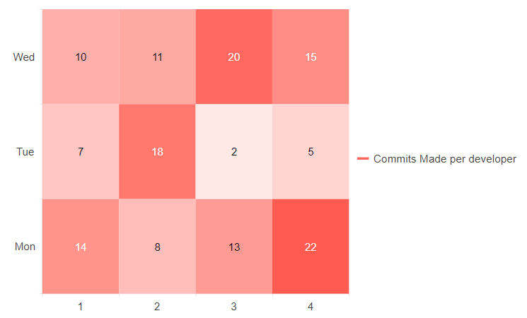
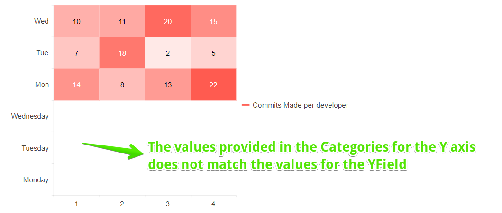
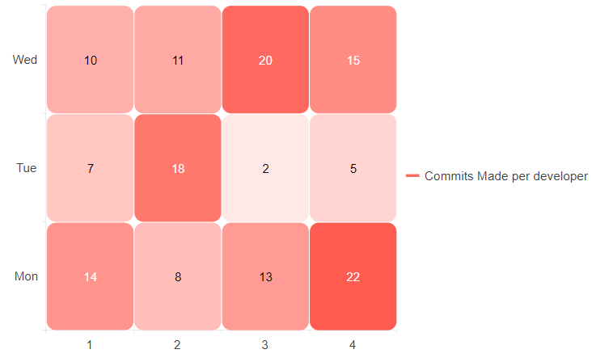
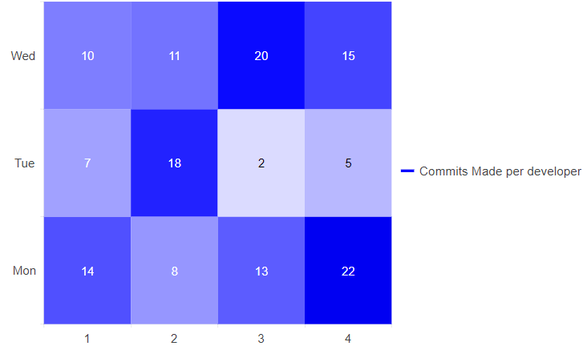
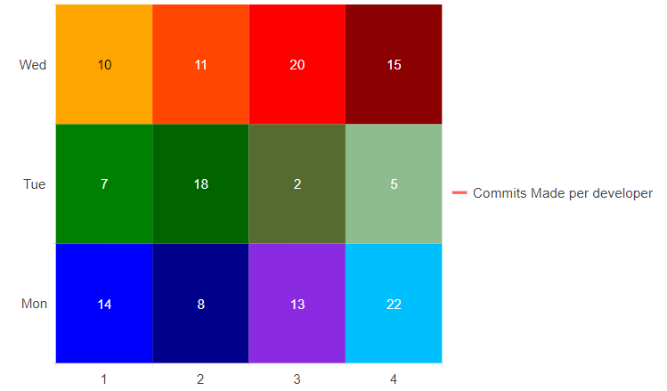
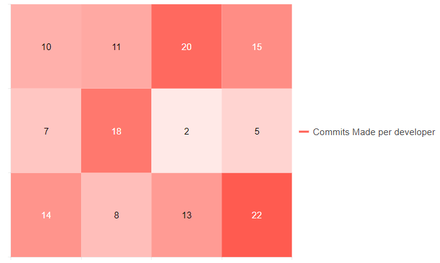

# Heatmap Chart

The <a href="https://www.telerik.com/blazor-ui/heatmap-chart" target="_blank">Blazor Heatmap chart</a> shows the data in a grid-like structure that shows the magnitude of a value over two dimensions.


#### In this article:

* [Basics](#basics)

* [Data Binding Notes](#data-binding-notes)

* [Heatmap Chart Specific Appearance Settings](#heatmap-chart-specific-appearance-settings)

    * [Setting the Marker Type](#setting-the-marker-type)
    * [Color](#color)
    * [ColorField](#colorfield)
    * [Customize Chart Elements - Nested Tags Settings](#customize-chart-elements--nested-tags-settings)

>caption Heatmap chart. Results from the first code snippet below



@[template](/_contentTemplates/chart/link-to-basics.md#understand-basics-and-databinding-first)

#### To create a Heatmap chart:

1. add a `ChartSeries` to the `ChartSeriesItems` collection
2. set its `Type` property to `ChartSeriesType.Heatmap`
3. provide a data collection to its `Data` property and set the corresponding attributes:
    *  `XField` - the field that will be displayed on the X-axis
    *  `YField` - the field that will be displayed on the Y-axis
    *  `Field` - the field that will be rendered in the contents of the Heatmap Chart
4. optionally, provide data for the X and Y axes `Categories`


>caption A Heatmap Chart that shows commits made by developers

````CSHTML
@*Heatmap series*@

<TelerikChart>
    <ChartSeriesItems>
        <ChartSeries Type="@ChartSeriesType.Heatmap"
                     Name="Commits Made per developer"
                     Data="@HeatmapData"
                     XField="@(nameof(MyHeatmapDataModel.Week))"
                     YField="@(nameof(MyHeatmapDataModel.Day))"
                     Field="@(nameof(MyHeatmapDataModel.CommitsNumber))">

        </ChartSeries>
    </ChartSeriesItems>
</TelerikChart>

@code {
    public List<MyHeatmapDataModel> HeatmapData { get; set; }

    protected override void OnInitialized()
    {
        HeatmapData = GetMyHeatmapData();
    }

    private List<MyHeatmapDataModel> GetMyHeatmapData()
    {
        List<MyHeatmapDataModel> data = new List<MyHeatmapDataModel>()
        {
            new MyHeatmapDataModel("John", 14, 1, "Mon"),
            new MyHeatmapDataModel("Idell", 8, 2, "Mon"),
            new MyHeatmapDataModel("Ines", 13, 3, "Mon"),
            new MyHeatmapDataModel("Stephen", 22, 4, "Mon"),
            new MyHeatmapDataModel("John", 7, 1, "Tue"),
            new MyHeatmapDataModel("Idell", 18, 2, "Tue"),
            new MyHeatmapDataModel("Ines", 2, 3, "Tue"),
            new MyHeatmapDataModel("Stephen", 5, 4, "Tue"),
            new MyHeatmapDataModel("John", 10, 1, "Wed"),
            new MyHeatmapDataModel("Idell", 11, 2, "Wed"),
            new MyHeatmapDataModel("Ines", 20, 3, "Wed"),
            new MyHeatmapDataModel("Stephen", 15, 4, "Wed")
        };

        return data;
    }

    public class MyHeatmapDataModel
    {
        public MyHeatmapDataModel() { }

        public MyHeatmapDataModel(string devName, int commits, int week, string day)
        {
            DeveloperName = devName;
            CommitsNumber = commits;
            Week = week;
            Day = day;
        }

        public string DeveloperName { get; set; }
        public int CommitsNumber { get; set; }
        public int Week { get; set; }
        public string Day { get; set; }
    }
}
````


## Data Binding Notes

When you are data binding the Heatmap Chart you should have the following points under consideration:

* When you have set a value for the `XField` and `YField` attributes, you do not have to provide an `object[]` to the `Categories` attribute of the `<ChartXAxis>`, and the `<ChartYAxis>`.
    * If you define both `X/YField` and the `<ChartX/YAxis>` the items must match, otherwise blank data items will be rendered in the Heatmap content. 
    

>caption Heatmap Chart where the data for the `Categories` does not match the `YField` value. **Problematic behavior**. The result from the code snippet below.




````CSHTML
@* Observe the behavior of the Heatmap chart when the values for the YAxis Categories does not match the values provided to the YField. The same behavior extends to the XAxis and XField. *@

<TelerikChart>
    <ChartSeriesItems>
        <ChartSeries Type="@ChartSeriesType.Heatmap"
                     Name="Commits Made per developer"
                     Data="@HeatmapData"
                     XField="@(nameof(MyHeatmapDataModel.Week))"
                     YField="@(nameof(MyHeatmapDataModel.Day))"
                     Field="@(nameof(MyHeatmapDataModel.CommitsNumber))">

        </ChartSeries>
    </ChartSeriesItems>

    <ChartYAxes>
        <ChartYAxis Categories="@YAxisCategories"></ChartYAxis>
    </ChartYAxes>
</TelerikChart>

@code {
    public List<MyHeatmapDataModel> HeatmapData { get; set; }

    //This line causes the problematic behavior. Change the values to Mon, Tue, Wed to fix that.
    public object[] YAxisCategories { get; set; } = new object[] { "Monday", "Tuesday", "Wednesday" };

    protected override void OnInitialized()
    {
        HeatmapData = GetMyHeatmapData();
    }

    private List<MyHeatmapDataModel> GetMyHeatmapData()
    {
        List<MyHeatmapDataModel> data = new List<MyHeatmapDataModel>()
        {       
            new MyHeatmapDataModel("John", 14, 1, "Mon"),
            new MyHeatmapDataModel("Idell", 8, 2, "Mon"),
            new MyHeatmapDataModel("Ines", 13, 3, "Mon"),
            new MyHeatmapDataModel("Stephen", 22, 4, "Mon"),
            new MyHeatmapDataModel("John", 7, 1, "Tue"),
            new MyHeatmapDataModel("Idell", 18, 2, "Tue"),
            new MyHeatmapDataModel("Ines", 2, 3, "Tue"),
            new MyHeatmapDataModel("Stephen", 5, 4, "Tue"),
            new MyHeatmapDataModel("John", 10, 1, "Wed"),
            new MyHeatmapDataModel("Idell", 11, 2, "Wed"),
            new MyHeatmapDataModel("Ines", 20, 3, "Wed"),
            new MyHeatmapDataModel("Stephen", 15, 4, "Wed")
        };

        return data;
    }

    public class MyHeatmapDataModel
    {
        public MyHeatmapDataModel() { }

        public MyHeatmapDataModel(string devName, int commits, int week, string day)
        {
            DeveloperName = devName;
            CommitsNumber = commits;
            Week = week;
            Day = day;
        }

        public string DeveloperName { get; set; }
        public int CommitsNumber { get; set; }
        public int Week { get; set; }
        public string Day { get; set; }
    }
}
````
 
## Heatmap Chart Specific Appearance Settings


### Setting the Marker Type

To change the marker type you should set the `Type` parameter, exposed on the `ChartSeriesMarkers` tag (child tag of the `<ChartSeries>`). It takes a member of the Telerik.Blazor.Components.ChartSeriesMarkersType enum:

* `Rect` - the default value - specifies a rectangular form of the marker.

* `RoundedRect` - specifies a rectangle with rounded edges form of the marker. 

>caption Change the Type of the marker. The result from the code snippet below.



````CSHTML
@* Set the type of the marker to RoundedRect *@

<TelerikChart>
    <ChartSeriesItems>
        <ChartSeries Type="@ChartSeriesType.Heatmap"
                     Name="Commits Made per developer"
                     Data="@HeatmapData"
                     XField="@(nameof(MyHeatmapDataModel.Week))"
                     YField="@(nameof(MyHeatmapDataModel.Day))"
                     Field="@(nameof(MyHeatmapDataModel.CommitsNumber))">
            <ChartSeriesMarkers Type="@ChartSeriesMarkersType.RoundedRect"
                                BorderRadius="10">
            </ChartSeriesMarkers>
        </ChartSeries>
    </ChartSeriesItems>
</TelerikChart>

@code {
    public List<MyHeatmapDataModel> HeatmapData { get; set; }

    protected override void OnInitialized()
    {
        HeatmapData = GetMyHeatmapData();
    }

    private List<MyHeatmapDataModel> GetMyHeatmapData()
    {
        List<MyHeatmapDataModel> data = new List<MyHeatmapDataModel>()
        {       
            new MyHeatmapDataModel("John", 14, 1, "Mon"),
            new MyHeatmapDataModel("Idell", 8, 2, "Mon"),
            new MyHeatmapDataModel("Ines", 13, 3, "Mon"),
            new MyHeatmapDataModel("Stephen", 22, 4, "Mon"),
            new MyHeatmapDataModel("John", 7, 1, "Tue"),
            new MyHeatmapDataModel("Idell", 18, 2, "Tue"),
            new MyHeatmapDataModel("Ines", 2, 3, "Tue"),
            new MyHeatmapDataModel("Stephen", 5, 4, "Tue"),
            new MyHeatmapDataModel("John", 10, 1, "Wed"),
            new MyHeatmapDataModel("Idell", 11, 2, "Wed"),
            new MyHeatmapDataModel("Ines", 20, 3, "Wed"),
            new MyHeatmapDataModel("Stephen", 15, 4, "Wed")
        };

        return data;
    }

    public class MyHeatmapDataModel
    {
        public MyHeatmapDataModel() { }

        public MyHeatmapDataModel(string devName, int commits, int week, string day)
        {
            DeveloperName = devName;
            CommitsNumber = commits;
            Week = week;
            Day = day;
        }

        public string DeveloperName { get; set; }
        public int CommitsNumber { get; set; }
        public int Week { get; set; }
        public string Day { get; set; }
    }
}
````

### Color

The `Color` parameter controls the general color pallete for the markers of the Heatmap. The invidual marker color set to the markers depends the value bound to the `Field` - the higher the value the darker the color. 

>caption Change the Color of the Heatmap. The result from the code snippet below.



````CSHTML
@* Set the color of the Heatmap to blue. *@

<TelerikChart>
    <ChartSeriesItems>
        <ChartSeries Type="@ChartSeriesType.Heatmap"
                     Name="Commits Made per developer"
                     Data="@HeatmapData"
                     XField="@(nameof(MyHeatmapDataModel.Week))"
                     YField="@(nameof(MyHeatmapDataModel.Day))"
                     Field="@(nameof(MyHeatmapDataModel.CommitsNumber))"
                     Color="blue">
        </ChartSeries>
    </ChartSeriesItems>
</TelerikChart>

@code {
    public List<MyHeatmapDataModel> HeatmapData { get; set; }

    protected override void OnInitialized()
    {
        HeatmapData = GetMyHeatmapData();
    }

    private List<MyHeatmapDataModel> GetMyHeatmapData()
    {
        List<MyHeatmapDataModel> data = new List<MyHeatmapDataModel>()
        {       
            new MyHeatmapDataModel("John", 14, 1, "Mon"),
            new MyHeatmapDataModel("Idell", 8, 2, "Mon"),
            new MyHeatmapDataModel("Ines", 13, 3, "Mon"),
            new MyHeatmapDataModel("Stephen", 22, 4, "Mon"),
            new MyHeatmapDataModel("John", 7, 1, "Tue"),
            new MyHeatmapDataModel("Idell", 18, 2, "Tue"),
            new MyHeatmapDataModel("Ines", 2, 3, "Tue"),
            new MyHeatmapDataModel("Stephen", 5, 4, "Tue"),
            new MyHeatmapDataModel("John", 10, 1, "Wed"),
            new MyHeatmapDataModel("Idell", 11, 2, "Wed"),
            new MyHeatmapDataModel("Ines", 20, 3, "Wed"),
            new MyHeatmapDataModel("Stephen", 15, 4, "Wed")
        };

        return data;
    }

    public class MyHeatmapDataModel
    {
        public MyHeatmapDataModel() { }

        public MyHeatmapDataModel(string devName, int commits, int week, string day)
        {
            DeveloperName = devName;
            CommitsNumber = commits;
            Week = week;
            Day = day;
        }

        public string DeveloperName { get; set; }
        public int CommitsNumber { get; set; }
        public int Week { get; set; }
        public string Day { get; set; }
    }
}
````

### ColorField

The `ColorField` parameter allows you to control the color of an individual marker in the content of the Heatmap. If you do not provide a color in the field bound to the `ColorField` the Heatmap will render white markers.

>caption Provide a custom color to all markers in the Heatmap. The result from the code snippet below.



````CSHTML
@* Use the ColorField to provide custom color to each individual marker *@ 

<TelerikChart>
    <ChartSeriesItems>
        <ChartSeries Type="@ChartSeriesType.Heatmap"
                     Name="Commits Made per developer"
                     Data="@HeatmapData"
                     XField="@(nameof(MyHeatmapDataModel.Week))"
                     YField="@(nameof(MyHeatmapDataModel.Day))"
                     Field="@(nameof(MyHeatmapDataModel.CommitsNumber))"
                     ColorField="@(nameof(MyHeatmapDataModel.Color))">
        </ChartSeries>
    </ChartSeriesItems>
</TelerikChart>

@code {
    public List<MyHeatmapDataModel> HeatmapData { get; set; }

    protected override void OnInitialized()
    {
        HeatmapData = GetMyHeatmapData();
    }

    private List<MyHeatmapDataModel> GetMyHeatmapData()
    {
        List<MyHeatmapDataModel> data = new List<MyHeatmapDataModel>()
        {
            new MyHeatmapDataModel("blue","John", 14, 1, "Mon"),
            new MyHeatmapDataModel("darkblue", "Idell", 8, 2, "Mon"),
            new MyHeatmapDataModel("blueviolet", "Ines", 13, 3, "Mon"),
            new MyHeatmapDataModel("deepskyblue", "Stephen", 22, 4, "Mon"),
            new MyHeatmapDataModel("green", "John", 7, 1, "Tue"),
            new MyHeatmapDataModel("darkgreen", "Idell", 18, 2, "Tue"),
            new MyHeatmapDataModel("darkolivegreen", "Ines", 2, 3, "Tue"),
            new MyHeatmapDataModel("darkseagreen", "Stephen", 5, 4, "Tue"),
            new MyHeatmapDataModel("orange", "John", 10, 1, "Wed"),
            new MyHeatmapDataModel("orangered", "Idell", 11, 2, "Wed"),
            new MyHeatmapDataModel("red", "Ines", 20, 3, "Wed"),
            new MyHeatmapDataModel("darkred", "Stephen", 15, 4, "Wed")
        };

        return data;
    }

    public class MyHeatmapDataModel
    {
        public MyHeatmapDataModel() { }

        public MyHeatmapDataModel(string color, string devName, int commits, int week, string day)
        {
            Color = color;
            DeveloperName = devName;
            CommitsNumber = commits;
            Week = week;
            Day = day;
        }

        public string Color { get; set; }
        public string DeveloperName { get; set; }
        public int CommitsNumber { get; set; }
        public int Week { get; set; }
        public string Day { get; set; }
    }
}
````


@[template](/_contentTemplates/chart/link-to-basics.md#configurable-nested-chart-settings)

@[template](/_contentTemplates/chart/link-to-basics.md#configurable-nested-chart-settings-axis-free)

>caption Hide the Labels for both X and Y axes. The result of the code snippet below.



````CSHTML
@* Use the nested tag settings to hide the labels for both axes *@

<TelerikChart>
    <ChartSeriesItems>
        <ChartSeries Type="@ChartSeriesType.Heatmap"
                     Name="Commits Made per developer"
                     Data="@HeatmapData"
                     XField="@(nameof(MyHeatmapDataModel.Week))"
                     YField="@(nameof(MyHeatmapDataModel.Day))"
                     Field="@(nameof(MyHeatmapDataModel.CommitsNumber))">
        </ChartSeries>
    </ChartSeriesItems>

    <ChartXAxes>
        <ChartXAxis>
            <ChartXAxisLabels Visible="false"></ChartXAxisLabels>
        </ChartXAxis>
    </ChartXAxes>

    <ChartYAxes>
        <ChartYAxis>
            <ChartYAxisLabels Visible="false"></ChartYAxisLabels>
        </ChartYAxis>
    </ChartYAxes>
</TelerikChart>

@code {
    public List<MyHeatmapDataModel> HeatmapData { get; set; }

    protected override void OnInitialized()
    {
        HeatmapData = GetMyHeatmapData();
    }

    private List<MyHeatmapDataModel> GetMyHeatmapData()
    {
        List<MyHeatmapDataModel> data = new List<MyHeatmapDataModel>()
        {       
            new MyHeatmapDataModel("John", 14, 1, "Mon"),
            new MyHeatmapDataModel("Idell", 8, 2, "Mon"),
            new MyHeatmapDataModel("Ines", 13, 3, "Mon"),
            new MyHeatmapDataModel("Stephen", 22, 4, "Mon"),
            new MyHeatmapDataModel("John", 7, 1, "Tue"),
            new MyHeatmapDataModel("Idell", 18, 2, "Tue"),
            new MyHeatmapDataModel("Ines", 2, 3, "Tue"),
            new MyHeatmapDataModel("Stephen", 5, 4, "Tue"),
            new MyHeatmapDataModel("John", 10, 1, "Wed"),
            new MyHeatmapDataModel("Idell", 11, 2, "Wed"),
            new MyHeatmapDataModel("Ines", 20, 3, "Wed"),
            new MyHeatmapDataModel("Stephen", 15, 4, "Wed")
        };

        return data;
    }

    public class MyHeatmapDataModel
    {
        public MyHeatmapDataModel() { }

        public MyHeatmapDataModel(string devName, int commits, int week, string day)
        {
            DeveloperName = devName;
            CommitsNumber = commits;
            Week = week;
            Day = day;
        }

        public string DeveloperName { get; set; }
        public int CommitsNumber { get; set; }
        public int Week { get; set; }
        public string Day { get; set; }
    }
}
````

## See Also

  * [Live Demo: Heatmap Chart](https://demos.telerik.com/blazor-ui/chart/heatmap-chart)
