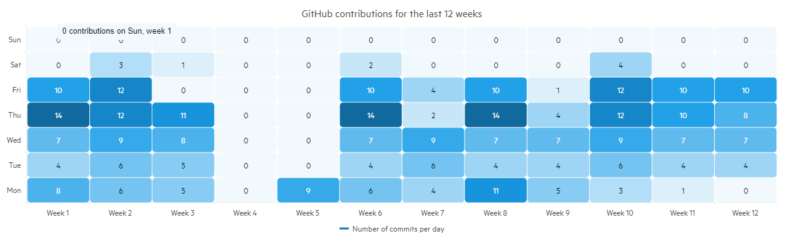
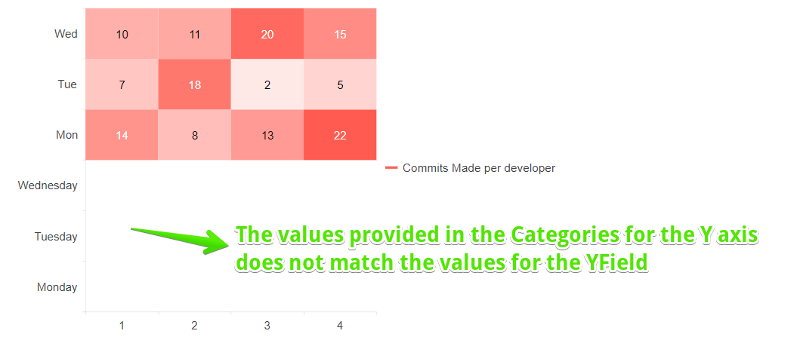

# Heatmap Chart

The <a href="https://www.telerik.com/blazor-ui/heatmap" target="_blank">Blazor Heatmap chart</a> shows the data in a grid-like structure that shows the magnitude of a value over two dimensions.



#### In this article:

* [Data Binding Notes](#data-binding-notes)
* [Heatmap Chart Specific Appearance Settings](#heatmap-chart-specific-appearance-settings)
    * [Setting the Marker Type](#setting-the-marker-type)
    * [Color](#color)
    * [ColorField](#colorfield)
    * [Handling Long Y-axis Labels](#handling-long-y-axis-labels)
    * [Customize Chart Elements - Nested Tags Settings](#customize-chart-elements-nested-tags-settings)

@[template](/_contentTemplates/chart/link-to-basics.md#understand-basics-and-databinding-first)

#### To create a Heatmap chart:

1. add a `ChartSeries` to the `ChartSeriesItems` collection
2. set its `Type` property to `ChartSeriesType.Heatmap`
3. provide a data collection to its `Data` property and set the corresponding attributes:
    *  `XField` - the field that will be displayed on the X-axis
    *  `YField` - the field that will be displayed on the Y-axis
    *  `Field` - the field that will be rendered in the contents of the Heatmap Chart
4. optionally, provide data for the X and Y axes `Categories`


>caption A Heatmap Chart that shows commits made by developers

<demo metaUrl="client/chart/types/heatmap/overview/" height="500"></demo>

## Data Binding Notes

When you are data binding the Heatmap Chart you should have the following points under consideration:

* When you have set a value for the `XField` and `YField` attributes, you do not have to provide an `object[]` to the `Categories` attribute of the `<ChartXAxis>`, and the `<ChartYAxis>`.
    * If you define both `X/YField` and the `<ChartX/YAxis>` the items must match, otherwise blank data items will be rendered in the Heatmap content. 
    

>caption Heatmap Chart where the data for the `Categories` does not match the `YField` value. **Problematic behavior**. The result from the code snippet below.




<demo metaUrl="client/chart/types/heatmap/categories-mismatch/" height="500"></demo>

## Heatmap Chart Specific Appearance Settings


### Setting the Marker Type

To change the marker type you should set the `Type` parameter, exposed on the `ChartSeriesMarkers` tag (child tag of the `<ChartSeries>`). It takes a member of the Telerik.Blazor.Components.ChartSeriesMarkersType enum:

* `Rect` - the default value - specifies a rectangular form of the marker.

* `RoundedRect` - specifies a rectangle with rounded edges form of the marker. 

>caption Change the Type of the marker.

<demo metaUrl="client/chart/types/heatmap/marker-type/" height="500"></demo>

### Color

The `Color` parameter controls the general color palette for the markers of the Heatmap. The individual marker color set to the markers depends the value bound to the `Field` - the higher the value the darker the color. 

>caption Change the Color of the Heatmap.

<demo metaUrl="client/chart/types/heatmap/color/" height="500"></demo>

### ColorField

The `ColorField` parameter allows you to control the color of an individual marker in the content of the Heatmap. If you do not provide a color in the field bound to the `ColorField` the Heatmap will render white markers.

>caption Provide a custom color to all markers in the Heatmap.

<demo metaUrl="client/chart/types/heatmap/color-field/" height="500"></demo>
````RAZOR
@* Use the ColorField to provide custom color to each individual marker *@

<TelerikChart>
    <ChartSeriesItems>
        <ChartSeries Type="@ChartSeriesType.Heatmap"
                     Name="Commits Made per developer"
                     Data="@HeatmapData"
                     XField="@(nameof(MyHeatmapDataModel.Week))"
                     YField="@(nameof(MyHeatmapDataModel.Day))"
                     Field="@(nameof(MyHeatmapDataModel.CommitsNumber))"
                     ColorField="@(nameof(MyHeatmapDataModel.Color))">
        </ChartSeries>
    </ChartSeriesItems>
</TelerikChart>

@code {
    public List<MyHeatmapDataModel> HeatmapData { get; set; }

    protected override void OnInitialized()
    {
        HeatmapData = GetMyHeatmapData();
    }

    private List<MyHeatmapDataModel> GetMyHeatmapData()
    {
        List<MyHeatmapDataModel> data = new List<MyHeatmapDataModel>()
        {
            new MyHeatmapDataModel("blue","John", 14, 1, "Mon"),
            new MyHeatmapDataModel("darkblue", "Idell", 8, 2, "Mon"),
            new MyHeatmapDataModel("blueviolet", "Ines", 13, 3, "Mon"),
            new MyHeatmapDataModel("deepskyblue", "Stephen", 22, 4, "Mon"),
            new MyHeatmapDataModel("green", "John", 7, 1, "Tue"),
            new MyHeatmapDataModel("darkgreen", "Idell", 18, 2, "Tue"),
            new MyHeatmapDataModel("darkolivegreen", "Ines", 2, 3, "Tue"),
            new MyHeatmapDataModel("darkseagreen", "Stephen", 5, 4, "Tue"),
            new MyHeatmapDataModel("orange", "John", 10, 1, "Wed"),
            new MyHeatmapDataModel("orangered", "Idell", 11, 2, "Wed"),
            new MyHeatmapDataModel("red", "Ines", 20, 3, "Wed"),
            new MyHeatmapDataModel("darkred", "Stephen", 15, 4, "Wed")
        };

        return data;
    }

    public class MyHeatmapDataModel
    {
        public MyHeatmapDataModel() { }

        public MyHeatmapDataModel(string color, string devName, int commits, int week, string day)
        {
            Color = color;
            DeveloperName = devName;
            CommitsNumber = commits;
            Week = week;
            Day = day;
        }

        public string Color { get; set; }
        public string DeveloperName { get; set; }
        public int CommitsNumber { get; set; }
        public int Week { get; set; }
        public string Day { get; set; }
    }
}
````

### Handling Long Y-axis Labels

The Heatmap Y axis displays categories from the `YField` or the `Categories` collection. These categories can be text, such as names or descriptions. To prevent long labels from being truncated, use the settings under `ChartYAxisLabels` to adjust the label font, margin, position, or density. You can also rotate labels with the nested `ChartYAxisLabelsRotation` tag or provide custom label text through the `Template` parameter.

The Chart does not provide a Heatmap-specific parameter that automatically wraps Y-axis labels. If the labels still do not fit, increase the available chart width, shorten the category text, or hide the labels when the category information is available elsewhere. For general label rotation and density examples, see [Prevent crowded labels in the Chart](slug:chart-kb-crowded-labels). For custom label output and line breaks, see [Label Template and Format](slug:components/chart/label-template-format).


@[template](/_contentTemplates/chart/link-to-basics.md#configurable-nested-chart-settings)

@[template](/_contentTemplates/chart/link-to-basics.md#configurable-nested-chart-settings-axis-free)

>caption Hide the Labels for both X and Y axes.

<demo metaUrl="client/chart/types/heatmap/hide-axis-labels/" height="500"></demo>

## See Also

* [Live Demo: Heatmap Chart](https://demos.telerik.com/blazor-ui/chart/heatmap-chart)
