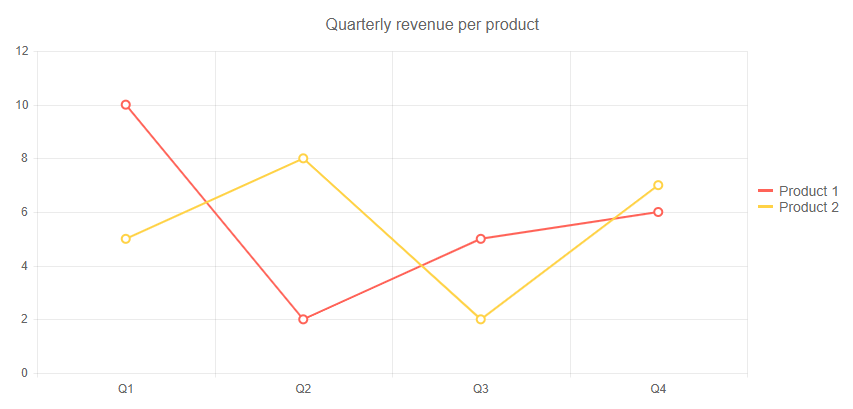
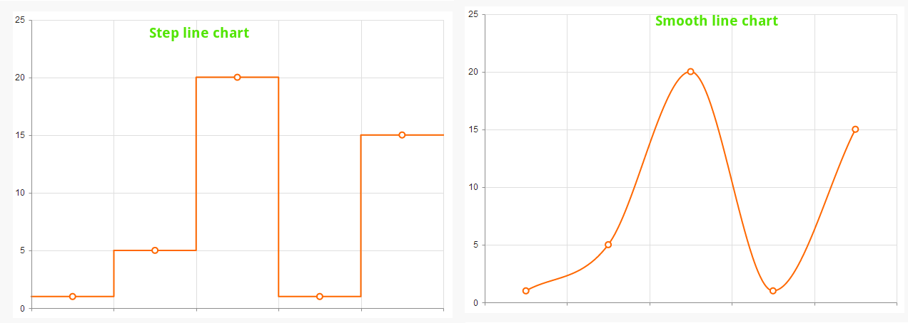

# Line Chart

A **Line** chart displays data as continuous lines that pass through points defined by the values of their items. It is useful for rendering a trend over time and comparing several sets of similar data.

>caption Line chart.  Results from the first code snippet below



@[template](/_contentTemplates/chart/link-to-basics.md#understand-basics-and-databinding-first)

To create a line chart:

1. add a `TelerikChartSeries` to the `TelerikChartSeriesItems` collection
2. set its `Type` property to `ChartSeriesType.Line`
3. provide a data collection to its `Data` property
4. optionally, provide data for the x-axis `Categories`


>caption A line chart that shows product revenues

````CSHTML
@using Telerik.Blazor
@using Telerik.Blazor.Components.Chart

<TelerikChart>
	<ChartSeriesItems>
		<ChartSeries Type="ChartSeriesType.Line" Name="Product 1" Data="@series1Data">
		</ChartSeries>
		<ChartSeries Type="ChartSeriesType.Line" Name="Product 2" Data="@series2Data">
		</ChartSeries>
	</ChartSeriesItems>

	<ChartCategoryAxes>
		<ChartCategoryAxis Categories="@xAxisItems"></ChartCategoryAxis>
	</ChartCategoryAxes>

	<ChartTitle Text="Quarterly revenue per product"></ChartTitle>

	<ChartLegend Position="ChartLegendPosition.Right">
	</ChartLegend>
</TelerikChart>

@code {
	public List<object> series1Data = new List<object>() { 10, 2, 5, 6 };
	public List<object> series2Data = new List<object>() { 5, 8, 2, 7 };
	public string[] xAxisItems = new string[] { "Q1", "Q2", "Q3", "Q4" };
}
````


## Line Chart Specific Appearance Settings

## Markers

Each data item is denoted by a marker. You can control its settings through the child `TelerikChartSeriesMarkers` tag of the series.

You can hide the markers by setting their `Visible` property to `false`.

The `Size` property is the size of the marker in pixels.

The `Type` property is a member of the `Telerik.Blazor.ChartSeriesMarkersType` enum:

* `Circle` - the default
* `Cross`
* `Square`
* `Triangle`

The `Rotation` property is the degrees with which the marker is rotated from its default orientation.

### Color

The color of the line is controlled through the `Color` property that can take any valid CSS color (for example, `#abcdef`, `#f00`, or `blue`).

You can control the color of the markers by using the `Background` property of the nested `TelerikChartSeriesMarkers` tag.

### Missing Values

If some values are missing from the series data (they are `null`), you can have the chart work around this by setting the `MissingValues` property of the series to the desired behavior (member of the `Telerik.Blazor.ChartSeriesMissingValues` enum):

* `Zero` - the default behavior. The line goes to the 0 value mark.
* `Interpolate` - the line will go through the interpolated value of the missing data points and connect to the next data point with a value.
* `Gap` - behaves the same way as `Zero` because a line chart cannot have a gap in its filled area.


### Line Style

You can render the lines between the points with different styles. The supported styles can be set via the `Style` property that takes a member of `Telerik.Blazor.ChartSeriesStyle` enum:

* `Normal`—This is the default style. It produces a straight line between data points.
* `Step`—The style renders the connection between data points through vertical and horizontal lines. It is suitable for indicating that the value is constant between the changes.
* `Smooth`—This style causes the Area Chart to display a fitted curve through data points. It is suitable when the data requires to be displayed with a curve, or when you wish to connect the points with smooth instead of straight lines.

>caption Comparison between the line styles




## See Also

  * [Live Demo: Line Chart](https://demos.telerik.com/blazor-ui/chart/line-chart)
