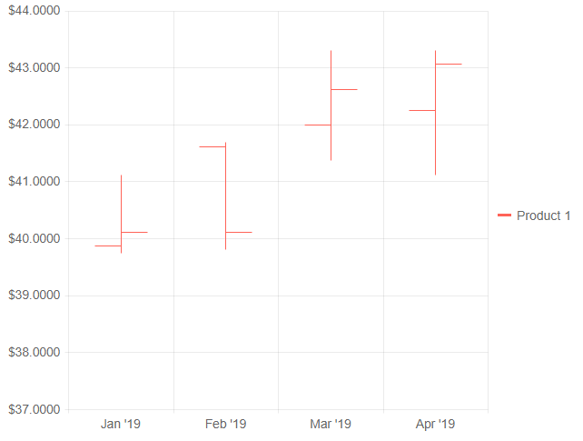

# OHLC Chart

The **OHLC** (open-high-low-close) chart is typically used to illustrate movements in the price of a financial instrument over time. Each vertical line on the chart shows the price range (the highest and lowest prices) over a period of time.

>caption OHLC chart. Results from the first code snippet below



@[template](/_contentTemplates/chart/link-to-basics.md#understand-basics-and-databinding-first)

#### To create an OHLC chart:

1. add a `ChartSeries` to the `ChartSeriesItems` collection
2. set its `Type` property to `ChartSeriesType.OHLC`
3. provide a data collection to its `Data` property and set the corresponding fields:
    * `CategoryField` - the date that will be matched to the x-axis
    * `OpenField` - the field with the Open value
    * `CloseField` - the field with the Close value
    * `HighField` - the field with the High value
    * `LowField` - the field with the Low value
4. make the x-axis a [Date axis]() - while the candlestick chart can work with simple string categories, it is designed to show financial data over time


>caption An OHLC chart that shows product financial stock data

````CSHTML
@* OHLC chart *@

<TelerikChart Height="480px" Width="640px">

    <ChartSeriesItems>
        <ChartSeries Type="@ChartSeriesType.OHLC"
                     Name="Product 1"
                     Data="@ChartProduct1Data"
                     CategoryField="@(nameof(StockDataPoint.Date))"
                     OpenField="@nameof(StockDataPoint.Open)"
                     CloseField="@nameof(StockDataPoint.Close)"
                     HighField="@nameof(StockDataPoint.High)"
                     LowField="@nameof(StockDataPoint.Low)">
        </ChartSeries>
    </ChartSeriesItems>

    <ChartCategoryAxes>
        <ChartCategoryAxis Type="@ChartCategoryAxisType.Date" BaseUnit="@ChartCategoryAxisBaseUnit.Months">
        </ChartCategoryAxis>
    </ChartCategoryAxes>

    <ChartValueAxes>
        <ChartValueAxis>
            <ChartValueAxisLabels Format="{0:C4}"></ChartValueAxisLabels>
        </ChartValueAxis>
    </ChartValueAxes>

</TelerikChart>

@code {
    List<StockDataPoint> ChartProduct1Data { get; set; }

    protected override async Task OnInitializedAsync()
    {
        await GenerateChartData();
    }

    async Task GenerateChartData()
    {
        ChartProduct1Data = new List<StockDataPoint>()
        {
            new StockDataPoint(new DateTime(2019, 1, 1), 39.88m, 40.12m, 41.12m, 39.75m, 3584700),
            new StockDataPoint(new DateTime(2019, 2, 1), 41.62m, 40.12m, 41.69m, 39.81m, 2632000),
            new StockDataPoint(new DateTime(2019, 3, 1), 42m, 42.62m, 43.31m, 41.38m, 7631700),
            new StockDataPoint(new DateTime(2019, 4, 1), 42.25m, 43.06m, 43.31m, 41.12m, 4922200),
        };

        await Task.FromResult(ChartProduct1Data);
    }

    public class StockDataPoint
    {
        public StockDataPoint() { }

        public StockDataPoint(DateTime date, decimal open, decimal close, decimal high, decimal low, int volume)
        {
            Date = date;
            Open = open;
            Close = close;
            High = high;
            Low = low;
            Volume = volume;
        }
        public DateTime Date { get; set; }

        public decimal Open { get; set; }

        public decimal Close { get; set; }

        public decimal High { get; set; }

        public decimal Low { get; set; }

        public int Volume { get; set; }
    }
}
````


## OHLC Chart Specific Appearance Settings


@[template](/_contentTemplates/stockchart/link-to-basics.md#color-field-column-ohlc-candlestick)

@[template](/_contentTemplates/chart/link-to-basics.md#gap-and-spacing)

@[template](/_contentTemplates/chart/link-to-basics.md#configurable-nested-chart-settings)


## See Also

 * [Live Demo: OHLC Chart](https://demos.telerik.com/blazor-ui/chart/ohlc-chart)
