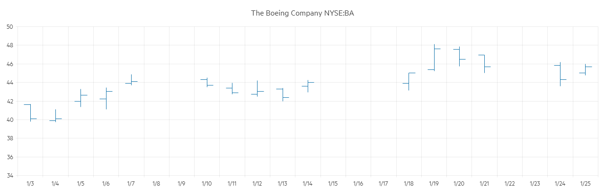

# OHLC Chart

The <a href="https://www.telerik.com/blazor-ui/ohlc-chart" target="_blank">OHLC (open-high-low-close) chart </a> is typically used to illustrate movements in the price of a financial instrument over time. Each vertical line on the chart shows the price range (the highest and lowest prices) over a period of time.

@[template](/_contentTemplates/chart/link-to-basics.md#understand-basics-and-databinding-first)

#### To create an OHLC chart:

1. add a `ChartSeries` to the `ChartSeriesItems` collection
2. set its `Type` property to `ChartSeriesType.OHLC`
3. provide a data collection to its `Data` property and set the corresponding fields:
    * `CategoryField` - the date that will be matched to the x-axis
    * `OpenField` - the field with the Open value
    * `CloseField` - the field with the Close value
    * `HighField` - the field with the High value
    * `LowField` - the field with the Low value
4. make the x-axis a [Date axis](slug:components/chart/date-axis) - while the candlestick chart can work with simple string categories, it is designed to show financial data over time

>caption An OHLC chart that shows product financial stock data

<demo metaUrl="client/chart/types/ohlc/" height="560"></demo>

## OHLC Chart Specific Appearance Settings

@[template](/_contentTemplates/stockchart/link-to-basics.md#color-field-column-ohlc-candlestick)

@[template](/_contentTemplates/chart/link-to-basics.md#gap-and-spacing)

@[template](/_contentTemplates/chart/link-to-basics.md#configurable-nested-chart-settings)

## See Also

* [Live Demo: OHLC Chart](https://demos.telerik.com/blazor-ui/chart/ohlc-chart)
