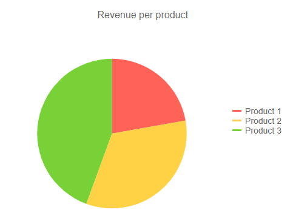
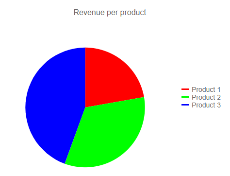
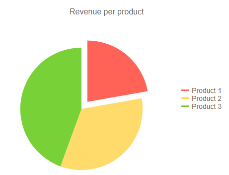
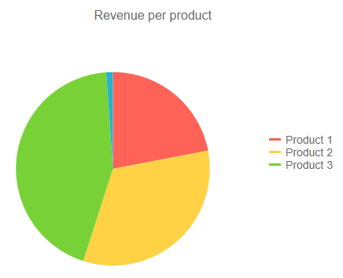

# Pie Chart

The **Pie** chart displays the data as sectors from a two-dimensional circle and is therefore useful for displaying data as parts of a whole. There can only be one series in a pie chart.

>caption Pie chart. Results from the first code snippet below



@[template](/_contentTemplates/chart/link-to-basics.md#understand-basics-and-databinding-first)

To create a pie chart:

1. add a `ChartSeries` to the `ChartSeriesItems` collection
2. set its `Type` property to `ChartSeriesType.Pie`
3. provide a data model collection to its `Data` property
4. set the `Field` and `CategoryField` properties to the corresponding fields in the model that carry the values and names that will be shown in the legend

If you use [simple data binding](#independent-series-binding) and only provide values, the chart will not render a legend.

>caption A pie chart that shows product revenues

````CSHTML
Pie series

<TelerikChart>
	<ChartSeriesItems>
		<ChartSeries Type="ChartSeriesType.Pie" Data="@pieData" 
							Field="@nameof(MyPieChartModel.SegmentValue)" CategoryField="@nameof(MyPieChartModel.SegmentName)">
		</ChartSeries>
	</ChartSeriesItems>

	<ChartTitle Text="Revenue per product"></ChartTitle>

	<ChartLegend Position="ChartLegendPosition.Right">
	</ChartLegend>
</TelerikChart>

@code {
	public class MyPieChartModel
	{
		public string SegmentName { get; set; }
		public double SegmentValue { get; set; }
	}
	
	public List<MyPieChartModel> pieData = new List<MyPieChartModel>
	{
		new MyPieChartModel
		{
			SegmentName = "Product 1",
			SegmentValue = 2
		},
		new MyPieChartModel
		{
			SegmentName = "Product 2",
			SegmentValue = 3
		},
		new MyPieChartModel
		{
			SegmentName = "Product 3",
			SegmentValue = 4
		}
	};
}
````

## Pie Chart Specific Appearance Settings

### Rotation

By default, the firt segment starts at the top. You can change that by using the `StartAngle` property of the series.

### Color Field

You can control the color of the individual segments of the pie chart by providing a string with the desired color in the model, and setting the `ColorField` of the series to it. You can pass a valid CSS color (for example, `#abcdef`, `#f00`, or `blue`).

````CSHTML
Set color to the pie chart items

<TelerikChart>
	<ChartSeriesItems>
		<ChartSeries Type="ChartSeriesType.Pie" Data="@pieData" ColorField="@nameof(MyPieChartModel.SegmentColor)"
							Field="@nameof(MyPieChartModel.SegmentValue)" CategoryField="@nameof(MyPieChartModel.SegmentName)">
		</ChartSeries>
	</ChartSeriesItems>

	<ChartTitle Text="Revenue per product"></ChartTitle>

	<ChartLegend Position="ChartLegendPosition.Right">
	</ChartLegend>
</TelerikChart>

@code {
	public class MyPieChartModel
	{
		public string SegmentName { get; set; }
		public double SegmentValue { get; set; }
		public string SegmentColor { get; set; }
	}
	
	public List<MyPieChartModel> pieData = new List<MyPieChartModel>
	{
		new MyPieChartModel
		{
			SegmentName = "Product 1",
			SegmentValue = 2,
			SegmentColor = "red"
		},
		new MyPieChartModel
		{
			SegmentName = "Product 2",
			SegmentValue = 3,
			SegmentColor = "#00ff00"
		},
		new MyPieChartModel
		{
			SegmentName = "Product 3",
			SegmentValue = 4,
			SegmentColor = "#00f"
		}
	};
}
````

>caption The result from the code snippet above



### Exploded Segment

You can have some of the segments of the pie separated from the rest of the circle with a small margin. This helps bring attention to them as outliers or as important bits that the viewer should focus on.

To explode (separate) a segment, use the `ExplodeField` property of the series and set it to a boolean field that indicates whether the segment is exploded. Only a `true` value explodes a segment, so you can use a nullable field as well and only provide values for the items you want separated.

>caption Exploded Items

````CSHTML
Separate items from the main body of the chart

<TelerikChart>
	<ChartSeriesItems>
		<ChartSeries Type="ChartSeriesType.Pie" Data="@pieData" ExplodeField="@nameof(MyPieChartModel.IsSeparated)"
							Field="@nameof(MyPieChartModel.SegmentValue)" CategoryField="@nameof(MyPieChartModel.SegmentName)">
		</ChartSeries>
	</ChartSeriesItems>

	<ChartTitle Text="Revenue per product"></ChartTitle>

	<ChartLegend Position="ChartLegendPosition.Right">
	</ChartLegend>
</TelerikChart>

@code {
	public class MyPieChartModel
	{
		public string SegmentName { get; set; }
		public double SegmentValue { get; set; }
		public bool? IsSeparated { get; set; }
	}
	
	public List<MyPieChartModel> pieData = new List<MyPieChartModel>
    {
		new MyPieChartModel
		{
			SegmentName = "Product 1",
			SegmentValue = 2,
			IsSeparated = true
		},
		new MyPieChartModel
		{
			SegmentName = "Product 2",
			SegmentValue = 3
		},
		new MyPieChartModel
		{
			SegmentName = "Product 3",
			SegmentValue = 4
		}
	};
}
````

>caption The result from the code snippet above



### Visible In Legend

You can hide certain segments from the legend (for example, if their contribution is insignificantly small). To do this, add a boolean field to the model and set its name to the `VisibleInLegendField` property of the pie series. The flags in this field will denote whether the particular item will be rendered in the legend.

>caption Hide segments from the legend

````CSHTML
Show only some items in the legend

<TelerikChart>
	<ChartSeriesItems>
		<ChartSeries Type="ChartSeriesType.Pie" Data="@pieData" VisibleInLegendField="@nameof(MyPieChartModel.ShouldShowInLegend)"
							Field="@nameof(MyPieChartModel.SegmentValue)" CategoryField="@nameof(MyPieChartModel.SegmentName)">
		</ChartSeries>
	</ChartSeriesItems>

	<ChartTitle Text="Revenue per product"></ChartTitle>

	<ChartLegend Position="ChartLegendPosition.Right">
	</ChartLegend>
</TelerikChart>

@code {
	public class MyPieChartModel
	{
		public string SegmentName { get; set; }
		public double SegmentValue { get; set; }
		public bool ShouldShowInLegend { get; set; } = true;
	}
	
	public List<MyPieChartModel> pieData = new List<MyPieChartModel>
	{
		new MyPieChartModel
		{
			SegmentName = "Product 1",
			SegmentValue = 2
		},
		new MyPieChartModel
		{
			SegmentName = "Product 2",
			SegmentValue = 3
		},
		new MyPieChartModel
		{
			SegmentName = "Product 3",
			SegmentValue = 4
		},
		new MyPieChartModel
		{
			SegmentName = "Insignificant Product",
			SegmentValue = 0.1,
			ShouldShowInLegend = false
		}
	};
}
````

>caption The result from the code snippet above



## See Also

  * [Live Demo: Pie Chart](https://demos.telerik.com/blazor-ui/chart/pie-chart)
  