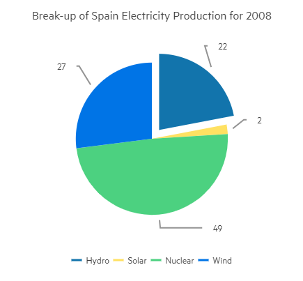

# Pie Chart

The <a href="https://www.telerik.com/blazor-ui/pie-chart" target="_blank">Blazor Pie chart</a> displays the data as sectors from a two-dimensional circle and is therefore useful for displaying data as parts of a whole. There can only be one series in a pie chart.



>caption Pie chart. Results from the first code snippet below

@[template](/_contentTemplates/chart/link-to-basics.md#understand-basics-and-databinding-first)

#### To create a pie chart:

1. add a `ChartSeries` to the `ChartSeriesItems` collection
2. set its `Type` property to `ChartSeriesType.Pie`
3. provide a data model collection to its `Data` property
4. set the `Field` and `CategoryField` properties to the corresponding fields in the model that carry the values and names that will be shown in the legend

If you use [simple data binding](slug://components/chart/databind#independent-series-binding) and only provide values, the chart will not render a legend.

>caption A pie chart that shows product revenues

````RAZOR
Pie series

<TelerikChart>
	<ChartSeriesItems>
		<ChartSeries Type="ChartSeriesType.Pie" Data="@pieData"
							Field="@nameof(MyPieChartModel.SegmentValue)" CategoryField="@nameof(MyPieChartModel.SegmentName)">
		</ChartSeries>
	</ChartSeriesItems>

	<ChartTitle Text="Revenue per product"></ChartTitle>

	<ChartLegend Position="ChartLegendPosition.Right">
	</ChartLegend>
</TelerikChart>

@code {
	public class MyPieChartModel
	{
		public string SegmentName { get; set; }
		public double SegmentValue { get; set; }
	}

	public List<MyPieChartModel> pieData = new List<MyPieChartModel>
	{
		new MyPieChartModel
		{
			SegmentName = "Product 1",
			SegmentValue = 2
		},
		new MyPieChartModel
		{
			SegmentName = "Product 2",
			SegmentValue = 3
		},
		new MyPieChartModel
		{
			SegmentName = "Product 3",
			SegmentValue = 4
		}
	};
}
````

## Rotation

By default, the first segment starts at the top. You can change that by using the `StartAngle` property of the series.

## Color Field

You can control the color of the individual segments of the pie chart by providing a string with the desired color in the model, and setting the `ColorField` of the series to it. You can pass a valid CSS color (for example, `#abcdef`, `#f00`, or `blue`).

````RAZOR
Set color to the pie chart items

<TelerikChart>
	<ChartSeriesItems>
		<ChartSeries Type="ChartSeriesType.Pie" Data="@pieData" ColorField="@nameof(MyPieChartModel.SegmentColor)"
							Field="@nameof(MyPieChartModel.SegmentValue)" CategoryField="@nameof(MyPieChartModel.SegmentName)">
		</ChartSeries>
	</ChartSeriesItems>

	<ChartTitle Text="Revenue per product"></ChartTitle>

	<ChartLegend Position="ChartLegendPosition.Right">
	</ChartLegend>
</TelerikChart>

@code {
	public class MyPieChartModel
	{
		public string SegmentName { get; set; }
		public double SegmentValue { get; set; }
		public string SegmentColor { get; set; }
	}

	public List<MyPieChartModel> pieData = new List<MyPieChartModel>
	{
		new MyPieChartModel
		{
			SegmentName = "Product 1",
			SegmentValue = 2,
			SegmentColor = "red"
		},
		new MyPieChartModel
		{
			SegmentName = "Product 2",
			SegmentValue = 3,
			SegmentColor = "#00ff00"
		},
		new MyPieChartModel
		{
			SegmentName = "Product 3",
			SegmentValue = 4,
			SegmentColor = "#00f"
		}
	};
}
````

## Exploded Segment

You can have some of the segments of the pie separated from the rest of the circle with a small margin. This helps bring attention to them as outliers or as important bits that the viewer should focus on.

To explode (separate) a segment, use the `ExplodeField` property of the series and set it to a boolean field that indicates whether the segment is exploded. Only a `true` value explodes a segment, so you can use a nullable field as well and only provide values for the items you want separated.

>caption Exploded Items

````RAZOR
Separate items from the main body of the chart

<TelerikChart>
	<ChartSeriesItems>
		<ChartSeries Type="ChartSeriesType.Pie" Data="@pieData" ExplodeField="@nameof(MyPieChartModel.IsSeparated)"
							Field="@nameof(MyPieChartModel.SegmentValue)" CategoryField="@nameof(MyPieChartModel.SegmentName)">
		</ChartSeries>
	</ChartSeriesItems>

	<ChartTitle Text="Revenue per product"></ChartTitle>

	<ChartLegend Position="ChartLegendPosition.Right">
	</ChartLegend>
</TelerikChart>

@code {
	public class MyPieChartModel
	{
		public string SegmentName { get; set; }
		public double SegmentValue { get; set; }
		public bool? IsSeparated { get; set; }
	}

	public List<MyPieChartModel> pieData = new List<MyPieChartModel>
    {
		new MyPieChartModel
		{
			SegmentName = "Product 1",
			SegmentValue = 2,
			IsSeparated = true
		},
		new MyPieChartModel
		{
			SegmentName = "Product 2",
			SegmentValue = 3
		},
		new MyPieChartModel
		{
			SegmentName = "Product 3",
			SegmentValue = 4
		}
	};
}
````

## Visible In Legend

You can hide certain segments from the legend (for example, if their contribution is insignificantly small). To do this, add a boolean field to the model and set its name to the `VisibleInLegendField` property of the pie series. The flags in this field will denote whether the particular item will be rendered in the legend.

>caption Hide segments from the legend

````RAZOR
Show only some items in the legend

<TelerikChart>
	<ChartSeriesItems>
		<ChartSeries Type="ChartSeriesType.Pie" Data="@pieData" VisibleInLegendField="@nameof(MyPieChartModel.ShouldShowInLegend)"
							Field="@nameof(MyPieChartModel.SegmentValue)" CategoryField="@nameof(MyPieChartModel.SegmentName)">
		</ChartSeries>
	</ChartSeriesItems>

	<ChartTitle Text="Revenue per product"></ChartTitle>

	<ChartLegend Position="ChartLegendPosition.Right">
	</ChartLegend>
</TelerikChart>

@code {
	public class MyPieChartModel
	{
		public string SegmentName { get; set; }
		public double SegmentValue { get; set; }
		public bool ShouldShowInLegend { get; set; } = true;
	}

	public List<MyPieChartModel> pieData = new List<MyPieChartModel>
	{
		new MyPieChartModel
		{
			SegmentName = "Product 1",
			SegmentValue = 2
		},
		new MyPieChartModel
		{
			SegmentName = "Product 2",
			SegmentValue = 3
		},
		new MyPieChartModel
		{
			SegmentName = "Product 3",
			SegmentValue = 4
		},
		new MyPieChartModel
		{
			SegmentName = "Insignificant Product",
			SegmentValue = 0.1,
			ShouldShowInLegend = false
		}
	};
}
````

## Width and Height

The main part of the Pie Chart is a circle. Thus, you may need to set both the `Width` and `Height` parameters to achieve the desired layout and dimensions. By default, the Chart container `<div>` expands horizontally to 100% and the height is set to `"400px"` in the CSS theme.

>caption Setting Pie Chart Width and Height

````RAZOR
Chart Width
<TelerikDropDownList Data="@ChartDimensions"
                     Value="@ChartWidth"
                     ValueChanged="@( async (string newValue) => {
                                          ChartWidth = newValue;
                                          await RefreshChart();
                                      } )"
                     DefaultText="100%"
                     Width="120px" />
Chart Height
<TelerikDropDownList Data="@ChartDimensions"
                     Value="@ChartHeight"
                     ValueChanged="@( async (string newValue) => {
                                          ChartHeight = newValue;
                                          await RefreshChart();
                                      } )"
                     Width="120px" />

Chart Legend Position
<TelerikDropDownList Data="@ChartLegendPositions"
                     @bind-Value="@ChartLegendPosition"
                     Width="120px" />

<TelerikChart @ref="ChartRef"
              Width="@ChartWidth"
              Height="@ChartHeight"
              Class="chart-border">
    <ChartSeriesItems>
        <ChartSeries Type="ChartSeriesType.Pie"
                     Data="@PieData"
                     Field="@nameof(PieChartModel.Value)"
                     CategoryField="@nameof(PieChartModel.Category)">
        </ChartSeries>
    </ChartSeriesItems>

    <ChartTitle Text="Revenue per product"></ChartTitle>

    <ChartLegend Position="@ChartLegendPosition">
    </ChartLegend>
</TelerikChart>

<style>
	/* Make the Chart dimensions more evident. */
    .chart-border {
        border: 1px solid #ccc;
    }
</style>

@code {
    private TelerikChart? ChartRef { get; set; }

    private List<string> ChartDimensions { get; set; } = new List<string>() { "200px", "400px", "600px", "800px" };

    private List<ChartLegendPosition> ChartLegendPositions { get; set; } = new List<ChartLegendPosition>() {
        ChartLegendPosition.Top,
        ChartLegendPosition.Bottom,
        ChartLegendPosition.Left,
        ChartLegendPosition.Right
    };

    private string? ChartWidth { get; set; }
    private string ChartHeight { get; set; } = "400px";
    private ChartLegendPosition ChartLegendPosition { get; set; } = ChartLegendPosition.Right;

    private async Task RefreshChart()
    {
        // The Chart renders in the browser and must receive its new dimension parameters first.
        // The Task.Delay() triggers parameter update before the Chart actually re-renders.
        await Task.Delay(1);

        ChartRef?.Refresh();
    }

    private List<PieChartModel> PieData = new List<PieChartModel>() {
        new PieChartModel
        {
            Category = "Product 1",
            Value = 2
        },
        new PieChartModel
        {
            Category = "Product 2",
            Value = 3
        },
        new PieChartModel
        {
            Category = "Product 3",
            Value = 4
        }
    };

    public class PieChartModel
    {
        public string Category { get; set; } = string.Empty;
        public double Value { get; set; }
    }
}
````

## Other Settings

@[template](/_contentTemplates/chart/link-to-basics.md#configurable-nested-chart-settings)

@[template](/_contentTemplates/chart/link-to-basics.md#configurable-nested-chart-settings-axis-free)

## See Also

* [Live Demo: Pie Chart](https://demos.telerik.com/blazor-ui/chart/pie-chart)
