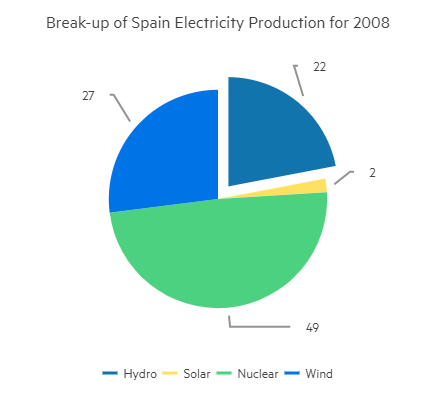

# Pie Chart

The <a href="https://www.telerik.com/blazor-ui/pie-chart" target="_blank">Blazor Pie chart</a> displays the data as sectors from a two-dimensional circle and is therefore useful for displaying data as parts of a whole. There can only be one series in a pie chart.

>caption Pie chart. Results from the first code snippet below

@[template](/_contentTemplates/chart/link-to-basics.md#understand-basics-and-databinding-first)

#### To create a pie chart:

1. add a `ChartSeries` to the `ChartSeriesItems` collection
2. set its `Type` property to `ChartSeriesType.Pie`
3. provide a data model collection to its `Data` property
4. set the `Field` and `CategoryField` properties to the corresponding fields in the model that carry the values and names that will be shown in the legend

If you use [simple data binding](slug:components/chart/databind#independent-series-binding) and only provide values, the chart will not render a legend.

>caption A pie chart that shows product revenues

<demo metaUrl="client/chart/types/pie/overview/" height="420"></demo>

## Rotation

By default, the first segment starts at the top. You can change that by using the `StartAngle` property of the series.

## Color Field

You can control the color of the individual segments of the pie chart by providing a string with the desired color in the model, and setting the `ColorField` of the series to it. You can pass a valid CSS color (for example, `#abcdef`, `#f00`, or `blue`).

<demo metaUrl="client/chart/types/pie/color-field/" height="420"></demo>

## Exploded Segment

You can have some of the segments of the pie separated from the rest of the circle with a small margin. This helps bring attention to them as outliers or as important bits that the viewer should focus on.

To explode (separate) a segment, use the `ExplodeField` property of the series and set it to a boolean field that indicates whether the segment is exploded. Only a `true` value explodes a segment, so you can use a nullable field as well and only provide values for the items you want separated.

>caption Exploded Items

<demo metaUrl="client/chart/types/pie/exploded-segment/" height="420"></demo>

## Visible In Legend

You can hide certain segments from the legend (for example, if their contribution is insignificantly small). To do this, add a boolean field to the model and set its name to the `VisibleInLegendField` property of the pie series. The flags in this field will denote whether the particular item will be rendered in the legend.

>caption Hide segments from the legend

<demo metaUrl="client/chart/types/pie/visible-in-legend/" height="420"></demo>

## Width and Height

The main part of the Pie Chart is a circle. Thus, you may need to set both the `Width` and `Height` parameters to achieve the desired layout and dimensions. By default, the Chart container `
` expands horizontally to 100% and the height is set to `"400px"` in the CSS theme.

>caption Setting Pie Chart Width and Height

<demo metaUrl="client/chart/types/pie/width-and-height/" height="500"></demo>

## Other Settings

@[template](/_contentTemplates/chart/link-to-basics.md#configurable-nested-chart-settings)

@[template](/_contentTemplates/chart/link-to-basics.md#configurable-nested-chart-settings-axis-free)

## See Also

* [Live Demo: Pie Chart](https://demos.telerik.com/blazor-ui/chart/pie-chart)
* [Hide Pie Chart Category on Legend Click](slug:chart-kb-toggle-category-on-legend-item-click)
