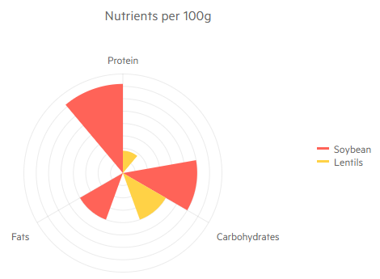

# Radar Column Chart

The Blazor Radar Column chart shows the data points on radial lines starting from a common center and act as value axis. The closer the data point to the center, the lower its value. The Radar Column chart creates triangles for the values instead of rectangular bars like regular columns charts do.

Radar column charts are often used to make comparisons between several units that depend on a multitude of quantitative factors, with the compared units being the individual series, and the factors being the categories. The lack of overlap between the series makes it easy to compare individual values as opposed to overall coverage.


>caption Radar Column chart. Results from the first code snippet below



@[template](/_contentTemplates/chart/link-to-basics.md#understand-basics-and-databinding-first)

#### To create a radar column chart:

1. add a `ChartSeries` to the `ChartSeriesItems` collection
2. set its `Type` property to `ChartSeriesType.RadarColumn`
3. provide a data collection to its `Data` property
4. optionally, provide data for the x-axis `Categories`


>caption A radar column chart that shows comparison between the nutritional composition of two foods

````CSHTML
@* Radar Column series*@

<TelerikChart>
    <ChartSeriesItems>
        <ChartSeries Type="@ChartSeriesType.RadarColumn" Name="Soybean" Data="@series1Data">
        </ChartSeries>
        <ChartSeries Type="@ChartSeriesType.RadarColumn" Name="Lentils" Data="@series2Data">
        </ChartSeries>
    </ChartSeriesItems>

    <ChartCategoryAxes>
        <ChartCategoryAxis Categories="@xAxisItems">
        </ChartCategoryAxis>
    </ChartCategoryAxes>

    <ChartValueAxes>
        <ChartValueAxis Visible="false"></ChartValueAxis>
    </ChartValueAxes>

    <ChartTitle Text="Nutrients per 100g">
    </ChartTitle>

    <ChartLegend Position="@Telerik.Blazor.ChartLegendPosition.Right">
    </ChartLegend>

</TelerikChart>

@code {
    public List<object> series1Data = new List<object>() { 36, 30, 20 };
    public List<object> series2Data = new List<object>() { 9, 20, 0.4d };
    public string[] xAxisItems = new string[] { "Protein", "Carbohydrates", "Fats" };
}
````


## Radar Column Chart Specific Appearance Settings

### Color

The color of a series is controlled through the `Color` property that can take any valid CSS color (for example, `#abcdef`, `#f00`, or `blue`).

### Color Field

Column charts can take the color of the series item from the `ColorField` of the data source. You can pass a valid CSS color (for example, `#abcdef`, `#f00`, or `blue`).

@[template](/_contentTemplates/chart/link-to-basics.md#gap-and-spacing)

>note The explanations above treat the general concept of the `Gap` and `Spacing` features of the Telerik charts. For radar-type charts the calculations are slightly different and the results will, generally, be less pronounced due to the radial nature of the bars.

@[template](/_contentTemplates/chart/link-to-basics.md#configurable-nested-chart-settings)

@[template](/_contentTemplates/chart/link-to-basics.md#configurable-nested-chart-settings-categorical)

## See Also

  * [Live Demo: Radar Column Chart](https://demos.telerik.com/blazor-ui/chart/radar-column-chart)
