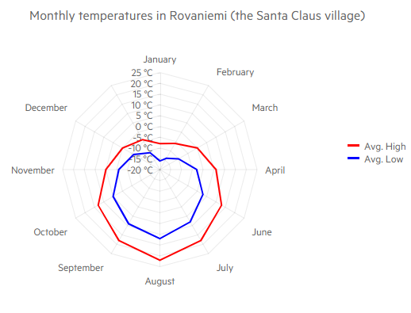

# Radar Line Chart

The Blazor Radar Line chart shows the data points on radial lines starting from a common center and act as value axis. The closer the data point to the center, the lower its value. The Radar Line chart connects the values of the data points with lines.

Radar line charts are often used to make comparisons between several units that depend on a multitude of quantitative factors, with the compared units being the individual series, and the factors being the categories. The lack of overlap between the series makes it easier to compare individual values in addition to overall coverage.


>caption Radar Line chart. Results from the first code snippet below



@[template](/_contentTemplates/chart/link-to-basics.md#understand-basics-and-databinding-first)

#### To create a radar line chart:

1. add a `ChartSeries` to the `ChartSeriesItems` collection
2. set its `Type` property to `ChartSeriesType.RadarLine`
3. provide a data collection to its `Data` property
4. optionally, provide data for the x-axis `Categories`


>caption A radar column chart that shows comparison between the nutritional composition of two foods

````CSHTML
@* Radar Line series*@

<TelerikChart>
    <ChartSeriesItems>
        <ChartSeries Type="@ChartSeriesType.RadarLine" Name="Avg. High" Data="@series1Data" Color="red">
        </ChartSeries>
        <ChartSeries Type="@ChartSeriesType.RadarLine" Name="Avg. Low" Data="@series2Data" Color="blue">
        </ChartSeries>
    </ChartSeriesItems>

    <ChartCategoryAxes>
        <ChartCategoryAxis Categories="@xAxisItems">
        </ChartCategoryAxis>
    </ChartCategoryAxes>

    <ChartValueAxes>
        <ChartValueAxis>
            <ChartValueAxisLabels Format="{0} °C"></ChartValueAxisLabels>
        </ChartValueAxis>
    </ChartValueAxes>

    <ChartTitle Text="Monthly temperatures in Rovaniemi (the Santa Claus village)">
    </ChartTitle>

    <ChartLegend Position="@Telerik.Blazor.ChartLegendPosition.Right">
    </ChartLegend>

</TelerikChart>

@code {
    public List<object> series1Data = new List<object>() { -8, -6, 0, 6, 13, 18, 22, 18, 13, 5, 0, -4 };
    public List<object> series2Data = new List<object>() { -16, -14, -10, -3, 3, 8, 12, 9, 5, -1, -6, -11 };
    public string[] xAxisItems = new string[] { "January", "February", "March", "April", "June", "July", "August", "September", "October", "November", "December" };
}
````


## Radar Line Chart Specific Appearance Settings

### Color

The color of a series is controlled through the `Color` property that can take any valid CSS color (for example, `#abcdef`, `#f00`, or `blue`).

You can control the color of the markers by using the Background property of the nested `ChartSeriesMarkers` tag.

### ColorField

You can pass a `ColorField` to the chart as a part of the model, and the data points (markers) will use that color instead of the `Color` of the series or the `Background` of the markers settings.


### Missing Values

If some values are missing from the series data (they are `null`), you can have the chart work around this by setting the `MissingValues` property of the series to the desired behavior (member of the `Telerik.Blazor.ChartSeriesMissingValues` enum):

* `Zero` - the default behavior. The line goes to the 0 value mark.
* `Interpolate` - the line will go through the interpolated value of the missing data points and connect to the next data point with a value.
* `Gap` - there will be no line for the category that misses a value.


### Line Style

You can render the lines between the points with different styles. The supported styles can be set via the `Style` property of the child `ChartSeriesLine` tag - it takes a member of `Telerik.Blazor.ChartSeriesLineStyle` enum:

* `Normal`—This is the default style. It produces a straight line between data points.
* `Step`—Behaves in the same way as `Normal` for a Radar Line chart.
* `Smooth`—This style causes the Chart to display a fitted curve through data points. It is suitable when the data requires to be displayed with a curve, or when you wish to connect the points with smooth instead of straight lines.


@[template](/_contentTemplates/chart/link-to-basics.md#configurable-nested-chart-settings)

@[template](/_contentTemplates/chart/link-to-basics.md#configurable-nested-chart-settings-categorical)

## See Also

  * [Live Demo: Radar Line Chart](https://demos.telerik.com/blazor-ui/chart/radar-line-chart)
