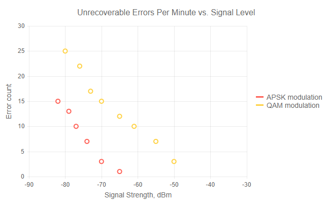

# Scatter Chart

A **Scatter** chart shows data as points defined by their items' values. Its x-axis is also numerical and does not require categorical items, but numerical values. 

Scatter charts are useful for showing the relation between different sets of data, for example scientific (experimental) results.

>caption Scatter chart. Results from the first code snippet below



@[template](/_contentTemplates/chart/link-to-basics.md#understand-basics-and-databinding-first)

To create a scatter chart:

1. add a `ChartSeries` to the `ChartSeriesItems` collection
2. set its `Type` property to `ChartSeriesType.Scatter`
3. provide a data collection to its `Data` property, which contains numerical data for the X and Y axes


>caption A bubble chart that shows projected population change on a plot of life expectancy versus fertility rate

````CSHTML
@* Scatter Series *@

<TelerikChart>
    <ChartTitle Text="Unrecoverable Errors Per Minute vs. Signal Level"></ChartTitle>

    <ChartSeriesItems>
        <ChartSeries Type="ChartSeriesType.Scatter"
                     Data="@Series1Data"
                     Name="APSK modulation"
                     XField="@nameof(ModelData.Strength)"
                     YField="@nameof(ModelData.Errors)">
        </ChartSeries>

        <ChartSeries Type="ChartSeriesType.Scatter"
                     Data="@Series2Data"
                     Name="QAM modulation"
                     XField="@nameof(ModelData.Strength)"
                     YField="@nameof(ModelData.Errors)">
        </ChartSeries>
    </ChartSeriesItems>

    <ChartXAxes>
        <ChartXAxis Max="-30" AxisCrossingValue="@(new object[] { -100 })">
            <ChartXAxisTitle Text="Signal Strength, dBm"></ChartXAxisTitle>
        </ChartXAxis>
    </ChartXAxes>

    <ChartYAxes>
        <ChartYAxis>
            <ChartYAxisTitle Text="Error count"></ChartYAxisTitle>
        </ChartYAxis>
    </ChartYAxes>
</TelerikChart>

@code {
    public class ModelData
    {
        public double Strength { get; set; }
        public double Errors { get; set; }
    }

    public List<ModelData> Series1Data = new List<ModelData>()
    {
       new ModelData { Strength = -82, Errors = 15  },
       new ModelData { Strength = -79, Errors = 13  },
       new ModelData { Strength = -77, Errors = 10  },
       new ModelData { Strength = -74, Errors = 7  },
       new ModelData { Strength = -70, Errors = 3  },
       new ModelData { Strength = -65, Errors = 1  }
    };

    public List<ModelData> Series2Data = new List<ModelData>()
    {
       new ModelData { Strength = -80, Errors = 25  },
       new ModelData { Strength = -76, Errors = 22  },
       new ModelData { Strength = -73, Errors = 17  },
       new ModelData { Strength = -70, Errors = 15  },
       new ModelData { Strength = -65, Errors = 12  },
       new ModelData { Strength = -61, Errors = 10  },
       new ModelData { Strength = -55, Errors = 7  },
       new ModelData { Strength = -50, Errors = 3  }
    };
}
````


## Scatter Chart Specific Appearance Settings

### Color

The color of a series is controlled through the `Color` property that can take any valid CSS color (for example, `#abcdef`, `#f00`, or `blue`).

The `ColorField` can change the color of individual items. To use it, pass a valid CSS color to the corresponding field in the model and the chart will use its values instead of the `Color` parameter.


## See Also

  * [Live Demo: Scatter Chart](https://demos.telerik.com/blazor-ui/chart/scatter-chart)
