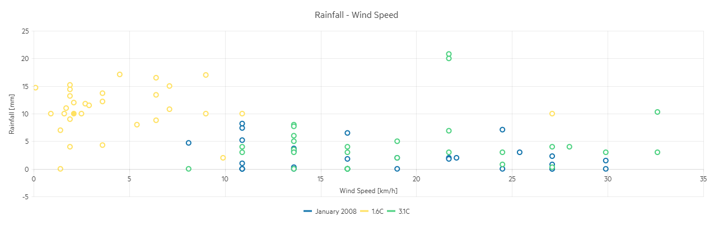

# Scatter Chart

The <a href="https://www.telerik.com/blazor-ui/scatter-chart" target="_blank">Blazor Scatter chart</a> shows data as points defined by their items' values. Its x-axis is also numerical and does not require categorical items, but numerical values.

Scatter charts are useful for showing the relation between different sets of data, for example scientific (experimental) results.

@[template](/_contentTemplates/chart/link-to-basics.md#understand-basics-and-databinding-first)

#### To create a scatter chart:

1. add a `ChartSeries` to the `ChartSeriesItems` collection
2. set its `Type` property to `ChartSeriesType.Scatter`
3. provide a data collection to its `Data` property, which contains numerical data for the X and Y axes

>caption A bubble chart that shows projected population change on a plot of life expectancy versus fertility rate

<demo metaUrl="client/chart/types/scatter/" height="460"></demo>

## Scatter Chart Specific Appearance Settings

@[template](/_contentTemplates/chart/link-to-basics.md#markers-line-scatter)

@[template](/_contentTemplates/chart/link-to-basics.md#color-line-scatter)

@[template](/_contentTemplates/chart/link-to-basics.md#configurable-nested-chart-settings)

@[template](/_contentTemplates/chart/link-to-basics.md#configurable-nested-chart-settings-numerical)

>tip See the code snippet above to observe setting the title text for the `ChartXAxis` and the `ChartYAxes`.

## See Also

* [Live Demo: Scatter Chart](https://demos.telerik.com/blazor-ui/chart/scatter-chart)
