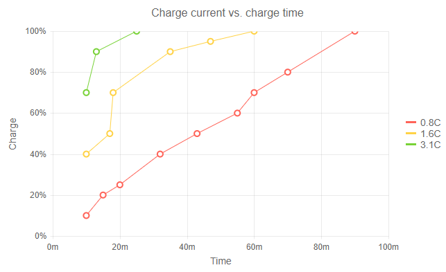

# ScatterLine Chart

The **ScatterLine** chart is very similar to the [Scatter]() chart—it shows data as points defined by their items' values, but the points are connected by lines and thus it can account for missing values in a series. Its x-axis is numerical and does not require items.

You would usually use ScatterLine charts for showing the relation between different sets of data, for example scientific (experimental) results, or when you need to have two numerical axes on a line-type chart.

>caption ScatterLine chart. Results from the first code snippet below



@[template](/_contentTemplates/chart/link-to-basics.md#understand-basics-and-databinding-first)

To create a scatter chart:

1. add a `ChartSeries` to the `ChartSeriesItems` collection
2. set its `Type` property to `ChartSeriesType.ScatterLine`
3. provide a data collection to its `Data` property, which contains numerical data for the X and Y axes


>caption A bubble chart that shows projected population change on a plot of life expectancy versus fertility rate

````CSHTML
@* ScatterLine Series *@

<TelerikChart>
    <ChartTitle Text="Charge current vs. charge time"></ChartTitle>
    <ChartLegend Visible="true"></ChartLegend>

    <ChartSeriesItems>
        <ChartSeries Type="ChartSeriesType.ScatterLine"
                     Data="@Series1Data"
                     Name="0.8C"
                     XField="@nameof(ModelData.X)"
                     YField="@nameof(ModelData.Y)">
        </ChartSeries>

        <ChartSeries Type="ChartSeriesType.ScatterLine"
                     Data="@Series2Data"
                     Name="1.6C"
                     XField="@nameof(ModelData.X)"
                     YField="@nameof(ModelData.Y)">
        </ChartSeries>

        <ChartSeries Type="ChartSeriesType.ScatterLine"
                     Data="@Series3Data"
                     Name="3.1C"
                     XField="@nameof(ModelData.X)"
                     YField="@nameof(ModelData.Y)">
        </ChartSeries>
    </ChartSeriesItems>

    <ChartXAxes>

        <ChartXAxis Max="100">
            <ChartXAxisTitle Text="Time"></ChartXAxisTitle>
            <ChartXAxisLabels Format="{0}m"></ChartXAxisLabels>
        </ChartXAxis>
    </ChartXAxes>

    <ChartYAxes>
        <ChartYAxis Max="100">
            <ChartYAxisTitle Text="Charge"></ChartYAxisTitle>
            <ChartYAxisLabels Format="{0}%"></ChartYAxisLabels>
        </ChartYAxis>

    </ChartYAxes>
</TelerikChart>

@code {
    public class ModelData
    {
        public int X { get; set; }
        public int Y { get; set; }
    }

    public List<ModelData> Series1Data = new List<ModelData>()
    {
        new ModelData() { X = 10, Y = 10 },
        new ModelData() { X = 15, Y = 20 },
        new ModelData() { X = 20, Y = 25 },
        new ModelData() { X = 32, Y = 40 },
        new ModelData() { X = 43, Y = 50 },
        new ModelData() { X = 55, Y = 60 },
        new ModelData() { X = 60, Y = 70 },
        new ModelData() { X = 70, Y = 80 },
        new ModelData() { X = 90, Y = 100 },
    };

    public List<ModelData> Series2Data = new List<ModelData>()
    {
        new ModelData() { X = 10, Y = 40 },
        new ModelData() { X = 17, Y = 50 },
        new ModelData() { X = 18, Y = 70 },
        new ModelData() { X = 35, Y = 90 },
        new ModelData() { X = 47, Y = 95 },
        new ModelData() { X = 60, Y = 100 },
    };

    public List<ModelData> Series3Data = new List<ModelData>()
    {
        new ModelData() { X = 10, Y = 70 },
        new ModelData() { X = 13, Y = 90 },
        new ModelData() { X = 25, Y = 100 },
    };
}
````

@[template](/_contentTemplates/chart/link-to-basics.md#configurable-nested-chart-settings)

## ScatterLine Chart Specific Appearance Settings

@[template](/_contentTemplates/chart/link-to-basics.md#markers-line-scatter)

@[template](/_contentTemplates/chart/link-to-basics.md#color-line-scatter)

@[template](/_contentTemplates/chart/link-to-basics.md#line-style-line)

@[template](/_contentTemplates/chart/link-to-basics.md#configurable-nested-chart-settings)

@[template](/_contentTemplates/chart/link-to-basics.md#configurable-nested-chart-settings-numerical)

>tip See the code snippet above to observe changing the Labels' Format and Text for the `ChartXAxis` and the `ChartYAxes`.

## See Also

  * [Live Demo: ScatterLine Chart](https://demos.telerik.com/blazor-ui/chart/scatter-line-chart)
