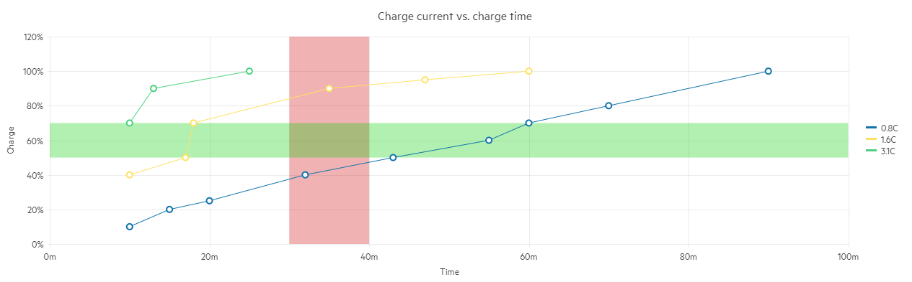

# ScatterLine Chart

The <a href="https://www.telerik.com/blazor-ui/scatter-line-chart" target="_blank">Blazor ScatterLine chart</a> is very similar to the [Scatter](slug:components/chart/types/scatter) chart—it shows data as points defined by their items' values, but the points are connected by lines and thus it can account for missing values in a series. Its x-axis is numerical and does not require items.

You would usually use ScatterLine charts for showing the relation between different sets of data, for example scientific (experimental) results, or when you need to have two numerical axes on a line-type chart.

@[template](/_contentTemplates/chart/link-to-basics.md#understand-basics-and-databinding-first)

#### To create a scatter chart:

1. add a `ChartSeries` to the `ChartSeriesItems` collection
2. set its `Type` property to `ChartSeriesType.ScatterLine`
3. provide a data collection to its `Data` property, which contains numerical data for the X and Y axes

>caption A scatter line chart that shows battery charging percentage over minutes depending on the charging current

<demo metaUrl="client/chart/types/scatterline/" height="460"></demo>

## ScatterLine Chart Specific Appearance Settings

@[template](/_contentTemplates/chart/link-to-basics.md#markers-line-scatter)

@[template](/_contentTemplates/chart/link-to-basics.md#color-line-scatter)

@[template](/_contentTemplates/chart/link-to-basics.md#line-style-line)

@[template](/_contentTemplates/chart/link-to-basics.md#configurable-nested-chart-settings)

@[template](/_contentTemplates/chart/link-to-basics.md#configurable-nested-chart-settings-numerical)

>tip See the code snippet above to observe changing the Labels' Format and Title Text for the `ChartXAxis` and the `ChartYAxes`.

## See Also

* [Live Demo: ScatterLine Chart](https://demos.telerik.com/blazor-ui/chart/scatter-line-chart)
