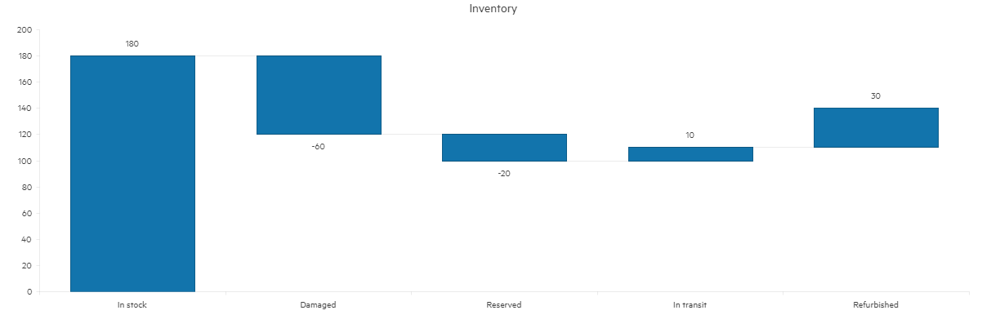
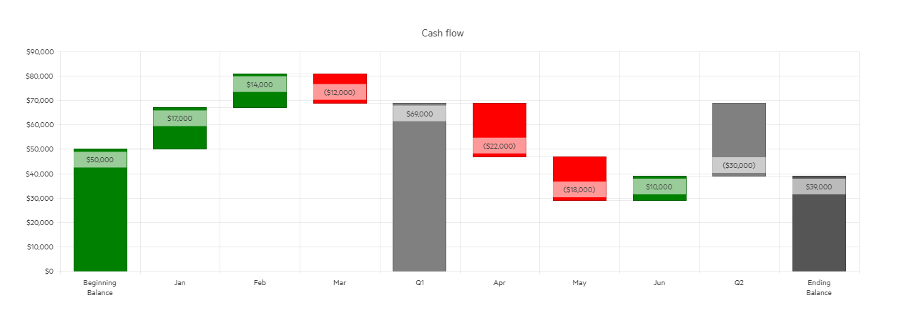
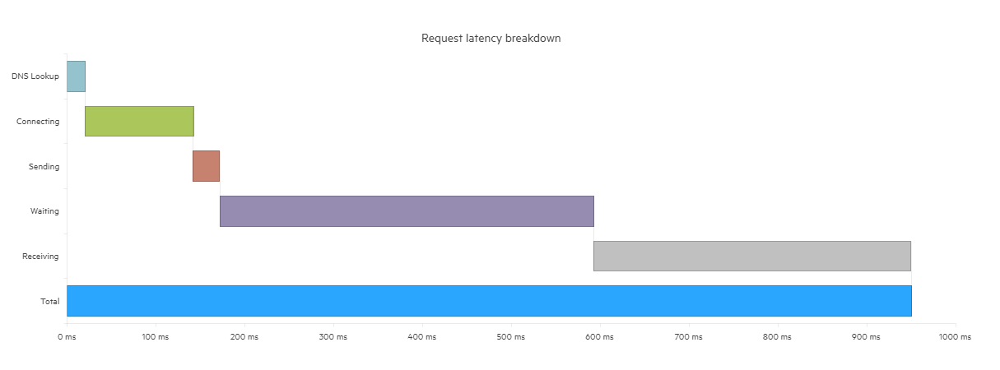

# Waterfall Chart

The Blazor Waterfall Chart is a form of data visualization that helps users understand the cumulative effect of sequentially introduced positive or negative values. These values can be either time-based or category-based.

A Waterfall Chart is useful for different types of quantitative analysis related to inventory, cash flows, performance, etc.



@[template](/_contentTemplates/chart/link-to-basics.md#understand-basics-and-databinding-first)

## Creating a Waterfall Chart

1. Add a `ChartSeries` tag to the `ChartSeriesItems` collection.
2. Set its `Type` parameter to `ChartSeriesType.Waterfall` or `ChartSeriesType.HorizontalWaterfall`.
3. Provide a data collection to its `Data` parameter.
4. (optional) Set the `SummaryField` to add a summary column. Summary columns can be two types:
   * `runningTotal`—This column shows the cumulative sum of all items since the last running total point.
   * `total`—This column displays the sum of all preceding items.

To define a data item as a running total or total, include a corresponding data point in the data source and set the `SummaryField` value as either `runningTotal` or `total`.

>caption A Waterfall Chart that shows cash flow

````RAZOR
<TelerikChart Width="100%"
              Height="400px">
    <ChartTitle Text="Cash Flow"></ChartTitle>
    <ChartSeriesItems>
        <ChartSeries Type="ChartSeriesType.Waterfall"
                     Data="@ChartData"
                     ColorField="@nameof(CashFlowData.Color)"
                     Field="@nameof(CashFlowData.Amount)"
                     CategoryField="@nameof(CashFlowData.Period)"
                     SummaryField="@nameof(CashFlowData.Summary)">
                     <ChartSeriesLabels Visible="true"
                                        Format="C0"
                                        Position="@ChartSeriesLabelsPosition.InsideEnd" />
        </ChartSeries>
    </ChartSeriesItems>
    <ChartValueAxes>
        <ChartValueAxis Type="ChartValueAxisType.Numeric">
            <ChartValueAxisLabels Format="C0" />
        </ChartValueAxis>
    </ChartValueAxes>
</TelerikChart>

@code {
    private CashFlowData[] ChartData { get; set; }

    protected override Task OnInitializedAsync()
    {
        ChartData = GetWaterfallData();

        return base.OnInitializedAsync();
    }

    private CashFlowData[] GetWaterfallData()
    {
        return new CashFlowData[] {
            new CashFlowData
            {
                Period = "Beginning\nBalance",
                Amount = 50000,
                Color = "green"
            },
            new CashFlowData
            {
                Period = "Jan",
                Amount = 17000,
                Color = "green"
            },
            new CashFlowData
            {
                Period = "Feb",
                Amount = 14000,
                Color = "green"
            },
            new CashFlowData
            {
                Period = "Mar",
                Amount = -12000,
                Color = "red"
            },
            new CashFlowData
            {
                Period = "Q1",
                Summary = "runningTotal",
                Color = "gray"
            },
            new CashFlowData
            {
                Period = "Apr",
                Amount = -22000,
                Color = "red"
            },
            new CashFlowData
            {
                Period = "May",
                Amount = -18000,
                Color = "red"
            },
            new CashFlowData
            {
                Period = "Jun",
                Amount = 10000,
                Color = "green"
            },
            new CashFlowData
            {
                Period = "Q2",
                Summary = "runningTotal",
                Color = "gray"
            },
            new CashFlowData
            {
                Period = "Ending\nBalance",
                Summary = "total",
                Color = "#555"
            }
        };
    }

    private class CashFlowData
    {
        public string Period { get; set; }
        public decimal? Amount { get; set; }
        public string Summary { get; set; }
        public string Color { get; set; }
    }
}
````

## Waterfall Chart Specific Appearance Settings

The Waterfall Chart provides dedicated properties that allow you to customize its appearance by controlling its [orientation](#orientation), [labels](#labels), and [color](#color).

### Orientation

Waterfall Charts fall into two types: 

* Traditional Waterfall Charts—They display changes vertically. To use this Waterfall Chart, set the series type to `ChartSeriesType.Waterfall`.
   
* Horizontal Waterfall Charts—They present changes horizontally. To use this type of Waterfall Chart, set the series type to `ChartSeriesType.HorizontalWaterfall`.
   

### Labels

Each data item is decorated with a text label. To control and customize these labels, use the `<ChartCategoryAxisLabels />` tag and its children, which accept the following parameters:

* `Visible`—When set to `false`, this parameter hides all labels.
* `Step`—Renders every n-th label, where n is the value (double number) passed to the parameter.
* `Skip`—Skips the first n number of labels, where n is the value (double number) passed to the parameter.
* `Angle`—Rotates the labels with the desired angle by n degrees, where n is the value passed to the parameter. It can take positive and negative numbers. To set this parameter, use the `< ChartCategoryAxisLabelsRotation />` child tag.

### Color

The color of a series is controlled through the `Color` property that can take any valid CSS color (for example, `#abcdef`, `#f00`, or `blue`).

@[template](/_contentTemplates/chart/link-to-basics.md#color-field-bar-column)

@[template](/_contentTemplates/chart/link-to-basics.md#gap-and-spacing)

@[template](/_contentTemplates/chart/link-to-basics.md#configurable-nested-chart-settings)

@[template](/_contentTemplates/chart/link-to-basics.md#configurable-nested-chart-settings-categorical)

## See Also

  * [Live Demo: Waterfall Chart](https://demos.telerik.com/blazor-ui/chart/waterfall-chart)
