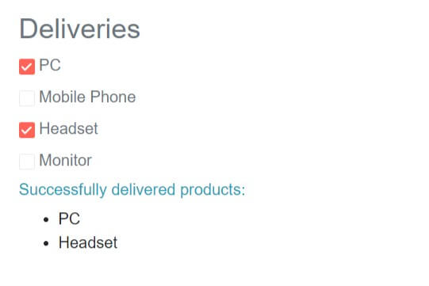
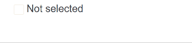

# Events

This article showcases the available events in the Telerik CheckBox component:
* [ValueChanged](#valuechanged)
* [OnChange](#onchange)
* [IndeterminateChanged](#indeterminatechanged)

## ValueChanged

The `ValueChanged` event fires every time the `Value` parameter changes.

>caption Handle ValueChanged

````CSHTML
@*This example showcases one-way data binding by using Value and ValueChanged*@

<h4 class="text-muted">Deliveries:</h4>

@foreach (var delivery in Deliveries)
{
    <div>
        <label class="text-muted">
            <TelerikCheckBox Value="@delivery.IsDelivered"
                             ValueChanged="@((bool value) => ChangeHandler(value, delivery.ProductName))" />
            @delivery.ProductName
        </label>
    </div>
}

@if (AlreadyDelivered.Any())
{
<div>
    <h6 class="text-info">Successfully delivered products:</h6>
    <ul>
        @{
            foreach (var item in AlreadyDelivered)
            {
                <li>
                    @item.ProductName
                </li>
            }
        }
    </ul>
</div>   
}

@code {
    public List<Delivery> Deliveries { get; set; }
    public List<Delivery> AlreadyDelivered
    {
        get
        {
            return Deliveries.Where(x => x.IsDelivered == true).ToList();
        }
    }

    void ChangeHandler(bool value, string productName)
    {
        var item = Deliveries.Where(x => x.ProductName == productName).First();
        // update the model value because the framework does not allow two-way binding when the event is used
        item.IsDelivered = value;
    }

    //In real case scenarios the model will be in a separate file.
    public class Delivery
    {
        public string ProductName { get; set; }
        public bool IsDelivered { get; set; }
    }

    //Generating dummy data
    protected override void OnInitialized()
    {
        //Make your real data generation here.
        Deliveries = new List<Delivery>();
        Deliveries.Add(new Delivery()
        {
            ProductName = "PC",
            IsDelivered = false
        });
        Deliveries.Add(new Delivery()
        {
            ProductName = "Mobile Phone",
            IsDelivered = false
        });
        Deliveries.Add(new Delivery()
        {
            ProductName = "Headset",
            IsDelivered = false
        });
        Deliveries.Add(new Delivery()
        {
            ProductName = "Monitor",
            IsDelivered = false
        });
    }
}
````
>caption The result from the code snippet above



@[template](/_contentTemplates/common/general-info.md#event-callback-can-be-async)

@[template](/_contentTemplates/common/issues-and-warnings.md#valuechanged-lambda-required)

## OnChange

The `OnChange` event fires every time the `Value` parameter changes. The key difference with `ValueChanged` is that `OnChange` does not prevent two-way data binding (using the `@bind-Value` syntax).

>caption Handle OnChange

````CSHTML
@*This example showcases the usage of OnChange event in conjunction with two-way data binding*@

<TelerikCheckBox Id="myCheckBox"
                 @bind-Value="@isSelected"
                 OnChange="@ChangeHandler">
</TelerikCheckBox>
<label for="myCheckBox">@(isSelected ? "Selected" : "Not selected")</label>

<div class="text-info">
    @Result
</div>


@code {
    private bool isSelected { get; set; }
    private string Result { get; set; } = String.Empty;

    void ChangeHandler(object value)
    {
        Result = $"OnChange event fired with: {value}";
    }
}
````
>caption The result from the code snippet above



## IndeterminateChanged

The `IndeterminateChanged` event fires every time the `Indeterminate` parameter changes. The component does this when the chekbox was indeterminate and the user clicks it to toggle it to a checked/unchecked state. If you toggle the parameter value yourself, the event will not be raised.

>caption Handle IndeterminateChanged event

````CSHTML
@* Click the checkbox when it is indeterminate to toggle its state to see when the event fires. *@

<div class="m-3">
    Checkbox is checked: @CheckBoxValue
    <br />
    @result
</div>
<div class="mt-2">
    <label for="theCb" class="text-muted">Indeterminate checkbox</label>
    <TelerikCheckBox @bind-Value="@CheckBoxValue" Id="theCb"
                     Indeterminate="@Indeterminate"
                     IndeterminateChanged="((bool val) => ChangeHandler(val))">
    </TelerikCheckBox>
</div>
<TelerikButton Primary="true" OnClick="@(() => Indeterminate = !Indeterminate)"> Toggle Indeterminate </TelerikButton>

@code{
    bool Indeterminate { get; set; } = true;
    bool CheckBoxValue { get; set; }

    string result { get; set; }

    void ChangeHandler(bool value)
    {
        // make sure to set the model value, two-way binding does not update it automatically
        Indeterminate = value;

        result = $"Indeterminate state changed to {value} on <strong>{DateTime.Now}</strong>";
    }
}
````

