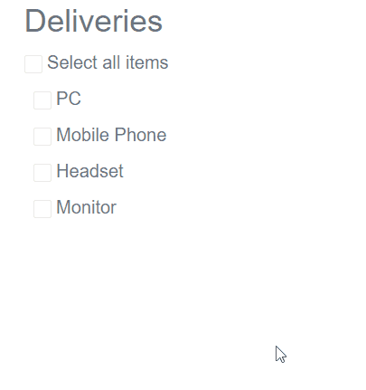

# Indeterminate State

In addition to `checked` and `unchecked` basic states, the Telerik CheckBox has a third state - `Indeterminate`. This means that its state is something in between - neither checked, nor unchecked.
The main use case is when the checkbox owns a number of sub-options and they have different states, than the main checkbox is in indeterminate state.

To put the checkbox in the indeterminate state, set its `Indeterminate` parameter to `true`. You can bind it to a `bool` and `bool?` types, and it also exposes the [`IndeterminateChanged` event](#indeterminatechanged) and two-way binding.

The `Indeterminate` parameter maps to the `indeterminate` attribute of the standard HTML `<input type="checkbox" />`.

The Indeterminate state is something that the application logic should set to show information to the user. A user interaction with the component will clear that state and will set a `true` or `false` value to it and the `Indeterminate` parameter will be set to `false`.. 

For example, if you bind the checkbox to a nullable field and its value is `null`, you may want to show the checkbox as indeterminate.

>caption Basic setup - show Indeterminate checkbox when its Value is not defined (null)

````CSHTML
@* 
    This example shows how to make a checkbox indeterminate when its Value is unknown (e.g., null)
    It also shows that when the user changes the state of the CheckBox, the Indeterminate status is set to false
*@

Indeterminate: @( !TheValue.HasValue )
<br />

Checked: @TheValue
<br />

<TelerikButton Primary="true" OnClick="@( _ => TheValue = null )">Make indeterminate</TelerikButton>
<br />

<TelerikCheckBox Id="DemoCheckbox" @bind-Value="@TheValue" Indeterminate="@( !TheValue.HasValue )" />
<label for="DemoCheckbox">Checkbox</label>

@code{
    bool? TheValue { get; set; } // defaults to null so the checkbox will be indeterminate initially
}
````

>caption Observe the behavior of the Indeterminate state

````CSHTML

@*Observe the behavior of the Select all checkbox*@

<h3 class="text-muted">Deliveries</h3>

<div>
    <TelerikCheckBox Id="selectAllCheckbox"
                     Value="SelectAll"
                     ValueChanged="((bool newVal) => ChangeAllHander(newVal))"
                     Indeterminate="SelectAllIndeterminate"></TelerikCheckBox>
    <label for="selectAllCheckbox" class="text-muted">Select all items</label>
</div>

@foreach (var delivery in Deliveries)
{
    <div class="ml-2">
        <label class="text-muted">
            <TelerikCheckBox Value="delivery.IsDelivered"
                             ValueChanged="((bool value) => ChangeHandler(value, delivery.ProductName))" />
            @delivery.ProductName
        </label>
    </div>
}

@if (AlreadyDelivered.Any())
{
    <div>
        <h6 class="text-info">Successfully delivered products:</h6>
        <ul>
            @{
                foreach (var item in AlreadyDelivered)
                {
                    <li>
                        @item.ProductName
                    </li>
                }
            }
        </ul>
    </div>
}


@code {
    public bool SelectAll
    {
        get
        {
            return Deliveries.All(item => item.IsDelivered);
        }
    }

    public bool SelectAllIndeterminate
    {
        get
        {
            return Deliveries.Any(item => item.IsDelivered) && !SelectAll;
        }
    }

    public List<Delivery> Deliveries { get; set; }
    public List<Delivery> AlreadyDelivered
    {
        get
        {
            return Deliveries.Where(x => x.IsDelivered == true).ToList();
        }
    }

    void ChangeAllHander(bool newVal)
    {
        Deliveries.ForEach(item => item.IsDelivered = newVal);
    }

    void ChangeHandler(bool value, string productName)
    {
        var item = Deliveries.Where(x => x.ProductName == productName).First();
        item.IsDelivered = value;
    }

    //In real case scenarios the model will be in a separate file.
    public class Delivery
    {
        public string ProductName { get; set; }
        public bool IsDelivered { get; set; }
    }

    //Generating dummy data
    protected override void OnInitialized()
    {
        //Make your real data generation here.
        Deliveries = new List<Delivery>();
        Deliveries.Add(new Delivery()
        {
            ProductName = "PC",
            IsDelivered = false
        });
        Deliveries.Add(new Delivery()
        {
            ProductName = "Mobile Phone",
            IsDelivered = false
        });
        Deliveries.Add(new Delivery()
        {
            ProductName = "Headset",
            IsDelivered = false
        });
        Deliveries.Add(new Delivery()
        {
            ProductName = "Monitor",
            IsDelivered = false
        });
    }
}
````

>caption The result from the code snippet above



## See Also

* [Checkbox Overview]()
* [Checkbox Events]()
