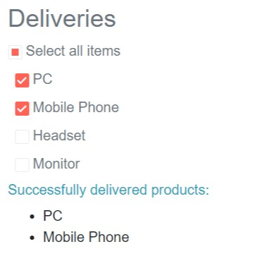

# Checkbox Overview

The Checkbox component allows you to add more customizable checkboxes to your Blazor application. It maintains the behavior of the standard HTML checkbox and provides checked, unchecked and indeterminate states.

To use a Telerik Checkbox for Blazor

1. add the `TelerikCheckBox` tag
1. provide `Value` (one-way data binding) or `bind-Value` (two-way data binding) property
1. (optional) set the `Indeterminate` or `bind-Indeterminate` property
1. (optional) set the `ValueChanged` and `IndeterminateChanged` (if using one-way data binding).

This article contains information about:
* [Features](#features)
* [Events](#events)
* [Examples](#examples)

>caption Basic setup of the Telerik CheckBox using two-way data binding

````CSHTML
@*Basic setup of the Telerik CheckBox Component*@
<TelerikCheckBox Id="myCheckBox"
                 @bind-Value="isSelected">
</TelerikCheckBox>
<label for="myCheckBox">@(isSelected ? "Selected" : "Not selected")</label>

@code {
        private bool isSelected {get; set;}
}
````


## Features

The CheckBox provides the following features:

* `Class` - the CSS class that will be rendered on the main wrapping element of the CheckBox.
* `Enabled` - whether the component is enabled.
* `Id` - renders as the `id` attribute on the `<select />` element, so you can attach a `<label for="">` to it.
* `TabIndex` - the `tabindex` attribute rendered on the CheckBox.
* `Value` and `bind-Value`- mapped to the `Checked` property of the normal HTML checkbox
  * The `Value` and `bind-Value` accept `bool` type
* `Indeterminate` and `bind-Indeterminate` - mapped to the `Indeterminate` property of the normal HTML checkbox. Every time the state is changed (checked or unchecked) the `Indeterminate` is set to false.
  * The `Indeterminate` and `bind-Indeterminate` accept `bool` type


## Events
* `ValueChanged` and `OnChange` - fire every time the Value gets changed.


## Examples

>caption One-way data binding by using Value and ValueChanged

````CSHTML
@*This example showcases one-way data binding by using Value and ValueChanged*@

<h4 class="text-muted">Deliveries:</h4>

@foreach (var delivery in Deliveries)
{
    <div>
        <label class="text-muted">
            <TelerikCheckBox Value="delivery.IsDelivered"
                             ValueChanged="((bool value) => ChangeHandler(value, delivery.ProductName))" />
            @delivery.ProductName
        </label>
    </div>
}

@if (AlreadyDelivered.Any())
{
<div>
    <h6 class="text-info">Successfully delivered products:</h6>
    <ul>
        @{
            foreach (var item in AlreadyDelivered)
            {
                <li>
                    @item.ProductName
                </li>
            }
        }
    </ul>
</div>   
}

@code {
    public List<Delivery> Deliveries { get; set; }
    public List<Delivery> AlreadyDelivered
    {
        get
        {
            return Deliveries.Where(x => x.IsDelivered == true).ToList();
        }
    }

    void ChangeHandler(bool value, string productName)
    {
        var item = Deliveries.Where(x => x.ProductName == productName).First();
        item.IsDelivered = value;
    }

    //In real case scenarios the model will be in a separate file.
    public class Delivery
    {
        public string ProductName { get; set; }
        public bool IsDelivered { get; set; }
    }

    //Generating dummy data
    protected override void OnInitialized()
    {
        //Make your real data generation here.
        Deliveries = new List<Delivery>();
        Deliveries.Add(new Delivery()
        {
            ProductName = "PC",
            IsDelivered = false
        });
        Deliveries.Add(new Delivery()
        {
            ProductName = "Mobile Phone",
            IsDelivered = false
        });
        Deliveries.Add(new Delivery()
        {
            ProductName = "Headset",
            IsDelivered = false
        });
        Deliveries.Add(new Delivery()
        {
            ProductName = "Monitor",
            IsDelivered = false
        });
    }
}
````
>caption The result from the code snippet above


>caption Observe the behavior of Indeterminate state

````CSHTML

@*Observe the behavior of the Select all checkbox*@

<h3 class="text-muted">Deliveries</h3>

<div>
    <TelerikCheckBox Id="selectAllCheckbox"
                     Value="SelectAll"
                     ValueChanged="((bool newVal) => ChangeAllHander(newVal))"
                     Indeterminate="SelectAllIndeterminate"></TelerikCheckBox>
    <label for="selectAllCheckbox" class="text-muted">Select all items</label>
</div>

@foreach (var delivery in Deliveries)
{
    <div class="ml-2">
        <label class="text-muted">
            <TelerikCheckBox Value="delivery.IsDelivered"
                             ValueChanged="((bool value) => ChangeHandler(value, delivery.ProductName))" />
            @delivery.ProductName
        </label>
    </div>
}

@if (AlreadyDelivered.Any())
{
    <div>
        <h6 class="text-info">Successfully delivered products:</h6>
        <ul>
            @{
                foreach (var item in AlreadyDelivered)
                {
                    <li>
                        @item.ProductName
                    </li>
                }
            }
        </ul>
    </div>
}


@code {
    public bool SelectAll
    {
        get
        {
            return Deliveries.All(item => item.IsDelivered);
        }
    }

    public bool SelectAllIndeterminate
    {
        get
        {
            return Deliveries.Any(item => item.IsDelivered) && !SelectAll;
        }
    }

    public List<Delivery> Deliveries { get; set; }
    public List<Delivery> AlreadyDelivered
    {
        get
        {
            return Deliveries.Where(x => x.IsDelivered == true).ToList();
        }
    }

    void ChangeAllHander(bool newVal)
    {
        Deliveries.ForEach(item => item.IsDelivered = newVal);
    }

    void ChangeHandler(bool value, string productName)
    {
        var item = Deliveries.Where(x => x.ProductName == productName).First();
        item.IsDelivered = value;
    }

    //In real case scenarios the model will be in a separate file.
    public class Delivery
    {
        public string ProductName { get; set; }
        public bool IsDelivered { get; set; }
    }

    //Generating dummy data
    protected override void OnInitialized()
    {
        //Make your real data generation here.
        Deliveries = new List<Delivery>();
        Deliveries.Add(new Delivery()
        {
            ProductName = "PC",
            IsDelivered = false
        });
        Deliveries.Add(new Delivery()
        {
            ProductName = "Mobile Phone",
            IsDelivered = false
        });
        Deliveries.Add(new Delivery()
        {
            ProductName = "Headset",
            IsDelivered = false
        });
        Deliveries.Add(new Delivery()
        {
            ProductName = "Monitor",
            IsDelivered = false
        });
    }
}
````
>caption The result from the code snippet above



## See Also
[Live Demo: CheckBox](https://demos.telerik.com/blazor-ui/checkbox/overview)
