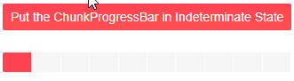

# Indeterminate state

The Indeterminate state of the ChunkProgressBar can be used in cases when the estimated time of completion of the task is unknown or the progress can not be represented as a physical value. The ChunkProgressBar is filled with flowing motion animation to showcase that the task is running. 

>caption Telerik ChunkProgressBar in Indeterminate state


To put the ChunkProgressBar in Indeterminate state set the `Indeterminate`, `boolean` parameter to `true`.

>caption Put the ChunkProgressBar in Indeterminate State

````CSHTML
<div>
    <TelerikButton Primary="true" OnClick="(_ => isIndeterminate = true)">Put the ChunkProgressBar in Indeterminate State</TelerikButton>
</div>

<br />

<TelerikChunkProgressBar Indeterminate="@isIndeterminate" Value="10" Max="100" ChunkCount="10"/>

@code {
    public bool isIndeterminate { get; set; } = false;
}
````




## See Also

  * [Live Demo: ChunkProgressBar Overview](https://demos.telerik.com/blazor-ui/chunkprogressbar/overview)
  * [Overview]()
  
