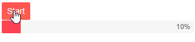

# Chunk Progress Bar Overview

The Progress Bar tracks the execution of operations and displays what portion of it is completed in predefined number of sections (chunks). For very long tasks, you can also make it [indeterminate]().


## Basic Chunk Progress Bar

To use the Telerik Progress Bar in your Blazor application:
* add the `<TelerikChunkProgressBar>` tag.
* set its `Value` parameter to denote how much is completed.
* set its `Max` parameter.


````CSHTML
@*Basic configuration of the ChunkProgressBar*@

<TelerikChunkProgressBar Value="@ChunkProgressBarValue" Max="@MaxValue" />

@code {
    public double MaxValue { get; set; } = 10;
    public double ChunkProgressBarValue { get; set; } = 3;
}
````


>caption Component namespace and reference

````CSHTML
<TelerikChunkProgressBar Value="@ChunkProgressBarValue" Max="@MaxValue" @ref="@MyChunkProgressBar" />

@code {
    Telerik.Blazor.Components.TelerikChunkProgressBar MyChunkProgressBar { get; set; }

    public double MaxValue { get; set; } = 10;
    public double ChunkProgressBarValue { get; set; } = 3;
}
````

## Features

The Progress Bar provides the following features:

* `Class` - the CSS class that will be rendered on the main wrapping element. You can use it to cascade styles more easily.
* `Max` - `double`, defaults to `100` - the maximum value of the ChunkProgressBar. It must be greater than `0`.
* `Value` - `double` - the value of the ChunkProgressBar. This value indicates the progress of the tracked process and is distributed in the chunks (sections) of the ChunkProgressBar. It is a fraction of the `Max`.
* `ChunkCount` - `unsigned int`, defaults to `5` - the number of chunks the ChunkProgressBar will be separated into.
* `Orientation` - you can control the orientation of the Progress Bar, through the `ProgressBarOrientation` enum, with members:
    * `Horizontal` - this is the default value
    * `Vertical`
* `Indeterminate` - `bool`, defaults to `false` - see the [Indeterminate]() article for more information.

## Examples

* [Matching Values for the Max and ChunkCount Parameters](#matching-values-for-the-max-and-chunkcount-parameters)
* [Non-matching Value for the Max and ChunkCount Parameters](#non--matching-values-for-the-max-and-chunkcount-paramters)



### Matching Values for the Max and ChunkCount Parameters

When the `Max` and `ChunkCount` parameters match in value, the `Value` parameter represents the progress of the ChunkProgressBar in sections (chunks) and is fraction of the `ChunkCount`. 

````CSHTML
<TelerikChunkProgressBar Value="@ChunkProgressBarValue" 
                         Max="@MaxValue"
                         ChunkCount="@((int)MaxValue)" />

@code {
    public double MaxValue { get; set; } = 10;
    public double ChunkProgressBarValue { get; set; } = 3;
}
````

>caption The result from the code snippet above


### Non-matching Value for the Max and ChunkCount Parameters

When the `Max` and `ChunkCount` parameters do not match in value, the `Value` parameter is fraction of the `Max`. Each chunk (section) will represent an equal part of the maximum value (`Max / ChunkCount`) and the filled sections will be equivelent to `Value / (Max / ChunckCount)`.

````CSHTML
<TelerikChunkProgressBar Value="@ChunkProgressBarValue" 
                         Max="@MaxValue"
                         ChunkCount="@ChuckCount" />

@code {
    public double MaxValue { get; set; } = 80;
    public double ChunkProgressBarValue { get; set; } = 16;
    public int ChuckCount { get; set; } = 10;
}
````

>caption The result of the code snippet above


## See Also

  * [Live Demo: ChunkProgressBar](https://demos.telerik.com/blazor-ui/TODO)
  * [Indeterminate state]()
  * [API Reference](https://docs.telerik.com/blazor-ui/api/Telerik.Blazor.Components.ChunkTelerikProgressBar)
   
