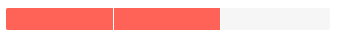
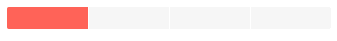

# Chunk Progress Bar Overview

The Progress Bar tracks the execution of operations and displays what portion of it is completed in predefined number of sections (chunks). For very long tasks, you can also make it [indeterminate]() while waiting for an update.


## Basic Chunk Progress Bar

To use the Telerik Progress Bar in your Blazor application:
* add the `<TelerikChunkProgressBar>` tag.
* set its `Value` and `Max` parameters to denote how much is completed.
    * You can read more about the relationship between them in the [Chunk Count, Value and MaxValue](#chunk-count-value-and-maxvalue) section.


````CSHTML
@*Basic configuration of the ChunkProgressBar*@

<TelerikChunkProgressBar Value="@ChunkProgressBarValue" Max="@MaxValue" />

@code {
    public double MaxValue { get; set; } = 5;
    public double ChunkProgressBarValue { get; set; } = 3;
}
````


>caption Component namespace and reference

````CSHTML
<TelerikChunkProgressBar Value="@ChunkProgressBarValue" Max="@MaxValue" @ref="@MyChunkProgressBar" />

@code {
    Telerik.Blazor.Components.TelerikChunkProgressBar MyChunkProgressBar { get; set; }

    public double MaxValue { get; set; } = 10;
    public double ChunkProgressBarValue { get; set; } = 3;
}
````

## Features

The Progress Bar provides the following features:

* `Class` - the CSS class that will be rendered on the main wrapping element. You can use it to cascade styles more easily.
* `Max` - `double`, defaults to `100` - the maximum value of the ChunkProgressBar. It must be greater than `0`.
* `Value` - `double` - the value of the ChunkProgressBar. This value indicates the progress of the tracked process and is distributed in the chunks (sections) of the ChunkProgressBar. It is a fraction of the `Max`. Read mode in the [Chunk Count, Value and MaxValue](#chunk-count-value-and-maxvalue) section.
* `ChunkCount` - `unsigned int`, defaults to `5` - the number of chunks the ChunkProgressBar will be separated into.
* `Orientation` - you can control the orientation of the Progress Bar, through the `ProgressBarOrientation` enum, with members:
    * `Horizontal` - this is the default value
    * `Vertical`
* `Indeterminate` - `bool`, defaults to `false` - see the [Indeterminate]() article for more information.

## Chunk Count, Value and MaxValue

The following examples explain how the three parameters of the component tie together to determine how many chunks are filled in.

* [Matching Values for the Max and ChunkCount Parameters](#matching-values-for-the-max-and-chunkcount-parameters)
* [Non-matching Value for the Max and ChunkCount Parameters](#non--matching-values-for-the-max-and-chunkcount-paramters)

### Matching Values for the Max and ChunkCount Parameters

When the `Max` and `ChunkCount` parameters match in value, the `Value` parameter represents the number of chunks that are hightlighted.

````CSHTML
<TelerikChunkProgressBar Value="2"
                         Max="3"
                         ChunkCount="3">
</TelerikChunkProgressBar>
````

>caption The result from the code snippet above



### Non-matching Value for the Max and ChunkCount Parameters

Each chunk (section) represents an equal part of the maximum value (`Max/ChunkCount`). So, when the `Max` and `ChunkCount` parameters do not match in value, the `Value` parameter highlights the number of chunks that is less than or equal (`<=`) to the full fractions that it represents.

In the example below each chunk is "worth" `10 / 4 = 2.5`. The `Value` is `3` so the full chunks this covers is `3 / 2.5 = 1.2`, so `1` chunk will be highlighted. If the `Value` is set to `4`, one chunk will remain highlighted, a second chunk will be highlighted when the `Value` becomes `5`.

````CSHTML
<TelerikChunkProgressBar Value="3"
                         Max="10"
                         ChunkCount="4">
</TelerikChunkProgressBar>
````

>caption The result of the code snippet above



## Examples

### Responsive ProgressBar

>caption The progress bar will resize with the parent element dimensions when you set its width to 100%

````CSHTML
<div style="width: 50%; border: 1px solid red;">

    <style>
        .width-100 {
            width: 100%;
        }
    </style>

    <TelerikChunkProgressBar Class="width-100" Value="44" />
</div>
````

## See Also

  * [Live Demo: ChunkProgressBar](https://demos.telerik.com/blazor-ui/TODO)
  * [Indeterminate state]()
  * [API Reference](https://docs.telerik.com/blazor-ui/api/Telerik.Blazor.Components.TelerikChunkProgressBar)
   
