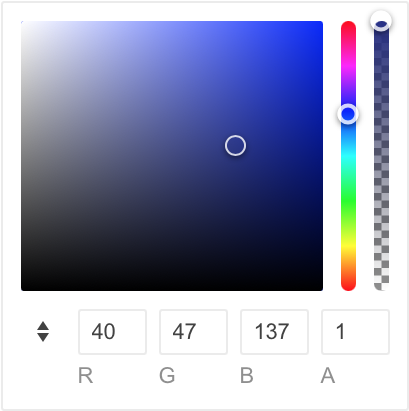

# ColorGradient Overview

The <a href = "https://www.telerik.com/blazor-ui/colorgradient" target="_blank">ColorGradient for Blazor</a> enables users to select a color from an [HSVA](https://en.wikipedia.org/wiki/HSL_and_HSV) canvas, or to type a specific RGB/HEX color value. Compared to our [ColorPalette component](), the ColorGradient allows selection from unlimited number of colors. It may also be preferred by advanced users.

#### In this article:
   * [Basics](#basics)
   * [Example](#example)
   * [Features](#features)
   * [Using Multiple Input Formats](#using-multiple-input-formats)
   * [Supported Value Formats](#supported-value-formats)

## Basics

To use a Telerik ColorGradient for Blazor:

1. Add the `TelerikColorGradient` tag.
1. Set its `Value` attribute to a [HEX/RGB](#supported-value-formats) `string` variable via [one-way](#valuechanged) or [two-way](#example) binding.
1. (optional) Set the [`ValueFormat` and `Format` attrbutes](#features) to the desired color format.

## Example

Here is a ColorGradient declaration and the resulting UI.

````CSHTML
@* Blazor ColorGradient *@

<TelerikColorGradient @bind-Value="@Value" />

@code {
    string Value { get; set; } = "rgb(40, 47, 137)";
}
````

>caption The snippet will produce the following result:


## Features

The ColorGradient exposes the following features via its attributes:

* `Value` - `string` - sets the ColorGradient value in a few [different color formats](#supported-value-formats). Supports two-way binding.
* `Formats` - `IEnumerable<ColorFormat>` - defines the available color formats, which the user **can see, toggle and edit** by typing. Both `Hex` and `Rgb` formats are enabled by default and the user can switch between them with a button.
* `Format` - `ColorFormat` - specifies the value format, which the users **sees initially** (`ColorFormat.Rgb` by default). Supports two-way binding. See [Using Multiple Input Formats](#using-multiple-input-formats) below. The `Rgb` input format allows changing the textbox values with the Up/Down arrow keys.
* `ValueFormat` - `ColorFormat` - sets the color format, which the **component will return** in the application code (`ColorFormat.Rgb` by default).
* `ShowOpacityEditor` - `bool` - specifies if the user can add opacity (transparency) to the color value (`true` by default).

## Using Multiple Input Formats

If you allow multiple `Formats`, the correct configuration is one of the following:

* use two-way binding for `Format`;
* use one-way binding and update the `Format` value in the [`FormatChanged` event](#formatchanged);
* don't set `Format` at all;

>caption Using multiple ColorGradient formats with two-way binding for Format

````CSHTML
@* Using multiple ColorGradient formats with two-way binding for Format *@

<TelerikColorGradient @bind-Value="@Value"
                      ValueFormat="ColorFormat.Hex"
                      @bind-Format="@Format" />

@code {
    string Value { get; set; } = "#282f89";
    ColorFormat Format { get; set; } = ColorFormat.Hex;
}
````
> If a specific `Format` is hard-coded, the component will switch to it automatically every time the user starts typing in a different format.

## Supported Value Formats

The ColorGradient accepts values by the application code in the following formats:

* Hexadecimal
    * 3 digits - `#f00`
    * 6 digits - `#ff0000`
    * 8 digits, including alpha opacity - `#ff000080`
* RGB or RGBA
    * integer color values - `rgb(255, 0, 0)`
    * percentage color values - `rgb(100%, 0%, 0%)`
    * the alpha opacity must always be a decimal number between 0 and 1 - `rgba(100%, 0%, 0%, 0.5)`. Note the `rgba()` notation, compared to `rgb()` above.

Users can type values in the following formats:

* All hexadecimal
* RGB and RGBA with integer color values

Color keywords are not supported. If this is the preferred use case scenario, consider the [ColorPalette component]().

## See Also

* [ColorGradient Events]()
* [ColorGradient Live Demo](https://demos.telerik.com/blazor-ui/colorgradient/overview)
