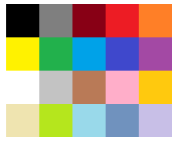

# Color Palette Overview

The <a href = "https://www.telerik.com/blazor-ui/colorpalette" target="_blank">Blazor Color Palette component</a> provides a list of color tiles for the user to pick a color from by clicking or tapping. You can choose a [predefined list of colors](), or [create your own](). Two-way binding and [events]() let you react to the user choice.

If unlimited choice of colors is preferred, consider the [ColorGradient component]() instead.

## Basics

To use a Telerik Color Palette for Blazor:

1. Add the `<TelerikColorPalette>` tag.
1. Bind its `Value` to the `string` you want to get out of it.
1. Optionally, choose a list of `Colors` to show the user (one of the [presets we provide](), or a set of [custom colors]()).
    * If you do not provide a value for the `Colors`, it will default to the `Office` [preset]().

>caption Basic color palette with two-way value binding and a default predefined palette

````CSHTML
<span style="color: @MyColor">@MyColor</span>
<br />

<TelerikColorPalette @bind-Value="@MyColor">
</TelerikColorPalette>

@code {
    public string MyColor { get; set; }
}
````

>caption The result from the code snippet above after selecting a color


## Appearance

You can control the appearane of the component not only through the lists of `Colors` you provide to it, but also its size through the `Columns`, `TileWidth` and `TileHeight` parameters.

>caption Make a large color palette with few columns

````CSHTML
@SelectedColor
<TelerikColorPalette Colors="@ColorPalettePresets.Basic" @bind-Value="@SelectedColor"
                     Columns="5" TileHeight="3em" TileWidth="3em">
</TelerikColorPalette>
@code{
    string SelectedColor { get; set; }
}
````

>caption Theresult from the code snippet above




## Component Reference

````CSHTML
<TelerikColorPalette @ref="@TheColorPaletteRef"></TelerikColorPalette>

@code{
    Telerik.Blazor.Components.TelerikColorPalette TheColorPaletteRef { get; set; }
}
````

## Features

>caption The Color Palette provides the following features:

* `Class` - the CSS class that will be rendered on the wrapping element of the component.

* `Colors` - the collection of colors the user can choose from. Can be one of the [presets that come with the component](), or [a custom list]().

* `Columns` - the number of columns to use when rendering the Colors list. Determines the size of the component together with the `TileHeight` and `TileWidth`.

* `Enabled` - whether the component is enabled.

* `Id` - renders as the `id` attribute on the wrapping element of the component.

* `TabIndex` - maps to the `tabindex` attribute of the main HTML element. You can use it to customize the order in which the elements in your page focus with the `Tab` key.

* `TileHeight` - the height of each individual color item. Determines the size of the component together with the `Columns` and `TileWidth`. Can take CSS [dimensions]() strings 

* `TileWidth`- the width of each individual color item. Determines the size of the component together with the `Columns` and `TileHeight`. Can take CSS [dimensions]() strings 

* `Value` - get/set the value of the input, can be used for binding. Can take any string that can be a [CSS background-color string](https://css-tricks.com/almanac/properties/b/background-color/). The presets we provide use hex format (`#123abc`).

* [Events]() to let you react to the user actions.

* Validation - see the [Input Validation]() article.


## See Also

  * [Live Demo: Color Palette](https://demos.telerik.com/blazor-ui/colorpalette/overview)
  * [Color Presets]()
  * [Custom Color Collections]()
  * [API Reference](https://docs.telerik.com/blazor-ui/api/Telerik.Blazor.Components.TelerikColorPalette)
