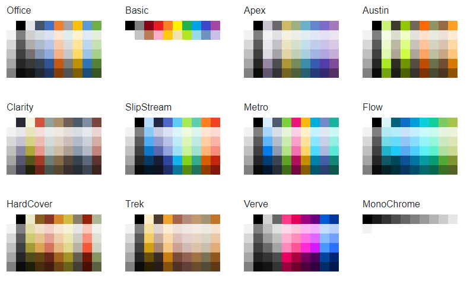

# Predefined Colors

The Telerik Blazor Color Palette component comes with a set of predefined color sets that you can show your users. To use them, set its `Colors` parameter to one of the members of the `Telerik.Blazor.Components.ColorPalettePresets` static class.

>caption Example of using a predefined color list

<demo metaUrl="client/colorpalette/presets/basic/" height="420"></demo>

>caption List of the built-in color presets in the Telerik Color Palette

>caption Explore the predefined color presets - generates the image above

<demo metaUrl="client/colorpalette/presets/all/" height="600"></demo>

## See Also

* [Color Palette Overview](slug:colorpalette-overview)
* [Custom Color Lists](slug:colorpalette-custom-colors)
