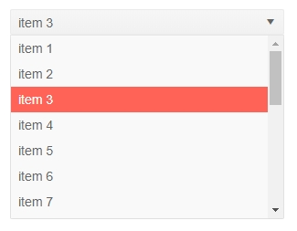

# ComboBox Overview

The ComboBox component allows the user to choose an option from a predefined set of choices presented in a dropdown popup. You can also allow them to enter [custom values]() and to [filter]() the available items. You can control the [data](), sizes, and various appearance options like class and [templates]().

To use a Telerik ComboBox for Blazor

1. add the `TelerikComboBox` tag
1. populate its `Data` property with the collection of items you want in the dropdown
1. set the `TextField` and `ValueField` properties to point to the corresponding names of the model
1. (optional) set the `Value` property to the initial value of the model.
1. (optional) enable features like filtering and clear button

>caption Basic combobox [data binding](data-bind) and two-way value binding

````CSHTML
Selected value: @selectedValue
<br />

<TelerikDropDownList Data="@myDdlData" TextField="MyTextField" ValueField="MyValueField" @bind-Value="selectedValue">
</TelerikDropDownList>

@code {
	//in a real case, the model is usually in a separate file
	//the model type and value field type must be provided to the dropdpownlist
	public class MyDdlModel
	{
		public int MyValueField { get; set; }
		public string MyTextField { get; set; }
	}

	IEnumerable<MyDdlModel> myDdlData = Enumerable.Range(1, 20).Select(x => new MyDdlModel { MyTextField = "item " + x, MyValueField = x });

	int selectedValue { get; set; } = 3; //usually the current value should come from the model data
}
````

>caption The result from the code snippet above



>caption Component namespace and reference

````CSHTML
@using Telerik.Blazor.Components.DropDownList

<TelerikDropDownList @ref="myDdlRef" Data="@myDdlData" TextField="MyTextField" ValueField="MyValueField" Value="3">
</TelerikDropDownList>

@code {
	//the type of the generic component is determined by the type of the model you pass to it, and the type of its value field
	Telerik.Blazor.Components.TelerikDropDownList<MyDdlModel, int> myDdlRef;

	IEnumerable<MyDdlModel> myDdlData = Enumerable.Range(1, 20).Select(x => new MyDdlModel { MyTextField = "item " + x, MyValueField = x });
	
	public class MyDdlModel
	{
		public int MyValueField { get; set; }
		public string MyTextField { get; set; }
	}
}

<TelerikDropDownList @ref="myDdlRef2" Data="@MyList" @bind-Value="MyItem">
</TelerikDropDownList>

@code {
    protected List<string> MyList = new List<string>() { "first", "second", "third" };

    protected string MyItem { get; set; } = "second";
    
    //the type of the generic component is determined by the type of the model you pass to it, when the model is a primitive type
	Telerik.Blazor.Components.TelerikDropDownList<string, string> myDdlRef2;
}
````

The ComboBox provides the following features:

* `AllowCustom` - whether the user can enter [custom values]().
* `Class` - the CSS class that will be rendered on the main wrapping element of the combobox.
* `ClearButton` - whether the user will have the option to clear the selected value. When it is clicked, the `Value` will be updated to `default(TValue)`, so the `Data`should be structured carefully. For example, if `int` is used, clearing the value will lead to `0` Value, so if there is an Item with 0 index - it will get selected. This feature can often go together with `AllowCustom`.
* `Data` - allows you to provide the data source. Required.
* `Enabled` - whether the component is enabled.
* `Filterable` - whether [filtering]() is enabled for the end user.
* `Placeholder` - the text the user sees as a hint when no item is selected.
* `PopupHeight` - the height of the expanded dropdown list element.
* `TItem` - the type of the model to which the component is bound. Required. Determines the type of the reference object.
* `TValue` - the type of the value field from the model to which the component is bound. Required. Determines the type of the reference object.
* `TextField` - the name of the field from the model that will be shown to the user. Defaults to `Text`.
* `ValueField` - the name of the field from the model that will be the underlying `value`. Defaults to `Value`.
* `Value` and `bind-Value`- get/set the value of the component, can be used for binding. If you set it to a value allowed by the model class value field, the corresponding item from the data collection will be pre-selected. Use the `bind-Value` syntax for two-way binding, for example, to a variable of your own. 
    
    The `Value` and `ValueField` can be of types:

    * `number` (such as `int`, `double` and so on)
    * `string`
    * `Guid`
    * `Enum`
* `Width` - the width of the dropdown and the main element.
* Templates - they allow you to control the rendering of items in the component. See the [Templates]() article for more details.
* Validation - see the [Input Validation]() article for more details.


## Examples

>caption Get selected item from external code

````CSHTML
@result
<br />

<TelerikDropDownList @ref="myDdlRef" Data="@myDdlData" TextField="MyTextField" ValueField="MyValueField" @bind-Value="@initialValue">
</TelerikDropDownList>

<TelerikButton OnClick="@GetSelectedItem">Get Selected Item</TelerikButton>

@code {
	string result;
    int initialValue {get;set;} = 5;
	void GetSelectedItem()
	{
		if (myDdlRef.SelectedDataItem != null)
		{
			result = (myDdlRef.SelectedDataItem as MyDdlModel).MyTextField;
		}
		else
		{
			result = "no item selected";
		}

		StateHasChanged();
	}

	//the type of the generic component is determined by the type of the model you pass to it, and the type of its value field
	Telerik.Blazor.Components.TelerikDropDownList<MyDdlModel, int> myDdlRef;

	public class MyDdlModel
	{
		public int MyValueField { get; set; }
		public string MyTextField { get; set; }
	}

	IEnumerable<MyDdlModel> myDdlData = Enumerable.Range(1, 20).Select(x => new MyDdlModel { MyTextField = "item " + x, MyValueField = x });
}
````


## See Also

  * [Data Binding]()
  * [Live Demo: ComboBox](https://demos.telerik.com/blazor-ui/combobox/overview)
  * [Live Demo: ComboBox Validation](https://demos.telerik.com/blazor-ui/combobox/validation)
  
