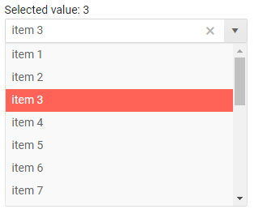

# ComboBox Overview

The <a href="https://www.telerik.com/blazor-ui/combobox" target="_blank">Blazor ComboBox component</a> allows the user to choose an option from a predefined set of choices presented in a dropdown popup. You can also allow them to enter [custom values]() and to [filter]() the available items. You can control the [data](), sizes, and various appearance options like class and [templates]().

To use a Telerik ComboBox for Blazor

1. add the `TelerikComboBox` tag
1. populate its `Data` property with the collection of items you want in the dropdown
1. set the `TextField` and `ValueField` properties to point to the corresponding names of the model
1. (optional) set the `Value` property to the initial value of the model.
1. (optional) enable features like filtering and clear button

>caption Combobox [data binding](data-bind), two-way value binding and main features

````CSHTML
Selected value: @selectedValue
<br />

<TelerikComboBox Data="@myComboData" TextField="MyTextField" ValueField="MyValueField" @bind-Value="selectedValue"
                 Placeholder="Select an item..." ClearButton="true" Filterable="true">
</TelerikComboBox>

@code {
    IEnumerable<MyDdlModel> myComboData = Enumerable.Range(1, 20).Select(x => new MyDdlModel { MyTextField = "item " + x, MyValueField = x });

    int selectedValue { get; set; } = 3; //usually the current value should come from the model data

    //in a real case, the model is usually in a separate file
    //the model type and value field type must be provided to the dropdpownlist
    public class MyDdlModel
    {
        public int MyValueField { get; set; }
        public string MyTextField { get; set; }
    }
}
````

>caption The result from the code snippet above



>caption Component namespace and reference

The ComboBox is a generic component and its type is determined by the type of the model you pass to it, and the type of its value field. You can find examples in the [Data Bind - Considerations](#considerations) article.

## Features

>caption The ComboBox provides the following features:

* `AllowCustom` - whether the user can enter [custom values](). If enabled, the `ValueField` must be a `string`.

* `Class` - the CSS class that will be rendered on the main wrapping element of the combobox.

* `ClearButton` - whether the user will have the option to clear the selected value. When it is clicked, the `Value` will be updated to `default(TValue)`, so there must be no item in the `Data` that has such a `Value`. For example, if `TValue` is `int`, clearing the value will lead to a `0` `Value`, so if there is an Item with `0` in its `ValueField` - issues may arise with its selection. This feature can often go together with `AllowCustom`.

* `Data` - allows you to provide the data source. Required.

* `Enabled` - whether the component is enabled.

* `Filterable` - whether [filtering]() is enabled for the end user.

* `FilterOperator` - the method of [filtering]() the items. Defaults to `StartsWith`.

* `Id` - renders as the `id` attribute on the `<input />` element, so you can attach a `<label for="">` to the input.

* `Placeholder` - the text the user sees as a hint when no item is selected (the `Value` is `null` or an empty string).

* `PopupHeight` - the height of the expanded dropdown list element.

* `PopupWidth` - the width of the expanded dropdown list element. If you don't specify a value, the dropdown width will match the main element which can help with responsive layouts and 100% widths.

* `TItem` - the type of the model to which the component is bound. Required if you can't provide `Data` or `Value`. Determines the type of the reference object.

* `TValue` - the type of the value field from the model to which the component is bound. Required if you can't provide `Data` or `Value`. Determines the type of the reference object.

* `TextField` - the name of the field from the model that will be shown to the user. Defaults to `Text`.

* `ValueField` - the name of the field from the model that will be the underlying `value`. Defaults to `Value`.

* `Value` and `bind-Value`- get/set the value of the component, can be used for binding. If you set it to a value allowed by the model class value field, the corresponding item from the data collection will be pre-selected. Use the `bind-Value` syntax for two-way binding, for example, to a variable of your own.

    The `Value` and `ValueField` can be of types:

    * `number` (such as `int`, `double` and so on)
    * `string`
    * `Guid`
    * `Enum`

* `Width` - the width of the dropdown and the main element. @[template](/_contentTemplates/inputs/inputs-width-template.md#inputs-width-information)

* Templates - they allow you to control the rendering of items in the component. See the [Templates]() article for more details.

* Validation - see the [Input Validation]() article for more details.


## Selected Item

By default, if no `Value` is provided, the ComboBox will appear empty, or will display the `Placeholder` defined. If a `Value` is provided and `AllowCustom` is *not* set to `true`, the `Value` should match an item in the data source (see more in the [Value Out of Range](#value-out-of-range) section).

The ComboBox will not always have a selected item, however, because it can act as an input. There will be no selected item in the following cases that depend on the settings of the component that the developer can control:

* the user clears the value through the Clear button,
* the user clears the value with `Backspace` or `Del` keys,
* `AllowCustom="false"` - when a custom value is typed, the ComboBox input value will be automatically cleared on the change event (`blur` of the input or `Enter` keypress). See the table below.
* `AllowCustom="true"` - when the user starts typing a custom value.


Missing selection is most common when the initial value is `null` as data sources rarely have items with a `null` value, and/or when you want to let your users type in values that are not in your predefined set of options.

>caption If the user types text in the input, selection behaves according to the following table:


| User input matches | AllowCustom=`true`   | AllowCustom=`false`                      |
|----------------------------|----------------------|------------------------------------------|
|  The `TextField` of an item | Matched item is selected. The `Value` is taken from the item. | Matched item is selected. The `Value` is taken from the item. |
| The `ValueField` of an item | No item is selected. `Value` is updated to the custom one. | No item is selected. `Value` is updated to `default(typeof(Value))`. The `OnChange` event does not fire for the value clearing. |
| No match | No item is selected. `Value` is updated to the custom one. | No item is selected. `Value` is updated to `default(typeof(Value))`. The `OnChange` event does not fire for the value clearing. |


>tip If you are looking for more fields from the view-model that describes the dropdown items, not just the `Value`, see the [Get model from dropodwn]() KB article and the [OnChange](events#onchange) event.
>
> You may also want to review/join the discussion and Vote for this request: <a href="https://www.telerik.com/forums/binding-dropdownlist-value-to-complex-model" target="_blank">Binding DropDownList Value to complex model</a>


## See Also

  * [Data Binding]()
  * [Live Demo: ComboBox](https://demos.telerik.com/blazor-ui/combobox/overview)
  * [Live Demo: ComboBox Validation](https://demos.telerik.com/blazor-ui/combobox/validation)
  * [API Reference](https://docs.telerik.com/blazor-ui/api/Telerik.Blazor.Components.TelerikComboBox-2)

