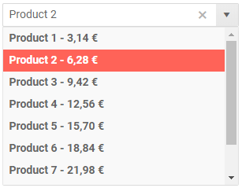
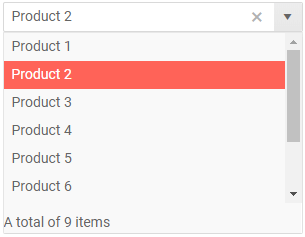

# ComboBox Templates

The ComboBox component allows you to change what is rendered in its items, header and footer through templates.

List of the available templates:

* [Item Template](#item-template)
* [Header](#header)
* [Footer](#footer)


## Item Template

The Item template determines how the individual items are rendered in the dropdown element of the component. By default, the text from the model is rendered.

>caption Item Template Example

````CSHTML
@* Define what renders for the items in the dropdown *@

<TelerikComboBox @bind-Value=@SelectedValue
                 Data="@ComboBoxData"
                 ValueField="ProductId"
                 TextField="ProductName">
    <ItemTemplate>
        <strong>@((context as Product).ProductName) - @(String.Format("{0:C2}", (context as Product).UnitPrice))</strong>
    </ItemTemplate>
</TelerikComboBox>

@code {
    public IEnumerable<Product> ComboBoxData { get; set; }
    public int SelectedValue { get; set; } = 2;

    protected override void OnInitialized()
    {
        List<Product> products = new List<Product>();
        for (int i = 1; i < 10; i++)
        {
            products.Add(new Product()
            {
                ProductId = i,
                ProductName = $"Product {i}",
                UnitPrice = (decimal)(i * 3.14)
            });
        }

        ComboBoxData = products;
        base.OnInitialized();
    }

    public class Product
    {
        public int ProductId { get; set; }
        public string ProductName { get; set; }
        public decimal UnitPrice { get; set; }
    }
}
````

>caption The result from the code snippet above



## Header

The header is content that you can place above the list of items inside the dropdown element. It is always visible when the combobox is expanded. By default it is empty.

>caption Header Example

````CSHTML
@* Define a header in the dropdown *@

<TelerikComboBox @bind-Value=@SelectedValue
                 Data="@ComboBoxData"
                 ValueField="ProductId"
                 TextField="ProductName">
    <HeaderTemplate>
        <div class="k-header" style="margin-top: 10px; padding-bottom: 10px">Header</div>
    </HeaderTemplate>
</TelerikComboBox>

@code {
    public IEnumerable<Product> ComboBoxData { get; set; }
    public int SelectedValue { get; set; } = 2;

    protected override void OnInitialized()
    {
        List<Product> products = new List<Product>();
        for (int i = 1; i < 10; i++)
        {
            products.Add(new Product()
            {
                ProductId = i,
                ProductName = $"Product {i}",
                UnitPrice = (decimal)(i * 3.14)
            });
        }

        ComboBoxData = products;
        base.OnInitialized();
    }

    public class Product
    {
        public int ProductId { get; set; }
        public string ProductName { get; set; }
        public decimal UnitPrice { get; set; }
    }
}
````

>caption The result from the code snippet above


## Footer

The footer is content that you can place below the list of items inside the dropdownlist element. It is always visible when the dropdown is expanded. By default it is empty.

>caption Footer Example

````CSHTML
@* Define dropdown footer *@

<TelerikComboBox @bind-Value=@SelectedValue
                 Data="@ComboBoxData"
                 ValueField="ProductId"
                 TextField="ProductName">
    <FooterTemplate>
        <div class="k-footer" style="margin-top: 10px">A total of @ComboBoxData.Count() items</div>
    </FooterTemplate>
</TelerikComboBox>

@code {
    public IEnumerable<Product> ComboBoxData { get; set; }
    public int SelectedValue { get; set; } = 2;

    protected override void OnInitialized()
    {
        List<Product> products = new List<Product>();
        for (int i = 1; i < 10; i++)
        {
            products.Add(new Product()
            {
                ProductId = i,
                ProductName = $"Product {i}",
                UnitPrice = (decimal)(i * 3.14)
            });
        }

        ComboBoxData = products;
        base.OnInitialized();
    }

    public class Product
    {
        public int ProductId { get; set; }
        public string ProductName { get; set; }
        public decimal UnitPrice { get; set; }
    }
}
````

>caption The result from the code snippet above



## See Also

  * [Live Demo: ComboBox Templates](https://demos.telerik.com/blazor-ui/combobox/templates)
   
  