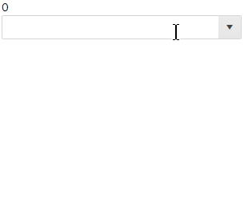

# ComboBox Virtualization

The ComboBox component can virtualize the elements in its dropdown so you can use huge data source without UI performance issues.

Enabling the UI virtualization feature makes the component reuse a set number of items in the dropdown as you scroll, instead of rendering out the entire data source. It can work both with local data that the view-model already has, or you can fetch remote data every time the user scrolls through an event the component provides.

#### In This Article

* [Basics](#basics)
* [Local Data](#local-data)
* [Remote Data](#remote-data)

## Basics

This section will explain the parameters and behaviors that are related to the virtualization feature so you can set it up.

>caption To enable UI virtualization, you need to set the following parameters of the component:

* `ScrollMode` - `Telerik.Blazor.DropDownScrollMode` - set it to `DropDownScrollMode.Virtual`. It defaults to the "regular" scrolling.

* `PopupHeight` - `string` - set the height of the popup element to a valid CSS unit. It must **not** be a `null/empty` string.

* `ItemHeight` - `decimal` - set it to the height each individual item will have in the dropdown. Make sure to accommodate the content your items will have and any item template.

* `PageSize` - `int` - defines how many items will actually be rendered and reused. The value determines how many items are loaded on each scroll. The number of items must be large enough according to the `ItemHeight` and `PopupHeight` so that there are more items than the dropdown so there is a scrollbar.

You can find a basic example in the [Local Data](#local-data) section below.

>caption For working with [remote data](#remote-data), you also need:

* `ValueMapper` - `Func<List<TValue, Task<TItem>>` - the component will call this method to request the model that matches the `Value` it has set. This is required because with remote data the `Value` may not be in the initial collection of `Data` that the component has, and so there would otherwise be no way to extract the `DataTextField` from it to render it. Usually, this method will be called on the initial render only to fetch the data item for the current selection.

* `OnRead` - `EventCallback` - the component will call this event when the user scrolls with the corresponding offset (`Skip`), `PageSize` and any filters. This lets you optimize the data queries and return only what is needed at the moment, when it is needed.

### Limitations

* When the initially selected item/items are on a page different than the first one, opening the dropdown list will NOT scroll the list to the selected item.

## Local Data

The example below shows how you can display, scroll and filter over 10k records in the combobox without delays and performance issues.



````CSHTML
@SelectedValue
<br />
<TelerikComboBox Data="@Data"

                 ScrollMode="@DropDownScrollMode.Virtual"
                 PopupHeight="200px"
                 ItemHeight="30"
                 PageSize="20"

                 TextField="@nameof(Person.Name)"
                 ValueField="@nameof(Person.Id)"
                 @bind-Value="@SelectedValue"
                 Filterable="true" FilterOperator="@StringFilterOperator.Contains">
</TelerikComboBox>

@code {
    int SelectedValue { get; set; }
    List<Person> Data { get; set; }

    protected override void OnInitialized()
    {
        Data = Enumerable.Range(1, 12345).Select(x => new Person { Id = x, Name = $"Name {x}" }).ToList();

        base.OnInitialized();
    }

    public class Person
    {
        public int Id { get; set; }
        public string Name { get; set; }
    }
}
````

## Remote Data


## See Also

  * [Live Demo: ComboBox Virtualization](https://demos.telerik.com/blazor-ui/combobox/virtualization)
   
  
