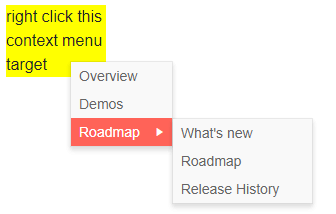

# Context Menu Data Binding to Flat Data

This article explains how to bind the Context Menu for Blazor to flat data. 
@[template](/_contentTemplates/menu/basic-example.md#context-menudata-binding-basics-link)


Flat data means that the entire collection of menu items is available at one level, for example `List<MyMenuModel>`.

The parent-child relationships are created through internal data in the model - the `ParentId` field which points to the `Id` of the item that will contain the current item. The root level has `null` for `ParentId`.

You are *not* required to provide a value for the `HasChildren` field. @[template](/_contentTemplates/menu/basic-example.md#has-children-behavior)

>caption Example of flat data in a context menu

````CSHTML
@* Using a self-referencing flat data source for the menu *@

<div class="menuTarget">
    right click this context menu target
</div>

<TelerikContextMenu Data="@MenuItems" Selector=".menuTarget"
             ParentIdField="@nameof(MenuItem.SectionId)"
             IdField="@nameof(MenuItem.Id)"
             TextField="@nameof(MenuItem.Section)"
             UrlField="@nameof(MenuItem.Page)">
</TelerikContextMenu>

@code {
    public List<MenuItem> MenuItems { get; set; }

    public class MenuItem
    {
        public int Id { get; set; }
        public int? SectionId { get; set; }
        public string Section { get; set; }
        public string Page { get; set; }
    }

    protected override void OnInitialized()
    {
        MenuItems = new List<MenuItem>()
        {
            // sample URLs for SPA navigation
            new MenuItem()
            {
                Id = 1,
                Section = "Overview",
                Page = "menu/overview"
            },
            new MenuItem()
            {
                Id = 2,
                Section = "Demos",
                Page = "menu/demos"
            },
            new MenuItem()
            {
                Id = 3,
                Section = "Roadmap"
            },
            // sample URLs for external navigation
            new MenuItem()
            {
                Id = 4,
                SectionId = 3,
                Section = "What's new",
                Page = "https://www.telerik.com/support/whats-new"
            },
            new MenuItem()
            {
                Id = 5,
                SectionId = 3,
                Section = "Roadmap",
                Page = "https://www.telerik.com/support/whats-new/blazor-ui/roadmap"

            },
            new MenuItem()
            {
                Id = 6,
                SectionId = 3,
                Section = "Release History",
                Page = "https://www.telerik.com/support/whats-new/blazor-ui/release-history"
            }
        };

        base.OnInitialized();
    }
}

<style>
    .menuTarget {
        width: 100px;
        background: yellow;
        margin: 50px;
    }
</style>
````

>caption The result from the code snippet above, after hovering the "Roadmap" item




## See Also

  * [Menu Data Binding Basics]()
  * [Live Demo: Menu Flat Data](https://demos.telerik.com/blazor-ui/menu/flat-data)
  * [Binding to Hierarchical Data]()

