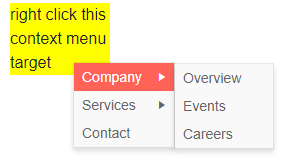

# Context Menu Data Binding to Hierarchical Data

This article explains how to bind the Context Menu for Blazor to hierarchical data. 
@[template](/_contentTemplates/menu/basic-example.md#context-menudata-binding-basics-link)


Hierarchical data means that the collection of child items is provided in a field of its parent's model. By default, this is the `Items` field. If there are items for a certain node, it will have an expand icon. The `HasChildren` field can override this, however, but it is not required for hierarchical data binding. Note that all menu item models must be of the same type.

This approach of providing nodes lets you gather separate collections of data for certain sections or areas. Check out the [Know The Target And Adjust Items](#know-the-target-and-adjust-items) example to see one way of altering the data (items) in the menu before showing it. 

>caption Example of using hierarchical data in a context menu

````CSHTML
@* Hierarchical menu data source and navigation through different views *@

<div class="menuTarget">
    right click this context menu target
</div>

<TelerikContextMenu Data="@MenuItems" Selector=".menuTarget"
             ItemsField="@nameof(MenuItem.SubSectionList)"
             TextField="@nameof(MenuItem.Section)"
             UrlField="@nameof(MenuItem.Page)">
</TelerikContextMenu>

@code {
    public List<MenuItem> MenuItems { get; set; }

    public class MenuItem
    {
        public string Section { get; set; }
        public string Page { get; set; }
        public List<MenuItem> SubSectionList { get; set; }
    }

    protected override void OnInitialized()
    {
        MenuItems = new List<MenuItem>()
        {
            // sample URLs for SPA navigation
            new MenuItem()
            {
                Section = "Company",
                SubSectionList = new List<MenuItem>()
                {
                    new MenuItem()
                    {
                        Section = "Overview",
                        Page = "company/overview"
                    },
                    new MenuItem()
                    {
                        Section = "Events",
                        Page = "events/all"
                    },
                    new MenuItem()
                    {
                        Section = "Careers",
                        Page = "careers"
                    }
                }
            },
            // sample URLs for external navigation
            new MenuItem()
            {
                Section = "Services",
                SubSectionList = new List<MenuItem>()
            {
                    new MenuItem()
                    {
                        Section = "Consulting",
                        Page = "https://mycompany.com/services/consulting"
                    },
                    new MenuItem()
                    {
                        Section = "Education",
                        Page = "https://mycompany.com/services/education"
                    }
                }
            },
            new MenuItem()
            {
                Section = "Contact",
                Page = "https://mycompany.com/contact"
            }
        };

        base.OnInitialized();
    }
}

<style>
    .menuTarget {
        width: 100px;
        background: yellow;
        margin: 50px;
    }
</style>
````

>caption The result from the code snippet above, after hovering the "Company" item




## See Also

  * [Context Menu Data Binding Basics]()
  * [Live Demo: Context Menu Hierarchical Data](https://demos.telerik.com/blazor-ui/contextmenu/hierarchical-data)
  * [Binding to Flat Data]()

