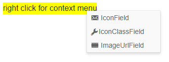

# Context Menu Icons

You can put an image, icon class or a font icon for each item in the Context Menu to illustrate its purpose for your end users. To apply them, use the following properties:

* for a [Telerik font icon](), point the `IconField` parameter of the component to a string field of the model that contains the corresponding icon name.

* for a raster image, point the `ImageUrlField` parameter of the component to a `string` field of the model that contains the url to the icon (relative or absolute).

* for a custom font icon class, point the `IconClassField` parameter of the component to a `string` field of the model that contains the desired CSS class list which provides the required rules (like font name and glyph symbol). Make sure to also reference the desired font in your app and to use its own recommendations.

The `IconClassField` and `ImageUrlField` are rendered, respectively, as `<span class="the custom class" />` and as ``

>caption How to use icons in Telerik Context Menu

````CSHTML
@* This example shows how to add icons or images to context menu items
Make sure that you also refernce the OpenIconic font that comes with the Blazor App template to see the custom font icon *@

<div id="context-menu-target" style="background:yellow;">right click for context menu</div>

<TelerikContextMenu Data="@MenuData"
                    Selector="#context-menu-target"
                    IconField="@nameof(MenuModel.TelerikIcon)"
                    ImageUrlField="@nameof(MenuModel.MyImage)"
                    IconClassField="@nameof(MenuModel.MyIconClass)">
</TelerikContextMenu>

@code {
    public List<MenuModel> MenuData { get; set; }

    protected override void OnInitialized()
    {
        GenerateMenuData();
    }

    public void GenerateMenuData()
    {
        MenuData = new List<MenuModel>()
        {
            new MenuModel()
            {
                Text = "IconField",
                TelerikIcon = "email"
            },
            new MenuModel()
            {
                Text = "IconClassField",
                MyIconClass = "oi oi-wrench",
            },
            new MenuModel()
             {
                Text = "ImageUrlField",
                MyImage = "https://docs.telerik.com/blazor-ui/images/video.png"
             }
        };
    }

    public class MenuModel
    {
        public string Text { get; set; }
        public string TelerikIcon { get; set; }
        public string MyImage { get; set; }
        public string MyIconClass { get; set; }
    }
}
````

>caption The result from the code snippet above



## See Also

  * [Context Menu Overview]()
