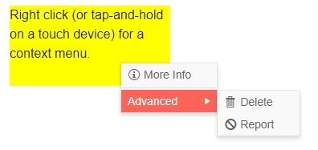

# Context Menu Overview

The Blazor Context Menu component displays a contextual popup with data (flat or hierarchical) in a traditional menu-like structure. It lets you invoke commands while preserving screen real estate.

In addition to built-in [navigation capabilities](), you can browse through the items and their children, define [templates]() for the individual nodes, render text and icons/images, and respond to [events]().

To use a Telerik Context Menu for Blazor:

1. add the `TelerikContextMenu` tag and set its `Selector` parameter to a CSS selector that will match the element(s) you want to attach the context menu to.
1. provide a collection of models to its `Data` property (read more in the [Data Binding article]())
1. match the fields in the models with the binding schema for the nodes
1. handle the `OnClick` [event]() to respond to the user action

>caption Basic context menu with hierarchical data binding and click event handler

````CSHTML
@* Use a context menu to perform actions *@

<div class="context-menu-target" style="width:200px; height: 100px; background: yellow; margin-bottom: 50px;">
    Right click (or tap-and-hold on a touch device) for a context menu.
</div>

<TelerikContextMenu Selector=".context-menu-target" Data="@MenuItems"
                    TextField="Text" SeparatorField="Separator" IconField="Icon"
                    OnClick="@( (ContextMenuItem itm) => ClickHandler(itm) )">
</TelerikContextMenu>


@code {
    public List<ContextMenuItem> MenuItems { get; set; }

    async Task ClickHandler(ContextMenuItem clickedItem)
    {
        if (!string.IsNullOrEmpty(clickedItem.CommandName))
        {
            Console.WriteLine($"The programm will now perform the {clickedItem.CommandName} operation");
        }
    }

    protected override void OnInitialized()
    {

        MenuItems = new List<ContextMenuItem>()
        {
            new ContextMenuItem
            {
                Text = "More Info",
                Icon = IconName.Information,
                CommandName = "info"
            },
            new ContextMenuItem
            {
                Separator = true
            },
            new ContextMenuItem
            {
                Text = "Advanced",
                Items = new List<ContextMenuItem>()
                {
                    new ContextMenuItem
                    {
                        Text = "Delete",
                        Icon = IconName.Delete,
                        CommandName = "delete"
                    },
                    new ContextMenuItem
                    {
                        Text = "Report",
                        Icon = IconName.Cancel,
                        CommandName = "report"
                    }
                }
            }
        };

        base.OnInitialized();
    }

    public class ContextMenuItem
    {
        public string Text { get; set; }
        public string CommandName { get; set; }
        public string Icon { get; set; }
        public bool Separator { get; set; }
        public List<ContextMenuItem> Items { get; set; }
    }
}
````

>caption The result from the snippet above, after right clicking the yellow target and hovering the "Advanced" item



>caption Component namespace and reference

````CSHTML
@using Telerik.Blazor.Components

<TelerikContextMenu Data="@MenuItems" @ref="@TheContextMenu">
</TelerikContextMenu>

@code {
    // the context menu is a generic component and its type depends on the model it binds to
    TelerikContextMenu<ContextMenuItem> TheContextMenu { get; set; }

    List<ContextMenuItem> MenuItems { get; set; }

    protected override void OnInitialized()
    {

        MenuItems = new List<ContextMenuItem>()
        {
            new ContextMenuItem
            {
                Text = "Item 1"
            },
            new ContextMenuItem
            {
                Text = "Item 2"
            }
        };

        base.OnInitialized();
    }

    public class ContextMenuItem
    {
        public string Text { get; set; }
        public List<ContextMenuItem> Items { get; set; }
    }
}
````


## Navigate Views

A menu is often used to list pages, views or sections in an application so the user can navigate through them. To do that with a menu, you have two options:

* Use the built-in `UrlField` in the [bound data]() to populate the URLs in the anchors the menu will generate for you if an URL is provided for the given item. An example is available in the beginning of this article.
* Use a [Template]() to generate the desired links (e.g., `NavLink` components) with your own code to enable fine-tuning.

>tip You can find an example of a menu used to navigate between pages in an app in the [Navigation]() article.

## Know The Target And Adjust Items

Using the simple `Selector` parameter to attach the context menu to one or more targets at a time is simple, and can be useful when you want the same menu for many elements, but it does not matter which one the user clicked.

In some cases, you may need to know which element the user clicked so you can use it in the command handling. You may also want to adjust the menu contents based on which element the user clicked (e.g., disable or entirely remove some items from the menu based on a condition).

To achieve such flexibility and granularity, you can:

1. Use your own code to hook to an event such as `@oncontextmenu` to store the desired target and its metadata.
    * You can use other events to show the context menu, like click, mousedown and so on. Make sure to pass correct coordinates to the menu - they must be relative to the viewport.
    * If you use the `@oncontextmenu` event, also add `@oncontextmenu:preventDefault="true"` to avoid the browser context menu which will always show above HTML structures on the page, like the Telerik Context Menu.
1. Optionally, alter the data source or template of the menu based on the metadata for the target.
1. Show the Telerik menu through its `@ref` and the `ShowAsync` method it exposes.

>caption Use the context menu target and change menu items based on the target data

````CSHTML
@* Get context menu target and alter its items based on it *@ 

<TelerikContextMenu Data="@MenuItems" @ref="@TheContextMenu"
                    TextField="Text" SeparatorField="Separator" IconField="Icon" DisabledField="Disabled"
                    OnClick="@( (ContextMenuItem itm) => ClickHandler(itm) )">
</TelerikContextMenu>

<TelerikListView Data="@ListViewData" Width="700px" Pageable="true">
    <Template>
        <div @oncontextmenu:preventDefault="true"
             @oncontextmenu="@( (MouseEventArgs e) => ShowContextMenu(e, context) )"
             class="listview-item">
            <h4>@context.Name</h4>
            <h5>@context.Team</h5>
            <h6>Special context menu: @context.IsSpecial</h6>
        </div>
    </Template>
</TelerikListView>

@code {
    public List<ContextMenuItem> MenuItems { get; set; }
    TelerikContextMenu<ContextMenuItem> TheContextMenu { get; set; }
    SampleData LastClickedItem { get; set; }

    async Task ShowContextMenu(MouseEventArgs e, SampleData clickedItem)
    {
        // save the target/metadata
        LastClickedItem = clickedItem;
        // change the menu items
        PrepareMenuItems(clickedItem);
        // show the menu
        await TheContextMenu.ShowAsync(e.ClientX, e.ClientY);
    }

    void PrepareMenuItems(SampleData clickedItem)
    {
        // disable one item, you can make bigger changes here too
        MenuItems[2].Items[0].Disabled = clickedItem.IsSpecial;
    }

    async Task ClickHandler(ContextMenuItem clickedItem)
    {
        // handle the command from the context menu by using the stored metadata
        if (!string.IsNullOrEmpty(clickedItem.CommandName) && LastClickedItem != null)
        {
            Console.WriteLine($"The programm will now perform the {clickedItem.CommandName} operation for {LastClickedItem.Name}");
        }
        LastClickedItem = null;
    }

    // generate sample data for the listview and the menu
    protected override void OnInitialized()
    {

        MenuItems = new List<ContextMenuItem>()
        { 
            new ContextMenuItem
            {
                Text = "More Info",
                Icon = IconName.Information,
                CommandName = "info"
            },
            new ContextMenuItem
            {
                Separator = true
            },
            new ContextMenuItem
            {
                Text = "Advanced",
                Items = new List<ContextMenuItem>()
                {
                    new ContextMenuItem
                    {
                        Text = "Delete",
                        Icon = IconName.Delete,
                        CommandName = "delete"
                    },
                    new ContextMenuItem
                    {
                        Text = "Report",
                        Icon = IconName.Cancel,
                        CommandName = "report"
                    }
                }
            }
        };

        base.OnInitialized();
    }

    public class ContextMenuItem
    {
        public string Text { get; set; }
        public string CommandName { get; set; }
        public string Icon { get; set; }
        public bool Separator { get; set; }
        public bool Disabled { get; set; }
        public List<ContextMenuItem> Items { get; set; }
    }

    List<SampleData> ListViewData { get; set; } = Enumerable.Range(1, 25).Select(x => new SampleData
    {
        Id = x,
        Name = $"Name {x}",
        Team = $"Team {x % 3}",
        IsSpecial = x % 4 == 0
    }).ToList();

    public class SampleData
    {
        public int Id { get; set; }
        public string Name { get; set; }
        public string Team { get; set; }
        public bool IsSpecial { get; set; }
    }
}

<style>
    .listview-item {
        height: 150px;
        width: 150px;
        display: inline-block;
        margin: 10px;
        border: 1px solid black;
        border-radius: 10px;
        padding: 10px;
    }
</style>
````

## Context Menu for a Grid Row

To integrate the context menu with the Telerik Grid, you need to:

1. Use the grid's `OnRowContextMenu` event to get the current row model and show the menu
2. Use the context menu's `OnClick` event to handle the desired operation

In this example, the context menu is used to select/deselect items, put an item in edit mode and delete items

>caption Use a Context Menu for Grid rows

````CSHTML
@using System.Collections.Generic
@using System.Collections.ObjectModel

<TelerikContextMenu @ref="@ContextMenuRef" Data="@MenuItems" OnClick="@((MenuItem item) => OnItemClick(item))"></TelerikContextMenu>

<TelerikGrid Data="@GridData" @ref="@GridRef"
             EditMode="@GridEditMode.Inline"
             Height="500px"
             Pageable="true"
             OnCreate="@CreateItem" OnUpdate="@UpdateHandler"
             OnRowContextMenu="@OnContextMenu"
             SelectionMode="@GridSelectionMode.Multiple"
             @bind-SelectedItems="@SelectedItems">
    <GridToolBar>
        <GridCommandButton Command="Add" Icon="add">Add Employee</GridCommandButton>
    </GridToolBar>
    <GridColumns>
        <GridColumn Field=@nameof(SampleData.ID) Editable="false" />
        <GridColumn Field=@nameof(SampleData.Name) />
        <GridCommandColumn>
            <GridCommandButton Command="Save" Icon="save" ShowInEdit="true">Update</GridCommandButton>
            <GridCommandButton Command="Cancel" Icon="cancel" ShowInEdit="true">Cancel</GridCommandButton>
        </GridCommandColumn>
    </GridColumns>
</TelerikGrid>

@if (SelectedItems.Any())
{
    <ul>
        @foreach (var item in SelectedItems)
        {
            <li>@item.Name</li>
        }
    </ul>
}

@code {
    //data sources
    ObservableCollection<SampleData> GridData { get; set; }
    List<MenuItem> MenuItems { get; set; }
    IEnumerable<SampleData> SelectedItems { get; set; } = Enumerable.Empty<SampleData>();
    //metadata for the context menu actions
    SampleData SelectedPerson { get; set; }
    //component references so we can use their methods
    TelerikContextMenu<MenuItem> ContextMenuRef { get; set; }
    TelerikGrid<SampleData> GridRef { get; set; }

    // sample menu item class
    public class MenuItem
    {
        public string Text { get; set; }
        public string Icon { get; set; }
        public Action Action { get; set; }
        public string CommandName { get; set; }
    }

    // show the context menu for a particular row
    async Task OnContextMenu(GridRowClickEventArgs args)
    {
        var argsItem = args.Item as SampleData;

        SelectedPerson = argsItem;

        if (args.EventArgs is MouseEventArgs mouseEventArgs)
        {
            await ContextMenuRef.ShowAsync(mouseEventArgs.ClientX, mouseEventArgs.ClientY);
        }
    }

    // sample handling of the context menu click
    async Task OnItemClick(MenuItem item)
    {
        // one way to pass handlers is to use an Action, you don't have to use this
        if (item.Action != null)
        {
            item.Action.Invoke();
        }
        else
        {
            // or you can use local code to perform a task
            // such as put a row in edit mode or select it
            switch (item.CommandName)
            {
                case "BeginEdit": // read more at https://localhost/blazor-ui/components/grid/state#initiate-editing-or-inserting-of-an-item
                    var currState = GridRef.GetState();
                    currState.InsertedItem = null;
                    SampleData itemToEdit = SampleData.GetClonedInstance(GridData.Where(itm => itm.ID == SelectedPerson.ID).FirstOrDefault());
                    currState.OriginalEditItem = itemToEdit;
                    await GridRef.SetState(currState);
                    break;
                case "ToggleSelect":
                    var selItems = SelectedItems.ToList();
                    if (SelectedItems.Contains(SelectedPerson))
                    {
                        selItems.Remove(SelectedPerson);
                    }
                    else
                    {
                        selItems.Add(SelectedPerson);
                    }
                    SelectedItems = selItems;
                    break;
                default:
                    break;
            }
        }
        SelectedPerson = null; // clean up
    }

    // generate data
    protected override void OnInitialized()
    {
        // context menu items
        MenuItems = new List<MenuItem>()
        {
            new MenuItem(){ Text = "Select", Icon=IconName.CheckboxChecked, CommandName="ToggleSelect" },
            new MenuItem(){ Text = "Edit", Icon=IconName.Edit, CommandName="BeginEdit" },
            new MenuItem(){ Text = "Delete", Icon=IconName.Delete, Action = DeleteItem }
        };

        // generate data for the grid
        GridData = new ObservableCollection<SampleData>();
        var rand = new Random();

        for (int i = 0; i < 100; i++)
        {
            GridData.Add(new SampleData()
            {
                ID = i,
                Name = "Employee " + i.ToString(),
            });
        }
    }


    // CUD operations for the grid

    async Task CreateItem(GridCommandEventArgs args)
    {
        var argsItem = args.Item as SampleData;

        // call the actual data service here

        argsItem.ID = GridData.Count + 1;

        GridData.Insert(0, argsItem);
    }

    void DeleteItem() // not async so it can be passed as an Action
    {
        var argsItem = SelectedPerson;

        // call the actual data service here

        GridData.Remove(argsItem);
    }

    async Task UpdateHandler(GridCommandEventArgs args)
    {
        var argsItem = args.Item as SampleData;

        // call the actual data service here

        var index = GridData.ToList().FindIndex(i => i.ID == argsItem.ID);
        if (index != -1)
        {
            GridData[index] = argsItem;
        }
    }

    public class SampleData
    {
        public int ID { get; set; }
        public string Name { get; set; }


        public override bool Equals(object obj)
        {
            if (obj is SampleData)
            {
                return this.ID == (obj as SampleData).ID;
            }
            return false;
        }

        public SampleData()
        {

        }

        public SampleData(SampleData itmToClone)
        {
            this.ID = itmToClone.ID;
            this.Name = itmToClone.Name;
        }

        public static SampleData GetClonedInstance(SampleData itmToClone)
        {
            return new SampleData(itmToClone);
        }
    }
}
````


## See Also

  * [Data Binding a Context Menu]()
  * [Live Demo: Context Menu](https://demos.telerik.com/blazor-ui/context menu/index)
  * [API Reference](https://docs.telerik.com/blazor-ui/api/Telerik.Blazor.Components.TelerikContextMenu-1)

