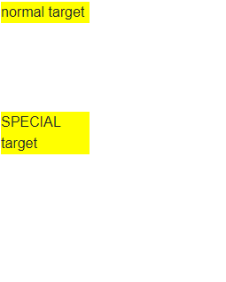

# Context Menu Content Template

The Context Menu component allows you to define a custom template for its entire content so you can render what you want in it

To override the context menu rendering, use the `<Template>` tag, and define your desired components and layout there.

The template receives the data source to which the context menu is bound as its `context`.

You can use the template to render arbitrary content according to your application's data and logic. You can use components in it and thus provide rich content instead of plain text. You can also use it to add DOM event handlers like click, doubleclick, mouseover if you need to respond to them.

>caption Use the content template to implement a custom layout that can also use the current target to alter itself

````CSHTML
@* Use the target to generate different custom layout in the context menu depending on what was clicked *@

<div @oncontextmenu:preventDefault="true"
     @oncontextmenu="@( (MouseEventArgs e) => ShowContextMenu(e, false) )"
     class="menuTarget">
    normal target
</div>

<div @oncontextmenu:preventDefault="true"
     @oncontextmenu="@( (MouseEventArgs e) => ShowContextMenu(e, true) )"
     class="menuTarget">
    SPECIAL target
</div>

<TelerikContextMenu Data="@MenuItems" @ref="@TheContextMenu">
    <Template>
        @* Shows how to use the data source you give to the menu *@
        @{
            var dataSource = context as List<ContextMenuItem>;
            <p>We have this data:</p>
            <ul>
                @foreach (var item in dataSource)
                {
                    <li>@item.Text</li>
                }
            </ul>
        }

        @* sample template *@

        <NavLink href="@dataSource[0].Metadata">Get Info</NavLink>

        @* Sample conditional template that depends on the target *@
        @if (UseSpecialMenu)
        {
            <TelerikButton OnClick="@( () => Console.WriteLine($"do more with {dataSource[1].Text}") )">Do More</TelerikButton>
        }
    </Template>
</TelerikContextMenu>

@code {
    public List<ContextMenuItem> MenuItems { get; set; }
    TelerikContextMenu<ContextMenuItem> TheContextMenu { get; set; }
    bool UseSpecialMenu { get; set; }

    async Task ShowContextMenu(MouseEventArgs e, bool IsSpecial)
    {
        // use information to toggle the menu content
        UseSpecialMenu = IsSpecial;
        // show the menu
        await TheContextMenu.ShowAsync(e.ClientX, e.ClientY);
    }

    // generate sample data for the listview and the menu
    protected override void OnInitialized()
    {
        MenuItems = new List<ContextMenuItem>()
        {
            new ContextMenuItem
            {
                Text = "More Info",
                Metadata = "info"
            },
            new ContextMenuItem
            {
                Text = "Special Command",
                Metadata = "special"
            }
        };

        base.OnInitialized();
    }

    public class ContextMenuItem
    {
        public string Text { get; set; }
        public string Metadata { get; set; }
    }
}

<style>
    .menuTarget{
        width: 100px;
        background: yellow;
        margin: 50px;
    }
</style>
````

>caption The result from the snippet above



## See Also

  * [Data Binding a Context Menu]()
  * [Live Demo: Context Menu Temlate](https://demos.telerik.com/blazor-ui/contextmenu/template)

