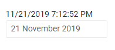

# Date Input Overview

The <a href="https://www.telerik.com/blazor-ui/date-input" target="_blank">Blazor Date Input component</a> allows the user to enter a date. The developer can control the format of the date. If the user input does not match the desired pattern, the value is not accepted. If the input can be parsed, it will be corrected automatically.

## Basics

#### To use a Telerik Date Input for Blazor, add the `TelerikDateInput` tag.

>caption Basic date input with namespace and reference

````CSHTML
@dateInputValue
<br />

<TelerikDateInput @bind-Value="@dateInputValue" Format="dd MMMM yyyy" @ref="theDateInput">
</TelerikDateInput>

@code {
    DateTime dateInputValue { get; set; } = DateTime.Now;

    Telerik.Blazor.Components.TelerikDateInput<DateTime> theDateInput;
    // the type of the component depends on the type of the value
    // in this case it is DateTime, but it could be DateTime?
}
````

>caption The result from the code snippet above



## Features

The date input provides the following features:

* `Class` - the CSS class that will be rendered on the `input` element.

* `Enabled` - whether the `input` is enabled.

* `Format` - the date format that the user input must match. Read more in the [Supported Formats]() article.

* `Id` - renders as the `id` attribute on the `<input />` element, so you can attach a `<label for="">` to the input.

* `Value` - get/set the value of the input, can be used for binding.

* `Width` - the width of the `input`. See the [Dimensions]() article.

* `TabIndex` - maps to the `tabindex` attribute of the HTML element. You can use it to customize the order in which the inputs in your form focus with the `Tab` key.

* `Placeholder` - `string` - maps to the `placeholder` attribute of the HTML element. The `Placeholder` will appear if the component is bound to nullable DateTime object - `DateTime?`, but will not be rendered if the component is bound to the default value of a non-nullable DateTime object. 

* Validation - see the [Input Validation]() article.

## DateTime and Nullable DateTime

The behavior of the component will depend on the type of field it is bound to, and this can result in different user experience and values that it will output:

##### Bound to a Nullabe DateTime

* When value is `null` - the `Format` is displayed as a placeholder.
* When modifying a part, if some parts are not defined, the value remains `null`.
* When all values are provided, the value changes.
* Upon deleting any part, the whole value changes to `null`, and the entire input returns to the format placeholder. When one or more segments are deleted the value is no longer a valid date and thus defaults to `null`.
* When inside an `EditForm`, if no attributes are present on the field, and the value is deleted, no validation error is shown.


##### Bound to a Non-Nullabe DateTime

* When the value is undefined, it defaults to `0001-01-01`, so the component has it as a value.
* When modifying a part, if some parts are not defined, the bound value does not change.
* When all values are provided, the value changes.
* Upon deleting a focused segment of the input, only that part switches to the format placeholder and not the entire value.
* When inside an `EditForm`, if no attributes are present on the field, and the value is deleted, a validation error is shown.


## Efficient Keyboard Input

The Telerik date inputs take into account what you are typing in order to let you input data quickly and efficiently.

The input focuses the next date segment automatically when the input for the current segment uniquely and successfully identifies the value current segment. 

You can change the focused segment through entering:

* `LeftArrow` or `RightArrow`

* the `value` of the input (for example, entering `12` for the month number)

* the `separator` of the date segments.
    * The supported separators in the Telerik date editors - `TelerikDateInput`, `TelerikDatePicker`, `TelerikDateTimePicker`, and the `TelerikTimePicker`, are the forward-slash `/`, the comma `,`, and the dot `.`. 


>caption Example scenarios when and how focus moves between date segments

In the example below, we will use the `M/d/yyyy` date format and take the `month` segment specifically to illustrate the component behavior.

* When the user inputs a `valid value` - a digit or two digits that can successfully and uniquely form the month of the year.

    * If the input is `two` (`2`), the focus will automatically shift to the next date segment (the day), because there are no months with two digits that start with `two` (`2`).
    
    * If the value is `one` (`1`), the focus will **not** automatically shift to the next date segment (the day), because there are months with two digits that start with `one` (`1`) - such as January (1), October (10), November (11), and December (12). 
    
* By typing the `separator` in the input (`/` in this example), or by using the `LeftArrow` / `RightArrow` keys on the keyboard.

    * This allows the user to quickly submit `one` (`1`) as a valid month without having to type `01` for January or wondering how to avoid typing a second digit because they don't want to enter `10`, `11` or `12`.
    
    * Providing a `separator` is an alternative to using the `left` / `right` arrows on the keyboard. This is useful when the user utilizes a numeric keyboard on a mobile device where no arrows are available.


This behavior allows the application users to quickly input a date in the editor, for example:

* writing `21/2021` will be automatically formatted to a valid `DateTime` object - `February 1, 2021` - the number `2` is a unique month and you don't have to do anything to move to the next segment, inputting the separator means you don't have to provide a two-digit date.

* writing `1/2/2021` will be recognized as `January 2, 2021` - inputting a first separators means you don't have to write a two-digit month or date.

* writing `5222021` will be recognized as `May 22, 2021` - inputting `5` uniquely identifies the month, and `22` uniquely identifies a date.

We recognize that there are many user experience patterns and ways that people want to write input, especially dates, considering that there are many formats for them. We chose the user experience described above because we believe it is the best common ground between automation, efficiency and control over the input. Unfortunately, there may be some users in your user base that seek a slightly different experience, and it is impossible for such a simple component to provide different ways for different users to interact with it - there would be no UI for the user to set their preferences, and if there were, it would make the UX too complicated for real world usage. Thus, we chose what we believe will work best for the majority of people.

## Validation


>caption Example of using validation to prompt the user for certain input

````CSHTML
@using System.ComponentModel.DataAnnotations

<EditForm Model="@person">
    <DataAnnotationsValidator />
    <ValidationSummary />
    <TelerikDateInput @bind-Value="person.Birthday" ParsingErrorMessage="plase enter a full date like 29 March 2019" Format="dd/MMMM/yyyy">
    </TelerikDateInput>
    <ValidationMessage For="@(() => person.Birthday)"></ValidationMessage>
    <button type="submit">submit</button>
</EditForm>

@code{
    //in a real case, the model will usually be in a separate file
    public class Person
    {
        [Required]
        [Range(typeof(DateTime), "1/1/1900", "1/12/2000",
            ErrorMessage = "Value for {0} must be between {1:dd MMM yyyy} and {2:dd MMM yyyy}")]
        public DateTime Birthday { get; set; }
    }

    Person person = new Person();
}
````

## See Also

  * [Live Demo: Date Input](https://demos.telerik.com/blazor-ui/dateinput/index)
  * [Input Validation]()
  * [Supported Date Formats]()
  * [API Reference](https://docs.telerik.com/blazor-ui/api/Telerik.Blazor.Components.TelerikDateInput-1)
