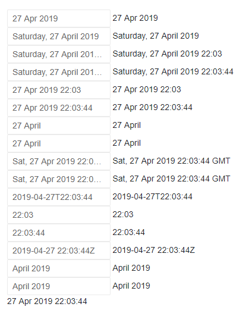
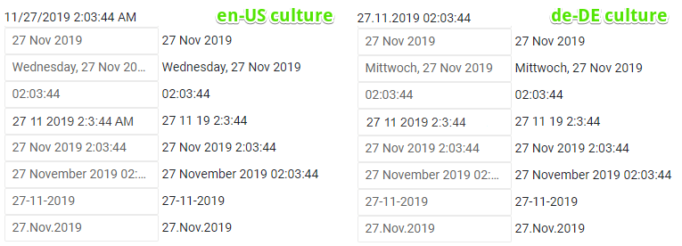

# Supported Date Formats

This article explains the format strings and specifiers supported by the Telerik DateInput for Blazor and how to set them to its `Format` property.

These formats are also used in composite components that also rely on a date input, such as the Date Picker and the Time Picker.

The Telerik Date Input supports the standard format strings and specifiers that come from the .NET Framework:

* [Standard Date and Time Format Strings](https://docs.microsoft.com/en-us/dotnet/standard/base-types/standard-date-and-time-format-strings) - all options are supported, except `O`, `o` and `U`.
* [Custom Date and Time Format Strings](https://docs.microsoft.com/en-us/dotnet/standard/base-types/custom-date-and-time-format-strings) - the most common date and time specifiers are supported down to the seconds level. Epoch, offset, time zone and sub-second specifiers are not supported. Here is a list of the supported specifiers:
    * `d`
    * `dd`
    * `ddd`
    * `dddd`
    * `M`
    * `MM`
    * `MMM`
    * `MMMM`
    * `yy`
    * `yyy`
    * `yyyy`
    * `h`
    * `hh`
    * `H`
    * `HH`
    * `m`
    * `mm`
    * `s`
    * `ss`
    * `tt`

>caution While the results of unsupported format specifiers values will render correctly, editing is not supported for them.

>tip There are some samples in the [Examples section](#examples).

### Two-digit Year Formats

We recommend avoiding two-digit year formats (something like `yy`) in favor of four-digit formats (like `yyyy`). Two-digit years produce the following issues:

* for the end user - it is unclear for the user whether the year will be 1960, 1860, 2060 or in some other century
* for the component - it is unclear for the code of the component which the date should be from the above list - determining that is a heuristic task while our components must provide consistent experience - the same input should result in the same output

This also makes it unclear how would validation work in such a case because the actual value for the year is undefined - for example, should a range starting from the year 2000 accept the "01" input since we don't know if it is the year 2001 or the year 0001.

So, for example, typing merely "20" would actually be the year 0020 (twenty years AD) as a number (value) the component receives, but it is very rare that this is the desired result - the expected results would usually be 1920 or 2020.

## Culture Awareness

The format strings are culture aware (see [Globalization - Overview]()) and the same `Format` may render different things depending on the culture. For example:

* If a custom format string includes the `/` format specifier, the DateInput displays the value of `System.Globalization.DateTimeFormat.DateSeparator` in place of `/` in the result string.

* If a custom format string includes the `:` format specifier, the DateInput displays the value of `System.Globalization.DateTimeFormat.TimeSeparator` in place of `:` in the result string.

>caption AM, PM and 12/24 Hour Formats

The AM/PM desginators and 12/24 formats are also taken into account as explained in the table below, and they also affect the rendering of the time pickers.


| Custom Format Contains | Culture Does Not Support AM/PM | Culture Supports AM/PM |
|------------------------|------------------------|--------------------------------|
| `hh`                   | This forces a 12 hour clock, but the day period carousel is **not** shown in the time picker.<br />- If `DateTimeFormat.AMDesignator` and `DateTimeFormat.PMDesignator` are set explicitly, the behavior is as if the culture supports AM/PM. <br />- If `DateTimeFormat.AMDesignator` and `DateTimeFormat.PMDesignator` are not present in the culture, the AM/PM values will not be rendered in strings and the AM/PM carousel will not be shown. | The default behavior - the day period carousel is shown in the time picker as the clock is 12 hour. |
| `HH`                   | The default behavior - the day period carousel in the time picker is not shown as the clock is 24 hour. | The default behavior - the day period carousel is shown in the time picker as the clock is 12 hour. |


If you set an `DateTimeFormat.AMDesignator` and `DateTimeFormat.PMDesignator` to your current culture, they will be used by the Telerik components - the framework honors them and will render them in the date/time strings, and so the Telerik Time Pickers will also render the period of day (AM/PM) carousel, as if the culture supports it, even if it does not have them by default.

This behavior stems from the default framework string behavior for dates, time and AM/PM support in cultures:

>caption Example with default ToString() behavior of the framework

````CS
DateTime date = new DateTime(2011,1,1,14,44,44);
var culture = new CultureInfo("bg-BG"); // this culture does not have day periods
//but we will set them here
culture.DateTimeFormat.AMDesignator = "сутрин";
culture.DateTimeFormat.PMDesignator = "следобед";
		
Console.WriteLine(date.ToString("hh:mm:ss tt", culture));		
Console.WriteLine(date.ToString("hh:mm:ss tt", CultureInfo.GetCultureInfo("bg-bg")));

// Output 
// 02:44:44 следобед
// 02:44:44 
````


## Examples

>caption Standard format strings support in Telerik Date Input for Blazor

````CSHTML
@TheDate
<br />

<TelerikDateInput @bind-Value="TheDate" Format="d" />@TheDate.ToString("d")
<br />
<TelerikDateInput @bind-Value="TheDate" Format="D" />@TheDate.ToString("D")
<br />
<TelerikDateInput @bind-Value="TheDate" Format="f" />@TheDate.ToString("f")
<br />
<TelerikDateInput @bind-Value="TheDate" Format="F" />@TheDate.ToString("F")
<br />
<TelerikDateInput @bind-Value="TheDate" Format="g" />@TheDate.ToString("g")
<br />
<TelerikDateInput @bind-Value="TheDate" Format="G" />@TheDate.ToString("G")
<br />
<TelerikDateInput @bind-Value="TheDate" Format="m" />@TheDate.ToString("m")
<br />
<TelerikDateInput @bind-Value="TheDate" Format="M" />@TheDate.ToString("M")
<br />
<TelerikDateInput @bind-Value="TheDate" Format="r" />@TheDate.ToString("r")
<br />
<TelerikDateInput @bind-Value="TheDate" Format="R" />@TheDate.ToString("R")
<br />
<TelerikDateInput @bind-Value="TheDate" Format="s" />@TheDate.ToString("s")
<br />
<TelerikDateInput @bind-Value="TheDate" Format="t" />@TheDate.ToString("t")
<br />
<TelerikDateInput @bind-Value="TheDate" Format="T" />@TheDate.ToString("T")
<br />
<TelerikDateInput @bind-Value="TheDate" Format="u" />@TheDate.ToString("u")
<br />
<TelerikDateInput @bind-Value="TheDate" Format="y" />@TheDate.ToString("y")
<br />
<TelerikDateInput @bind-Value="TheDate" Format="Y" />@TheDate.ToString("Y")

@code {
    DateTime TheDate { get; set; } = new DateTime(2019, 4, 27, 22, 03, 44);
}
````

>caption The result from the code snippet above




>caption Using supported .NET format specifiers to define relatively common date formats in the Telerik Date Input

````CSHTML
@TheDate
<br />

<TelerikDateInput @bind-Value="TheDate" Format="dd MM yyyy" /> @TheDate.ToString("dd MM yy")
<br />
<TelerikDateInput @bind-Value="TheDate" Format="dd MMM yyyy" /> @TheDate.ToString("dd MMM yyyy")
<br />
<TelerikDateInput @bind-Value="TheDate" Format="dddd, dd MMM yyyy" /> @TheDate.ToString("dddd, dd MMM yyyy")
<br />
<TelerikDateInput @bind-Value="TheDate" Format="HH:mm:ss" /> @TheDate.ToString("HH:mm:ss")
<br />
<TelerikDateInput @bind-Value="TheDate" Format="d M yyyy h:m:s tt" /> @TheDate.ToString("d M yy h:m:s")
<br />
<TelerikDateInput @bind-Value="TheDate" Format="dd MMM yyyy H:mm:ss" /> @TheDate.ToString("dd MMM yyyy H:mm:ss")
<br />
<TelerikDateInput @bind-Value="TheDate" Format="dd MMMM yyyy HH:mm:ss" /> @TheDate.ToString("dd MMMM yyyy HH:mm:ss")
<br />
<TelerikDateInput @bind-Value="TheDate" Format="dd-MM-yyyy" /> @TheDate.ToString("dd-MM-yyyy")
<br />
<TelerikDateInput @bind-Value="TheDate" Format="dd.MMM.yyyy" /> @TheDate.ToString("dd.MMM.yyyy")

@code {
    DateTime TheDate { get; set; } = new DateTime(2019, 11, 27, 02, 03, 44);
}
````

>caption The result from the code snippet above




## See Also

* [DateInput Overview]()
