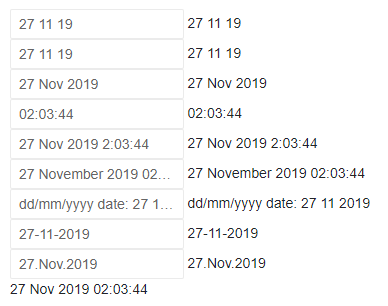

# Supported Date Formats

This article explains the format strings and specifiers supported by the Telerik DateInput for Blazor.

The `Format` property can take a number of possible format strings, and this is a list of the supported options and their effects.

<!-- ## Custom Formats -->

The .NET framework supports a list of format specifiers for dates that you can use to build your own format strings: [https://docs.microsoft.com/en-us/dotnet/standard/base-types/custom-date-and-time-format-strings](https://docs.microsoft.com/en-us/dotnet/standard/base-types/custom-date-and-time-format-strings). The Telerik Date Input steps on them and carries over as many as possible to the client-side to validate and facilitate user input.

>caption Using supported .NET format specifiers to define date format in the Telerik Date Input


````CSHTML
@using Telerik.Blazor.Components.DateInput

<TelerikDateInput @bind-Value="TheDate" Format="d/M/y" /> @TheDate.ToString("d/M/y")
<br />
<TelerikDateInput @bind-Value="TheDate" Format="dd/MM/yy" /> @TheDate.ToString("dd/MM/yy")
<br />
<TelerikDateInput @bind-Value="TheDate" Format="dd/MMM/yyyy" /> @TheDate.ToString("dd/MMM/yyyy")
<br />
<TelerikDateInput @bind-Value="TheDate" Format="HH:mm:ss" /> @TheDate.ToString("HH:mm:ss")
<br />
<TelerikDateInput @bind-Value="TheDate" Format="dd/MMM/yyyy H:mm:ss" /> @TheDate.ToString("dd/MMM/yyyy H:mm:ss")
<br />
<TelerikDateInput @bind-Value="TheDate" Format="dd/MMMM/yyyy HH:mm:ss" /> @TheDate.ToString("dd/MMMM/yyyy HH:mm:ss")
<br />
<TelerikDateInput @bind-Value="TheDate" Format="'dd/mm/yyyy date:' dd/MM/yyyy" /> @TheDate.ToString("'dd/mm/yyyy date:' dd/MM/yyyy")
<br />
<TelerikDateInput @bind-Value="TheDate" Format="dd-MM-yyyy" /> @TheDate.ToString("dd-MM-yyyy")
<br />
<TelerikDateInput @bind-Value="TheDate" Format="dd.MMM.yyyy" /> @TheDate.ToString("dd.MMM.yyyy")
<br />

@TheDate

@code  {
    DateTime TheDate { get; set; } = new DateTime(2019, 11, 27, 02, 03, 44);
}
````

>caption The result from the code snippet above



>caption Unsupported .NET format specifiers

* `m` - single digit minutes without leading zero
* `t` and `tt` - AM/PM indicators
* `g`, `gg` - epoch indicators
* `ddd`, `dddd` - day of the week names
* `z`, `zz`, `zzz` - UTC offsets
* `K` - kind

<!-- `t` and `tt` -makes h and hh useless even though they would maybe work -->
<!-- `g`, `gg` -  maybe should never be supported, since it may not be editable -->
<!-- `K` -  not tested until localization arrives, maybe should never be supported since it is not really an editable portion -->
<!-- `f` through `ffffff` and `F` through `FFFFFF` have not been tested as they are too granular for the current feature set of the components -->


<!--

>caption Most of the available custom format strings in .NET are used in the examples below

unsupported ATM:

m - single digit minutes
t and tt - AM/PM indicators -makes h and hh useless even though they would maybe work
g, gg - epoch indicators - maybe never, since it may not be editable
ddd, dddd - day names
z, zz, zzz - UTC offsets
K - kind - not tested until localization arrives, maybe never will be supported since it is not really an editable portion


````CSHTML
@using Telerik.Blazor.Components.DateInput

<TelerikDateInput @bind-Value="TheDate" Format="d/M/y h:m:s tt" />
@TheDate.ToString("d/M/y h:m:s")
<br />
<TelerikDateInput @bind-Value="TheDate" Format="dd/MM/yy hh:mm:ss" />
@TheDate.ToString("dd/MM/yy hh:mm:ss")
<br />
<TelerikDateInput @bind-Value="TheDate" Format="dd/MMM/yyyy H:m:ss g" />
@TheDate.ToString("dd/MMM/yyyy H:M:ss g")
<br />
<TelerikDateInput @bind-Value="TheDate" Format="dd/MMMM/yyyy HH:mm:ss" />
@TheDate.ToString("dd/MMMM/yyyy HH:MM:ss")
<br />
<TelerikDateInput @bind-Value="TheDate" Format="dd/MMM/yyyy H:m:ss z" />
@TheDate.ToString("dd/MMM/yyyy H:M:ss z")
<br />
<TelerikDateInput @bind-Value="TheDate" Format="'enter dd/mm/yyyy date:' dd/MM/yyyy" />
@TheDate.ToString("'enter dd/mm/yyy date:' dd/MM/yyyy")
<br />

@TheDate

@code  {
    DateTime TheDate { get; set; } = new DateTime(2019, 11, 27, 22, 03, 44);
}
````

>caption The result from the snippet above

-->


<!-- ## Standard Formats -->

The .NET framework also has a list of standard formats for dates: [https://docs.microsoft.com/en-us/dotnet/standard/base-types/standard-date-and-time-format-strings](https://docs.microsoft.com/en-us/dotnet/standard/base-types/standard-date-and-time-format-strings). They are **not** supported with the Telerik Date Input for Blazor at this point. 

>caution While the results of unsupported format specifiers values will render correctly, editing is not supported.

<!--

````CSHTML
@using Telerik.Blazor.Components.DateInput

<TelerikDateInput @bind-Value="TheDate" Format="d" />@TheDate.ToString("d")
<br />
<TelerikDateInput @bind-Value="TheDate" Format="D" />@TheDate.ToString("D")
<br />
<TelerikDateInput @bind-Value="TheDate" Format="f" />@TheDate.ToString("f")
<br />
<TelerikDateInput @bind-Value="TheDate" Format="F" />@TheDate.ToString("F")
<br />
<TelerikDateInput @bind-Value="TheDate" Format="g" />@TheDate.ToString("g")
<br />
<TelerikDateInput @bind-Value="TheDate" Format="G" />@TheDate.ToString("G")
<br />
<TelerikDateInput @bind-Value="TheDate" Format="m" />@TheDate.ToString("m")
<br />
<TelerikDateInput @bind-Value="TheDate" Format="M" />@TheDate.ToString("M")
<br />
@*the 'o' and 'O' are related to time zones and kinds whose implementation is still unclear in Blazor, so they are omitted from this list*@
<TelerikDateInput @bind-Value="TheDate" Format="r" />@TheDate.ToString("r")
<br />
<TelerikDateInput @bind-Value="TheDate" Format="R" />@TheDate.ToString("R")
<br />
<TelerikDateInput @bind-Value="TheDate" Format="s" />@TheDate.ToString("s")
<br />
<TelerikDateInput @bind-Value="TheDate" Format="t" />@TheDate.ToString("t")
<br />
<TelerikDateInput @bind-Value="TheDate" Format="T" />@TheDate.ToString("T")
<br />
<TelerikDateInput @bind-Value="TheDate" Format="u" />@TheDate.ToString("u")
<br />
<TelerikDateInput @bind-Value="TheDate" Format="U" />@TheDate.ToString("U")
<br />
<TelerikDateInput @bind-Value="TheDate" Format="y" />@TheDate.ToString("y")
<br />
<TelerikDateInput @bind-Value="TheDate" Format="Y" />@TheDate.ToString("Y")
<br />

@TheDate

@code {
    DateTime TheDate { get; set; } = new DateTime(2019, 4, 27, 22, 03, 44);
}
````

-->

## See Also

* [DateInput Overview]()
