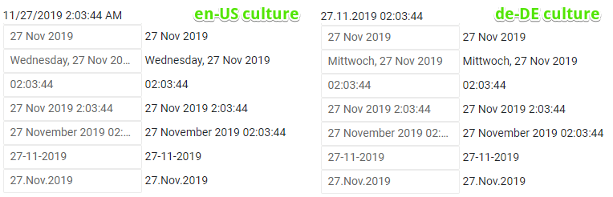

# Supported Date Formats

This article explains the format strings and specifiers supported by the Telerik DateInput for Blazor and how to set them to its `Format` property.

These formats are also used in composite components that also rely on a date input, such as the Date Picker and the Time Picker.

The Telerik Date Input supports the standard format strings and specifiers that come from the .NET Framework:

* [Standard Date and Time Format Strings](https://docs.microsoft.com/en-us/dotnet/standard/base-types/standard-date-and-time-format-strings) - all options are supported, except `O`, `o` and `U`.
* [Custom Date and Time Format Strings](https://docs.microsoft.com/en-us/dotnet/standard/base-types/custom-date-and-time-format-strings) - the most common date and time specifiers are supported down to the seconds level. Epoch, offset, time zone and sub-second specifiers are not supported. Here is a list of the supported specifiers:
    * `d`
    * `dd`
    * `ddd`
    * `dddd`
    * `M`
    * `MM`
    * `MMM`
    * `MMMM`
    * `yy`
    * `yyy`
    * `yyyy`
    * `h`
    * `hh`
    * `H`
    * `HH`
    * `m`
    * `mm`
    * `s`
    * `ss`
    * `tt`

>caution While the results of unsupported format specifiers values will render correctly, editing is not supported for them.

## Examples

>caption Standard format strings support in Telerik Date Input for Blazor

````CSHTML
@using Telerik.Blazor.Components.DateInput

<TelerikDateInput @bind-Value="TheDate" Format="d" />@TheDate.ToString("d")
<br />
<TelerikDateInput @bind-Value="TheDate" Format="D" />@TheDate.ToString("D")
<br />
<TelerikDateInput @bind-Value="TheDate" Format="f" />@TheDate.ToString("f")
<br />
<TelerikDateInput @bind-Value="TheDate" Format="F" />@TheDate.ToString("F")
<br />
<TelerikDateInput @bind-Value="TheDate" Format="g" />@TheDate.ToString("g")
<br />
<TelerikDateInput @bind-Value="TheDate" Format="G" />@TheDate.ToString("G")
<br />
<TelerikDateInput @bind-Value="TheDate" Format="m" />@TheDate.ToString("m")
<br />
<TelerikDateInput @bind-Value="TheDate" Format="M" />@TheDate.ToString("M")
<br />
<TelerikDateInput @bind-Value="TheDate" Format="r" />@TheDate.ToString("r")
<br />
<TelerikDateInput @bind-Value="TheDate" Format="R" />@TheDate.ToString("R")
<br />
<TelerikDateInput @bind-Value="TheDate" Format="s" />@TheDate.ToString("s")
<br />
<TelerikDateInput @bind-Value="TheDate" Format="t" />@TheDate.ToString("t")
<br />
<TelerikDateInput @bind-Value="TheDate" Format="T" />@TheDate.ToString("T")
<br />
<TelerikDateInput @bind-Value="TheDate" Format="u" />@TheDate.ToString("u")
<br />
<TelerikDateInput @bind-Value="TheDate" Format="y" />@TheDate.ToString("y")
<br />
<TelerikDateInput @bind-Value="TheDate" Format="Y" />@TheDate.ToString("Y")
<br />

@TheDate

@code {
    DateTime TheDate { get; set; } = new DateTime(2019, 4, 27, 22, 03, 44);
}
````

>caption The result from the code snippet above


>caption Using supported .NET format specifiers to define relatively common date formats in the Telerik Date Input

````CSHTML
@using Telerik.Blazor.Components.DateInput

<TelerikDateInput @bind-Value="TheDate" Format="dd/MM/yy" /> @TheDate.ToString("dd/MM/yy")
<br />
<TelerikDateInput @bind-Value="TheDate" Format="dd/MMM/yyyy" /> @TheDate.ToString("dd/MMM/yyyy")
<br />
<TelerikDateInput @bind-Value="TheDate" Format="dddd, dd/MMM/yyyy" /> @TheDate.ToString("dddd, dd/MMM/yyyy")
<br />
<TelerikDateInput @bind-Value="TheDate" Format="HH:mm:ss" /> @TheDate.ToString("HH:mm:ss")
<br />
<TelerikDateInput @bind-Value="TheDate" Format="d/M/yy h:m:s tt" /> @TheDate.ToString("d/M/yy h:m:s")
<br />
<TelerikDateInput @bind-Value="TheDate" Format="dd/MMM/yyyy H:mm:ss" /> @TheDate.ToString("dd/MMM/yyyy H:mm:ss")
<br />
<TelerikDateInput @bind-Value="TheDate" Format="dd/MMMM/yyyy HH:mm:ss" /> @TheDate.ToString("dd/MMMM/yyyy HH:mm:ss")
<br />
<TelerikDateInput @bind-Value="TheDate" Format="dd-MM-yyyy" /> @TheDate.ToString("dd-MM-yyyy")
<br />
<TelerikDateInput @bind-Value="TheDate" Format="dd.MMM.yyyy" /> @TheDate.ToString("dd.MMM.yyyy")
<br />

@TheDate

@code {
    DateTime TheDate { get; set; } = new DateTime(2019, 11, 27, 02, 03, 44);
}
````

>caption The result from the code snippet above




## See Also

* [DateInput Overview]()
