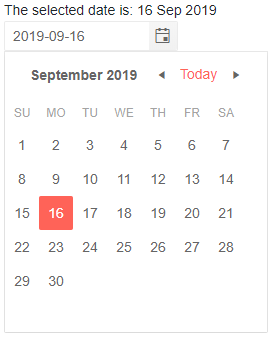

# Blazor Date Picker Component Overview

The <a href="https://www.telerik.com/blazor-ui/datepicker" target="_blank">Blazor Date Picker component</a> allows the user to choose a date from a visual Gregorian [calendar]() or type it into a [date input]() that can accept only dates. You can control the date format of the input, how the user navigates through the calendar, and which dates the user cannot select.

#### To use a Telerik Date Picker for Blazor, add the `TelerikDatePicker` tag.

>caption Basic date picker with namespace and reference

````CSHTML
The selected date is: @datePickerValue.ToShortDateString()
<br />

<TelerikDatePicker @bind-Value="datePickerValue" @ref="theDatePicker"></TelerikDatePicker>

@code  {
    DateTime datePickerValue { get; set; } = DateTime.Now;

    Telerik.Blazor.Components.TelerikDatePicker<DateTime> theDatePicker;
    // the type of the component depends on the type of the value
    // in this case it is DateTime, but it could be DateTime?
}
````



## Features

The Blazor Date Picker component exposes the following features:

*  `BottomView` - Defines the bottommost view in the popup calendar to which the user can navigate to. Defaults to `CalendarView.Month`.

* `DisabledDates` - Specifies a list of dates that can not be selected.

* `Class` - The custom CSS class rendered on the wrapping element.

* `PopupClass` - additional CSS class to customize the appearance of the Date Picker's dropdown.

* `Enabled` - Specifies whether typing in the input is allowed.

* `Format` - Specifies the format of the DateInput of the DatePicker. [Read more about supported data formats in Telerik DateInput for Blazor UI]() article.

* `Id` - renders as the `id` attribute on the `<input />` element, so you can attach a `<label for="">` to the input.

* `Min` - The earliest date that the user can select.

* `Max` - The latest date that the user can select.

* `PopupHeight` - Defines the height of the DatePicker's Popup. Defaults to `auto`.

* `PopupWidth` - Defines the width of the DatePicker's Popup. Defaults to `auto`.

* `Value` - The current value of the input. Can be used for binding.

* `View` - Specifies the current view that will be displayed in the popup calendar.

* `Width` - Defines the width of the DatePicker. Defaults to `280px`.

* `TabIndex` - maps to the `tabindex` attribute of the HTML element. You can use it to customize the order in which the inputs in your form focus with the `Tab` key.

* `Placeholder` - `string` - maps to the `placeholder` attribute of the HTML element. The `Placeholder` will appear if the component is bound to **nullable** DateTime object - `DateTime?`, but will not be rendered if the component is bound to the default value of a non-nullable DateTime object. The Placeholder value will be displayed when the input is not focused. Once the user focuses it to start typing, the Format Placeholder (default or [customized one](#format-placeholder)) will override the Placeholder to indicate the format the date should be entered in.

* Validation - see the [Input Validation]() article.

* `ValidateOn` - configures the event that will trigger validation (if validation is enabled). Read more at [Validation Modes for Simple Inputs](#validation-modes-for-simple-inputs).

The date picker is, essentially, a [date input]() and a [calendar]() and the properties it exposes are mapped to the corresponding properties of these two components. You can read more about their behavior in the respective components' documentation.

@[template](/_contentTemplates/date-inputs/format-placeholders.md#format-placeholder)

## See Also

  * [Live Demo: Date Picker](https://demos.telerik.com/blazor-ui/datepicker/index)
  * [Input Validation]()
  * [Supported Input Date Formats]()
  * [API Reference](https://docs.telerik.com/blazor-ui/api/Telerik.Blazor.Components.TelerikDatePicker-1)
