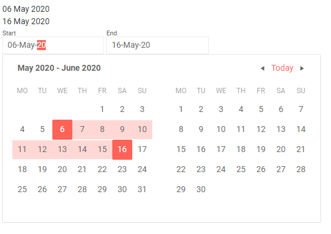

# Blazor DateRange Picker Component Overview

The <a href="https://www.telerik.com/blazor-ui/daterange-picker" target="_blank">Blazor DateRange Picker component</a> allows the user to select a date range (start and end date) - both from a visual list ([calendar]()) or to type it into a [date input]() that can accept only dates. You can control the format shown in the input, and dates the user cannot select, as well as implement validation and respond to events.

#### To use a Telerik Date Range Picker for Blazor:

1. add the `TelerikDateRangePicker` tag
2. bind its `StartValue` and `EndValue` parameters to fields in your model

>caption Basic date range picker

````CSHTML
@StartValue?.ToString("dd MMM yyyy")
<br />
@EndValue?.ToString("dd MMM yyyy")
<br />
<TelerikDateRangePicker @bind-StartValue="@StartValue"
                        @bind-EndValue="@EndValue">
</TelerikDateRangePicker>

@code {
    public DateTime? StartValue { get; set; } = DateTime.Now;
    public DateTime? EndValue { get; set; } = DateTime.Now.AddDays(10);
}
````



## Features

The Blazor Date Range Picker component exposes the following features:

*  `BottomView` - Defines the bottommost view in the popup calendar to which the user can navigate to. Defaults to `CalendarView.Month`.

* `DisabledDates` - Specifies a list of dates that can not be selected as the start or end of the range, see the <a href="https://demos.telerik.com/blazor-ui/daterangepicker/disabled-dates" target="_blank">Live Demo: Date Range Picker Disabled Dates</a>.

* `Enabled` - Specifies whether typing in the input is allowed.

* `Format` - Specifies the format of the DateInputs of the DateRangePicker. [Read more about supported data formats in Telerik DateInput for Blazor UI]() article.

* `EndId` and `StartId` - render as the `id` attribute on the `<input />` element, so you can attach a `<label for="">` to the input.

* `Min` - The earliest date that the user can select.

* `Max` - The latest date that the user can select.

* `StartValue` and `EndValue` - The current values of the inputs for start and end of the range. Can be used for two-way binding.

* `View` - Specifies the current view that will be displayed in the popup calendar.

* `Class` - The CSS class that will be rendered on the main wrapping element of the Date Range Picker

* `PopupClass` - additional CSS class to customize the appearance of the Date Range Picker's dropdown.

* `TabIndex` - maps to the `tabindex` attribute of both `input` HTML elements in the component and them both will have the same `tabindex`. You can use it to customize the order in which the inputs in your form focus with the `Tab` key.

* `Placeholder` - `string` - maps to the `placeholder` attribute of the HTML element. The `Placeholder` will appear if the component is bound to **nullable** DateTime object - `DateTime?`, but will not be rendered if the component is bound to the default value of a non-nullable DateTime object. The Placeholder value will be displayed when the input is not focused. Once the user focuses it to start typing, the Format Placeholder (default or [customized one](#format-placeholder)) will override the Placeholder to indicate the format the date should be entered in.

* Validation - see the [Input Validation]() article. 
    * To restrict the user from writing dates in the input so that the end is after the start, you must implement a custom data annotation attribute (you can find an example in the article linked above). The DateRangePicker component does not do this out-of-the-box in order to provide smooth user experience - the code cannot know what the user intent is and they might fix the range if they are given the chance, so correcting the input immediately may prevent them from using it comfortably. The component can fully control the user experience in the popup calendar and it ensures there that the range values are valid (start is before the end). If the user chooses an end date before the start, this date becomes the new start and they can choose the end again.

* [Events]() - a set of events that let you respond to the user actions with the component, and also to extract the data from it.

The date range picker is, essentially, a [date input]() and a [calendar]() and the properties it exposes are mapped to the corresponding properties of these two components. You can read more about their behavior in the respective components' documentation.

@[template](/_contentTemplates/date-inputs/format-placeholders.md#format-placeholder)

## See Also

  * [Live Demo: Date Range Picker](https://demos.telerik.com/blazor-ui/daterangepicker/index)
  * [Input Validation]()
  * [Supported Input Date Formats]()
  * [API Reference](https://docs.telerik.com/blazor-ui/api/Telerik.Blazor.Components.TelerikDateRangePicker-1)
