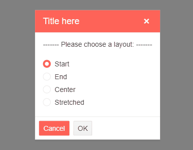

# Dialog Action Buttons

The Dialog provides options for rendering action buttons and customizing their content. To specify action buttons in the Dialog, use the `DialogButtons` tag. You can customize the layout of the buttons by using the `ButtonsLayout` property.

## Example

The following example demonstrates all supported layout options for the action buttons.

>caption The result from the code snippet.



>caption The supported layouts for the action buttons in the Telerik Dialog.

````CSHTML
@* An example of all the available layout options. *@

<TelerikDialog @ref="dialogRef" @bind-Visible="@Visible"
               Title="@Title"
               ButtonsLayout="SelectedBtnLayout">
    <DialogContent>
        <div>------- Please choose a layout: -------</div>
        <br/>
        <TelerikRadioGroup Data="@LayoutTypes" @bind-Value="@SelectedBtnLayout" OnChange="@OnChangeHandler"></TelerikRadioGroup>
    </DialogContent>
    <DialogButtons>
        <TelerikButton OnClick="@(() => { Visible = false; })">Cancel</TelerikButton>
        <TelerikButton OnClick="@(() => { Visible = false; })" Primary="true" >OK</TelerikButton>
    </DialogButtons>
</TelerikDialog>

@code {
    TelerikDialog dialogRef;
    private bool Visible { get; set; } = true;
    private string Title { get; set; } = "Title here";

    public DialogButtonsLayout SelectedBtnLayout { get; set; } = DialogButtonsLayout.Start;
    public List<DialogModel> LayoutTypes { get; set; } = new List<DialogModel>()
    {
        new DialogModel() { Text = "Start", Value = DialogButtonsLayout.Start },
        new DialogModel() { Text = "End", Value = DialogButtonsLayout.End },
        new DialogModel() { Text = "Center", Value = DialogButtonsLayout.Center },
        new DialogModel() { Text = "Stretched", Value = DialogButtonsLayout.Stretched }
    };

    public class DialogModel
    {
        public string Text { get; set; }
        public DialogButtonsLayout Value { get; set; }
    }

    async Task OnChangeHandler(object newValue)
    {
        dialogRef.Refresh(); // The Refresh() method is needed here to re-render and display the changed position of the buttons.
    }
}
````